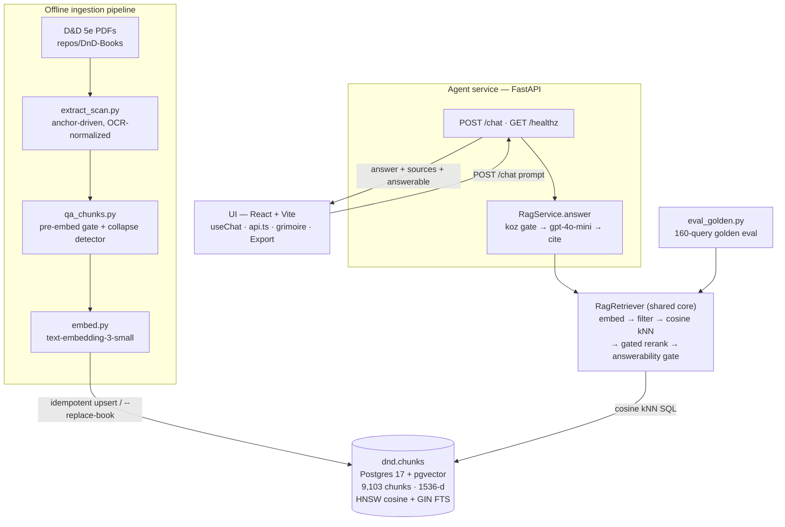
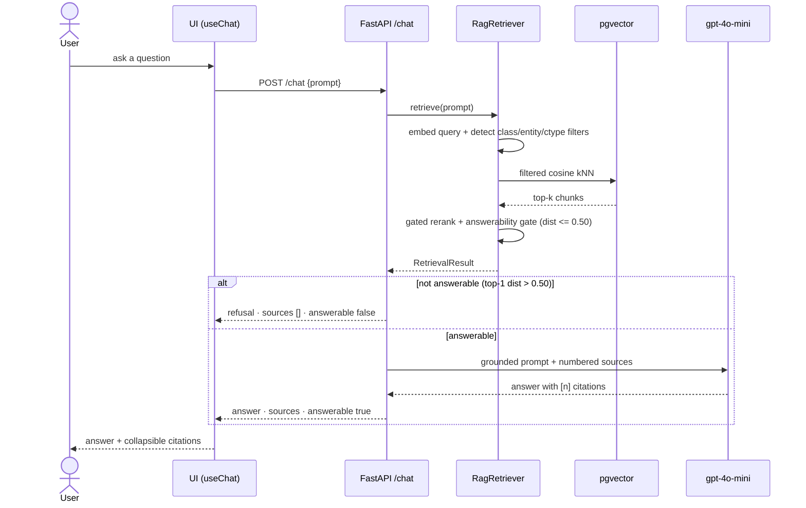
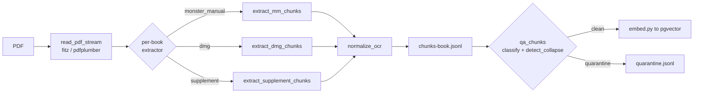

# D&D 5e RAG — Architecture

A retrieval-augmented chat app for D&D 5th Edition. A user asks about a spell, monster, rule, or
piece of lore; the **Sage** answers **only** from the ingested rulebook corpus (9,103 chunks across
12 5E books in pgvector), with citations, and refuses out-of-corpus questions instead of
hallucinating.

> Last updated: 2026-06-15 · corpus 9,103 chunks / 12 books · retrieval Hit@1 83.3%

## System architecture



## Request flow — `POST /chat`



## Ingestion pipeline (offline)



## Components

### Offline ingestion pipeline
Turns OCR-scanned PDFs into clean, typed, embedded chunks. This is the hardest part — the source
scans are damaged (mixed-case OCR, dropped/garbled characters, two-column layouts).

- **`ingestion/extract_scan.py`** — three per-book extractors selected by `cfg["kind"]`
  (`monster_manual` → `extract_mm_chunks`, `dmg` → `extract_dmg_chunks`, else
  `extract_supplement_chunks`). **Anchor-driven:** spells anchor on an OCR-tolerant "Nth-level
  &lt;school&gt;" / "&lt;school&gt; cantrip" line with a **Casting-Time fallback** when the level line is
  shredded; monsters on `Armor Class N`. Names are recovered from headings / type-lines, including
  **sub-threshold and mixed-case** names (`is_monster_name_candidate`, `is_spell_name_line`).
- **`ingestion/ocr_normalize.py`** — rule-based cleanup of the phb-5e scan's garble (`Vou`→You,
  `levei`→level, `/ire`→fire); a no-op on the 11 clean books.
- **`ingestion/qa_chunks.py`** — pre-embedding gate (`classify_chunk` quarantines cid markers, PUA /
  control chars, low-alpha, bad/field/sentence entity-names) **and** the corpus-wide
  **`detect_collapse`** regression guard (`--collapse-check [--from-db]`).
- **`ingestion/embed.py`** — embeds via OpenAI `text-embedding-3-small`; idempotent upsert with
  `--replace-book` (deletes a book's rows before insert so re-extraction can't orphan stale chunks).

### Vector DB
- **Postgres 17 + pgvector**, initialized from `vector-db/init/` (`01-extensions.sql`,
  `02-schema.sql`, `03-hybrid-search.sql`).
- **`dnd.chunks`** — `chunk_id` PK, `book_slug`, `source_file`, pages, `part`/`chapter`/`section`,
  `content_type` (rule · monster · dm_guidance · spell · magic_item · feat), `entity_name`,
  `class_name`, `feature_name`, `text`, `embedding vector(1536)`, `search_vector tsvector`.
- Indexes: **HNSW** (`vector_cosine_ops`) for ANN cosine, **GIN** on `search_vector` for FTS.
- `dnd.hybrid_search()` (vector + FTS via RRF) exists but is **not adopted** — evaluated in 3q3, it
  ties pure vector and is marginally worse on Recall@10. `vector-db/verify_db.py` is an insert+kNN
  smoke test.

### Retrieval core (shared)
- **`ingestion/retrieval.py` — `RagRetriever`** is the single retrieval brain used by **both** the
  agent service and the eval harness: embed the query → detect class/entity/content-type filters
  against the corpus vocabulary (with a generic-entity stoplist + stemmed ILIKE) → filtered cosine
  kNN → **gated cross-encoder rerank** (prose content types only) → **answerability gate**
  (`is_answerable`, refuse when top-1 cosine distance > 0.50). Default mode is pure filtered vector.

### Agent service
- **`service/app.py`** — FastAPI `POST /chat` + `GET /healthz`; `RagService` built once at startup
  (vocabulary loaded once); a guarded `StaticFiles` mount serves `ui/dist` when present.
- **`service/rag.py` / `service/generate.py`** — `RagService.answer`: retrieve → koz gate (refuse
  out-of-corpus with **no LLM call**) → grounded generation with `gpt-4o-mini` (answer only from
  numbered sources, cite `[n]`) → deduped `Source` citations.
- Contract: `ChatRequest{prompt}` → `ChatResponse{answer, sources[], answerable}`. Errors: 422
  (empty prompt), 503 (not ready / upstream); a refusal is `200` with `answerable=false`.

### UI
- **React 19 + Vite** (`ui/`), dark "grimoire" theme, no CSS framework. `useChat` owns the
  client-side exchange list (service is stateless); `api.ts` mirrors `service/models.py` exactly and
  maps 200/422/503/network into a discriminated result (refusals are **not** errors). Collapsible
  source citations; an **Export ↓** button dumps the conversation to JSON for debugging.

### Packaging
- `docker compose up --build` → `vector-db` + `service` + `ui` (nginx reverse-proxy) in dependency
  order; **or** a single `uvicorn` process serving the built `ui/dist` plus the API.

## Running it

```bash
cd repos/rag-chat
docker compose up --build          # full stack → http://localhost:5173
# or, single process:
cd ui && bun run build && cd ..
uv run --with fastapi --with uvicorn --with openai --with "psycopg[binary]" \
    uvicorn service.app:app --port 8000        # → http://localhost:8000

# offline pipeline (per book)
uv run --with pymupdf python ingestion/extract_scan.py "<pdf>" --book-slug <slug> --out ingestion/chunks-<slug>.jsonl
uv run python ingestion/qa_chunks.py ingestion/chunks-<slug>.jsonl                 # → .clean.jsonl
uv run --with "psycopg[binary]" --with openai python ingestion/embed.py --chunks ingestion/chunks-<slug>.clean.jsonl --replace-book

# evaluation (pure vector is the default)
PYTHONUTF8=1 uv run --with "psycopg[binary]" --with openai python ingestion/eval_golden.py
```

## Testing
Python suites use a self-contained `_run()` (no pytest), invoked via `uv run python ingestion/test_*.py`
and `service/test_*.py` (pure — no DB/LLM; retriever + LLM mocked). Key guards:
`test_extract_scan.py` (extraction), `test_qa_chunks.py` (gate + collapse detector),
`test_golden_entities.py` (canonical entities present), `test_ocr_normalize.py`, `test_rerank.py`,
plus `eval_golden.py` for live retrieval Hit@1. UI: `bunx vitest run` + `bunx tsc --noEmit`.

## Current metrics
- **Corpus:** 9,103 chunks · 12 books · 4,395 distinct entities.
- **Retrieval:** Hit@1 83.3% · spell_lookup Hit@1 96% · Recall@10 94.3%.

## Known gaps / follow-ups (Beads)
- **agent-forge-harness-ask** — refine `detect_collapse` to not flag legitimate multi-form monsters
  (lycanthropes) / lore sections; deep two-column MM tail.
- **agent-forge-harness-eue** — single-char/short junk entities over-restrict retrieval.
- **agent-forge-harness-17u** — GCP deployment (not started).
- **agent-forge-harness-1nh** — OCR Wayfinders + Blood Hunter (deferred; needs tesseract/ocrmypdf).
