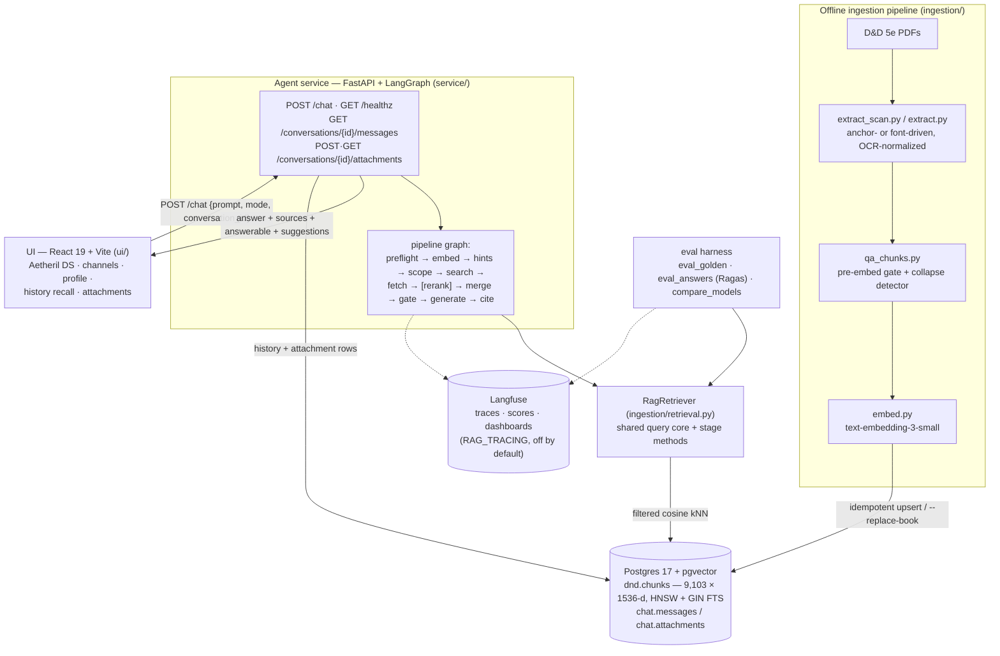
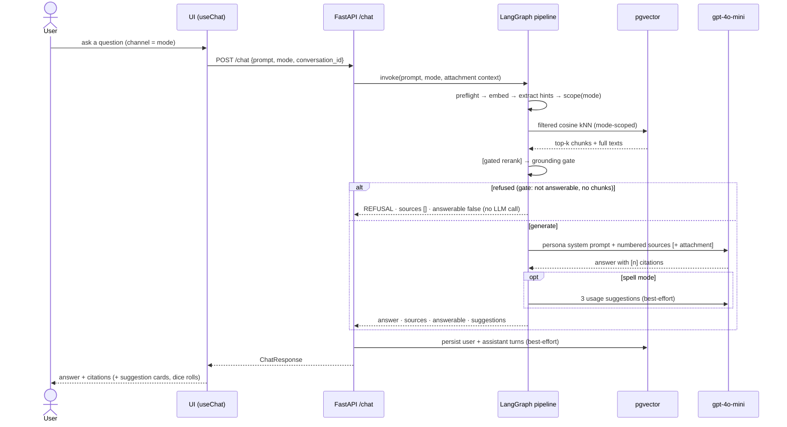
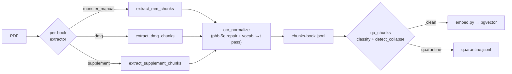

# D&D 5e RAG (Aetheril) — Architecture

A retrieval-augmented chat app for D&D 5th Edition. A user picks a **channel** (Sage · Spell ·
Rules · GM — each a persona with its own retrieval scope), asks about a spell, monster, rule, or
piece of lore, and gets an answer grounded **only** in the ingested rulebook corpus (9,000+ chunks
across 12 5E books in pgvector), with citations — out-of-corpus questions are refused, not
hallucinated. Conversations persist server-side, and uploaded files (`.txt`/`.md`/`.pdf`) ground
subsequent answers in that conversation.

> Last updated: 2026-07-21 (branch `feat/swe1-6-file-attachments`, PR stack #26→#29)
> Corpus 9,103 chunks / 12 books · retrieval Hit@1 83.3% (eval run 2026-06-15, pre-PHB-OCR-repair)

## System architecture



## Request flow — `POST /chat`



Gate rules: `sage`/`spell`/`rules` require top-1 cosine distance ≤ 0.50 **and** chunks;
`gm` proceeds with any chunks (creative mode); a conversation **attachment** relaxes the gate
entirely (an off-corpus "what does my homebrew doc say?" must generate). In `gm` mode the graph
also fans out to a stubbed **secondary world-corpus retriever** seam and merges by state.

## Ingestion pipeline (offline)



## Components

### Offline ingestion pipeline (`ingestion/` — [README](../ingestion/README.md))

Turns damaged OCR scans and born-digital PDFs into clean, typed, embedded chunks.
`extract_scan.py` anchors on textual structure (Armor Class / rarity / spell-level lines);
`ocr_normalize.py` repairs the PHB scan's systematic garble (incl. the vocabulary-checked l→t
pass fed by `build_vocab.py`); `qa_chunks.py` quarantines failure signatures pre-embedding;
`embed.py` upserts with `--replace-book`; `ingest_books.py` orchestrates the lot.

### Vector DB (`vector-db/` — [README](../vector-db/README.md))

- **Postgres 17 + pgvector**, initialized from `vector-db/init/`: `01-extensions.sql`,
  `02-schema.sql` (dnd.chunks + HNSW/GIN indexes), `03-hybrid-search.sql`,
  `04-chat-schema.sql` (chat.messages / chat.attachments — same DDL `history.ensure_schema()`
  applies idempotently at service startup for pre-existing volumes).
- `dnd.hybrid_search()` (vector+FTS RRF) exists but is **not adopted** — tied Hit@1, slightly
  worse Recall@10 (3q3). `verify_db.py` is an insert+kNN smoke test.

### Retrieval core (shared)

**`ingestion/retrieval.py` — `RagRetriever`** is the single retrieval brain used by both the
service graph and the evals: embed → detect class/entity/content-type hints against the corpus
vocabulary (generic-entity stoplist + ≥3-char entity floor + stemmed ILIKE) → filtered cosine
kNN → full-text fetch → answerability by top-1 distance. **`ingestion/scope.py`** maps mode →
(content-type, book) filters; **`ingestion/rerank.py`** gates the optional cross-encoder to
prose categories. Default mode is pure filtered vector.

### Agent service (`service/` — [README](../service/README.md))

- **`graph.py`** — the whole request pipeline as a LangGraph `StateGraph`; every stage is a
  traceable node (preflight, embed, extract_hints, scope, search, fetch_texts, rerank, merge,
  gate, generate, suggest, cite, refuse). **`rag.py`** is invoke + response mapping plus the
  injection seams (retriever, reranker, LLM client, secondary retriever).
- **`generate.py`** — per-channel persona prompts; grounded generation over **full** chunk
  texts; spell-usage suggestions (best-effort second LLM call); deduped `Source` citations.
- **`history.py`** — server-side conversation persistence (best-effort writes: history failure
  never fails an answer). **`attachments.py`** — upload text extraction + caps; attachment text
  is injected as a sibling context source and cited.
- **`tracing.py`** — env-gated Langfuse tracing (`RAG_TRACING`, off by default): node-level
  spans, token/cost, tagged model/version/mode. See [`observability/OVERVIEW.md`](observability/OVERVIEW.md).
- Contract: `ChatRequest{prompt, mode, conversation_id}` → `ChatResponse{answer, sources[],
  answerable, mode, conversation_id, suggestions?}`. Errors: 422 validation · 502 LLM upstream ·
  503 backend unavailable · 500 bug; a refusal is a **200** with `answerable=false`.

### UI (`ui/` — [README](../ui/README.md))

**React 19 + Vite**, bun-managed, on the **Aetheril design system** (`ui/src/ds/` — Material 3
token layer, warm fantasy palette, light *Parchment* / dark *Tavern*, 10 components, Storybook).
Shell: Landing → Workspace (TopBar brand · **AppHeader channel switcher** with per-channel
accents · LeftNav conversations + UserMenu · ChatPane) + Profile screen. Channels are
role-gated in the UI (GM is DM-only). `useChat` recalls stored history; ChatPane uploads
attachments; spell answers render suggestion cards; dice notation renders `DiceRoll`.
`api.ts` mirrors `service/models.py` exactly (refusals are not errors). Conversation
list/titles + user identity are still client-side stubs pending real auth.

### Packaging

The repo is an installable package (`pyproject.toml`: packages `service`+`ingestion`,
py-module `config`; extras `test` / `eval` / `rerank` / `extract`). `docker compose up --build`
→ `vector-db` + `service` + `ui` (nginx, :5173); or a single `uvicorn` process serves the built
`ui/dist` plus the API on :8000.

## Running it

```bash
cd repos/game-guide-ai
./scripts/up.sh                    # full stack → http://localhost:5173
# or single process (required today for history + attachments — see gaps below):
cd ui && bun run build && cd ..
uv run --with . uvicorn service.app:app --port 8000    # → http://localhost:8000

# offline pipeline (per book)
uv run --with '.[extract]' python ingestion/extract_scan.py "<pdf>" --book-slug <slug> --out ingestion/chunks-<slug>.jsonl
uv run python ingestion/qa_chunks.py ingestion/chunks-<slug>.jsonl
uv run --with "psycopg[binary]" --with openai python ingestion/embed.py --chunks ingestion/chunks-<slug>.clean.jsonl --replace-book

# evaluation (pure vector is the default; PYTHONUTF8=1 on Windows)
uv run --with "psycopg[binary]" --with openai python ingestion/eval_golden.py
uv run --with '.[eval]' python ingestion/eval_answers.py --limit 5
```

## Testing

Python: **pytest** from the repo root — `uv run --with '.[test]' python -m pytest -q`. Suites are
pure (no DB/LLM; retriever, LLM, and store faked): `service/tests/` (app, graph, history,
attachments, tracing), `ingestion/tests/` (extraction, QA gate, retrieval, scope, rerank, evals),
`tests/` (packaging + config invariants). UI: `bun run test` = jsdom unit tests + Storybook
browser tests (Playwright Chromium); `bun run typecheck` / `lint`.

## Current metrics (as of the 2026-06-15 eval run)

- **Corpus:** 9,103 chunks · 12 books · 4,395 distinct entities.
- **Retrieval:** Hit@1 83.3% · spell_lookup Hit@1 96% · Recall@10 94.3%.
- PHB OCR repair + re-ingest (PR #20, 2026-07-02) and the short-entity guard (#25) landed after
  this run; re-run `eval_golden.py` before quoting numbers.

## Known gaps / follow-ups (Beads)

- **agent-forge-harness-cnqf** — `/conversations/*` (history, attachments) not proxied by Vite
  dev server or nginx; those features currently need single-process serving on :8000.
- **x5bz.2** — real authentication (invite links); until then users/roles are client-side stubs
  and the GM channel is UI-gated only. Blocks **swe1.5** (notes/GM-lore nav — AppHeader slot reserved).
- **agent-forge-harness-17u** — GCP deployment (not started).
- **agent-forge-harness-1nh** — OCR Wayfinders + Blood Hunter (deferred; needs tesseract/ocrmypdf).
- **agent-forge-harness-ask** — `detect_collapse` false-positives on multi-form monsters; deep
  two-column MM tail.
