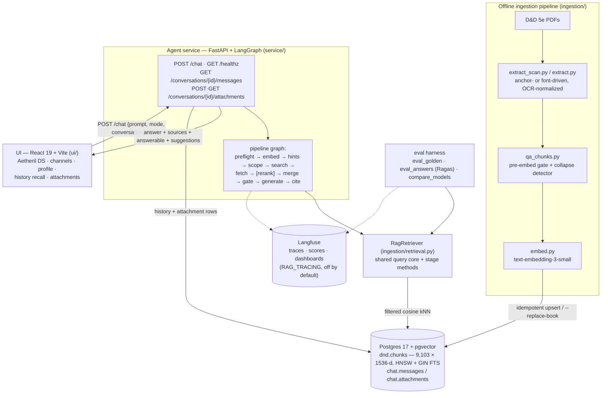
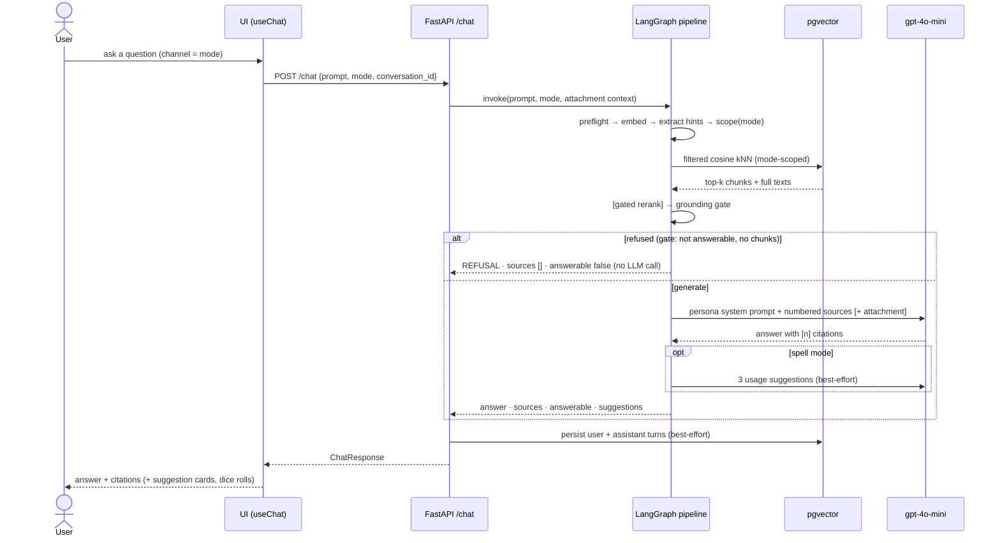
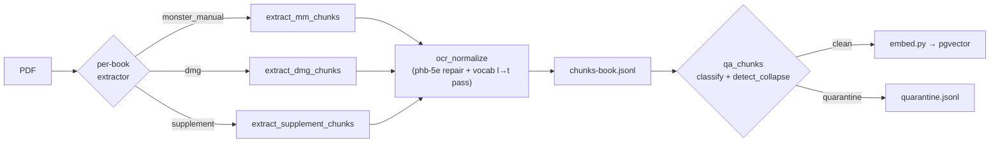

# D&D 5e RAG (Aetheril) — Architecture

A retrieval-augmented chat app for D&D 5th Edition. A user picks a **channel** (Sage · Spell ·
Rules · GM — each a persona with its own retrieval scope), asks about a spell, monster, rule, or
piece of lore, and gets an answer grounded **only** in the ingested rulebook corpus (9,000+ chunks
across 12 5E books in pgvector), with citations — out-of-corpus questions are refused, not
hallucinated. Access is **invite-gated**: accounts are created only through one-time invite links,
every data endpoint requires a session, and conversations are private to their owner. Conversations
persist server-side, and uploaded files (`.txt`/`.md`/`.pdf`) ground subsequent answers in that
conversation.

> Last updated: 2026-07-26 (branch `feat/x5bz.2-invite-auth` — invite-gated auth)
> Deployed: Cloud Run + Cloud SQL, `game-guide-ai-cloud` / us-central1, IAM-locked (x5bz.1)
> Corpus 9,103 chunks / 12 books · retrieval Hit@1 83.3% (eval run 2026-06-15, pre-PHB-OCR-repair)

## System architecture


```mermaid
flowchart TB
    subgraph offline["Offline ingestion pipeline (ingestion/)"]
        direction LR
        PDFs["D&D 5e PDFs"] --> EX["extract_scan.py / extract.py<br/>anchor- or font-driven, OCR-normalized"]
        EX --> QA["qa_chunks.py<br/>pre-embed gate + collapse detector"]
        QA --> EM["embed.py<br/>text-embedding-3-small"]
    end

    DB[("Postgres 17 + pgvector<br/>dnd.chunks — 9,103 × 1536-d, HNSW + GIN FTS<br/>chat.messages / chat.attachments")]

    EM -->|idempotent upsert / --replace-book| DB

    subgraph svc["Agent service — FastAPI + LangGraph (service/)"]
        API["POST /chat · GET /healthz<br/>GET /conversations/{id}/messages<br/>POST·GET /conversations/{id}/attachments"]
        GRAPH["pipeline graph:<br/>preflight → embed → hints → scope → search →<br/>fetch → [rerank] → merge → gate → generate → cite"]
        API --> GRAPH
    end

    RET["RagRetriever (ingestion/retrieval.py)<br/>shared query core + stage methods"]
    EVAL["eval harness<br/>eval_golden · eval_answers (Ragas) · compare_models"]
    LF[("Langfuse<br/>traces · scores · dashboards<br/>(RAG_TRACING, off by default)")]

    UI["UI — React 19 + Vite (ui/)<br/>Aetheril DS · channels · profile ·<br/>history recall · attachments"]

    UI -->|"POST /chat {prompt, mode, conversation_id}"| API
    API -->|answer + sources + answerable + suggestions| UI
    GRAPH --> RET
    EVAL --> RET
    RET -->|filtered cosine kNN| DB
    API -->|history + attachment rows| DB
    GRAPH -.-> LF
    EVAL -.-> LF
```

## Request flow — `POST /chat`


```mermaid
sequenceDiagram
    actor User
    participant UI as UI (useChat)
    participant API as FastAPI /chat
    participant G as LangGraph pipeline
    participant DB as pgvector
    participant LLM as gpt-4o-mini

    User->>UI: ask a question (channel = mode)
    UI->>API: POST /chat {prompt, mode, conversation_id}
    API->>G: invoke(prompt, mode, attachment context)
    G->>G: preflight → embed → extract hints → scope(mode)
    G->>DB: filtered cosine kNN (mode-scoped)
    DB-->>G: top-k chunks + full texts
    G->>G: [gated rerank] → grounding gate
    alt refused (gate: not answerable, no chunks)
        G-->>API: REFUSAL · sources [] · answerable false (no LLM call)
    else generate
        G->>LLM: persona system prompt + numbered sources [+ attachment]
        LLM-->>G: answer with [n] citations
        opt spell mode
            G->>LLM: 3 usage suggestions (best-effort)
        end
        G-->>API: answer · sources · answerable · suggestions
    end
    API->>DB: persist user + assistant turns (best-effort)
    API-->>UI: ChatResponse
    UI-->>User: answer + citations (+ suggestion cards, dice rolls)
```

Gate rules: `sage`/`spell`/`rules` require top-1 cosine distance ≤ 0.50 **and** chunks;
`gm` proceeds with any chunks (creative mode); a conversation **attachment** relaxes the gate
entirely (an off-corpus "what does my homebrew doc say?" must generate). In `gm` mode the graph
also fans out to a stubbed **secondary world-corpus retriever** seam and merges by state.

## Ingestion pipeline (offline)


```mermaid
flowchart LR
    PDF["PDF"] --> EXT{"per-book<br/>extractor"}
    EXT -->|monster_manual| MM["extract_mm_chunks"]
    EXT -->|dmg| DMG["extract_dmg_chunks"]
    EXT -->|supplement| SUP["extract_supplement_chunks"]
    MM --> NORM["ocr_normalize<br/>(phb-5e repair + vocab l→t pass)"]
    DMG --> NORM
    SUP --> NORM
    NORM --> JSONL["chunks-book.jsonl"]
    JSONL --> QA{"qa_chunks<br/>classify + detect_collapse"}
    QA -->|clean| EMB["embed.py → pgvector"]
    QA -->|quarantine| Q["quarantine.jsonl"]
```

## Components

### Offline ingestion pipeline (`ingestion/` — [README](../ingestion/README.md))

Turns damaged OCR scans and born-digital PDFs into clean, typed, embedded chunks.
`extract_scan.py` anchors on textual structure (Armor Class / rarity / spell-level lines);
`ocr_normalize.py` repairs the PHB scan's systematic garble (incl. the vocabulary-checked l→t
pass fed by `build_vocab.py`); `qa_chunks.py` quarantines failure signatures pre-embedding;
`embed.py` upserts with `--replace-book`; `ingest_books.py` orchestrates the lot.

### Vector DB (`vector-db/` — [README](../vector-db/README.md))

- **Postgres 17 + pgvector.** Corpus schema in `vector-db/init/`: `01-extensions.sql`,
  `02-schema.sql` (dnd.chunks + HNSW/GIN indexes), `03-hybrid-search.sql`.
- **Application schema is ordered migrations in `service/sql/migrations/`**
  (`0001_chat_schema.sql`, `0002_auth_schema.sql`, `0003_jobs_outbox.sql`, …) — one
  definition and one path: `service/migrations.py` applies what a database has not
  seen, once, under an advisory lock, before the service serves anything, and
  records each file's checksum in `app.schema_migrations`. A fresh database and an
  old one converge; drift stops startup. The files ship inside the installed
  package. Database access goes through a bounded connection gate (plus a small pool
  for the realtime path) and one transaction boundary (`service/db.py`); multi-step
  writes enqueue their follow-up work in the same
  transaction (`service/jobs.py`). See [migrations.md](migrations.md).
- `dnd.hybrid_search()` (vector+FTS RRF) exists but is **not adopted** — tied Hit@1, slightly
  worse Recall@10 (3q3). `verify_db.py` is an insert+kNN smoke test.

### Retrieval core (shared)

**`ingestion/retrieval.py` — `RagRetriever`** is the single retrieval brain used by both the
service graph and the evals: embed → detect class/entity/content-type hints against the corpus
vocabulary (generic-entity stoplist + ≥3-char entity floor + stemmed ILIKE) → filtered cosine
kNN → full-text fetch → answerability by top-1 distance. **`ingestion/scope.py`** maps mode →
(content-type, book) filters; **`ingestion/rerank.py`** gates the optional cross-encoder to
prose categories. Default mode is pure filtered vector.

### Agent service (`service/` — [README](../service/README.md))

- **`graph.py`** — the whole request pipeline as a LangGraph `StateGraph`; every stage is a
  traceable node (preflight, embed, extract_hints, scope, search, fetch_texts, rerank, merge,
  gate, generate, suggest, cite, refuse). **`rag.py`** is invoke + response mapping plus the
  injection seams (retriever, reranker, LLM client, secondary retriever).
- **`generate.py`** — per-channel persona prompts; grounded generation over **full** chunk
  texts; spell-usage suggestions (best-effort second LLM call); deduped `Source` citations.
- **`history.py`** — server-side conversation persistence (best-effort writes: history failure
  never fails an answer). **`attachments.py`** — upload text extraction + caps; attachment text
  is injected as a sibling context source and cited.
- **`tracing.py`** — env-gated Langfuse tracing (`RAG_TRACING`, off by default): node-level
  spans, token/cost, tagged model/version/mode. See [`observability/OVERVIEW.md`](observability/OVERVIEW.md).
- **Auth (x5bz.2)** — `auth_store.py` (users + invites in the `auth` schema, argon2 via
  `hashing.py`, atomic single-use invite redemption), `session.py` (itsdangerous-signed
  httpOnly session cookie carrying user id + role), `invites.py` (redeemability rules),
  `admin_invites.py` (operator CLI: create/list/revoke). `require_session` guards `/chat`,
  `/conversations/*` and `/auth/me`; `/healthz` and `/metrics/ui` stay open. The service
  **fails closed** if `SESSION_SECRET` is unset. Every auth-store call goes through
  `_auth_lookup`, so a backend that breaks *after* startup answers **503**, never 500 —
  "retry later", not "this request is broken". Design rationale:
  [`adr/invite-auth.md`](adr/invite-auth.md); incident response: [`deploy-gcp.md`](deploy-gcp.md) §10.
- Contract: `ChatRequest{prompt, mode, conversation_id}` → `ChatResponse{answer, sources[],
  answerable, mode, conversation_id, suggestions?}`. Errors: **401 no/expired session** ·
  **403 wrong role (GM channel) or another user's conversation** · 422 validation ·
  502 LLM upstream · 503 backend unavailable · 500 bug; a refusal is a **200** with
  `answerable=false`.

### UI (`ui/` — [README](../ui/README.md))

**React 19 + Vite**, bun-managed, on the **Aetheril design system** (`ui/src/ds/` — Material 3
token layer, warm fantasy palette, light *Parchment* / dark *Tavern*, 10 components, Storybook).
Shell: **Login / Signup** → Landing → Workspace (TopBar brand · **AppHeader channel switcher**
with per-channel accents · LeftNav conversations + UserMenu · ChatPane) + Profile screen.
`App` gates on the session check (`GET /auth/me`), which has four outcomes: *checking* holds a
loading gate, *authenticated* enters the app, **401 — and only 401 —** renders Login, or
**Signup** when the URL carries an invite (`/#invite=<token>` — a root-path link whose token
rides in the URL **fragment**, so it never reaches the server or its request logs; there is no
client router and the built SPA 404s on deeper paths). Anything else (5xx, network failure)
is *unavailable*: a retry screen, not Login — the session may be perfectly valid, and signing
in again would need the same backend that just failed. Identity and role come from the server session;
the GM channel is still hidden in the UI for DMs, but the **server** is what enforces it.
`useChat` recalls stored history; ChatPane uploads attachments; spell answers render suggestion
cards; dice notation renders `DiceRoll`. `api.ts` mirrors `service/models.py` exactly (refusals
are not errors) and sends `credentials:'include'` on every call. Conversation list/titles remain
client-side; display name + avatar tone are local cosmetics.

### Packaging

The repo is an installable package (`pyproject.toml`: packages `service`+`ingestion`,
py-module `config`; extras `test` / `eval` / `rerank` / `extract`). `docker compose up --build`
→ `vector-db` + `service` + `ui` (nginx, :5173); or a single `uvicorn` process serves the built
`ui/dist` plus the API on :8000.

## Campaign schema (GM Workbench)

Storage for the Workbench, added by `1kg.2.1`. Migrations `0004`–`0006`, with
`0009` making a participant **an account's seat at a campaign** (bead `fma`, the
owner's decisions D-1 and D-4: every player holds an account and there are no
guests); stores in `service/campaign_store.py`, `service/participant_store.py`,
`service/table_session_store.py` and `service/audit_log.py`. **No routes read any
of it yet** — those are `1kg.2.2`'s and `1kg.2.3`'s.

A seat is **open** (an alias the GM seated while preparing, no account),
**offered** (to one account), **accepted** (by that account) or **removed**
(marked, never deleted). Only an offer followed by that same account's
acceptance moves a seat forward: there is no claiming an open seat by
possession of a link or a code, because that would be the retired enrolment
code under a new name, and a GM is never offered a seat in their own campaign.
Every refusal is one `SeatUnavailable` with a fixed message that names nothing.
The store takes no campaign lock and advances no `authz_revision`; the route
that composes an offer or an acceptance (`1kg.2.2`) does both, as for `add`
(RQ-4, RQ-10). The single-use enrolment code and the device credential are
retired, and `0009` drops their tables.

### The tables

| Table | Holds | The rule that shapes it |
|---|---|---|
| `campaign.campaigns` | a GM's table: owner, name, created/updated/archived | owner is `NOT NULL` and cascades from `auth.users` |
| `campaign.authz_state` | `authz_revision`, and `lock_token` (never written) | an `AFTER INSERT` trigger on `campaigns` creates it, so no path can leave a campaign without one (RQ-1) |
| `campaign.participants` | a seat: alias, `alias_key`, created, `removed_at`, and (`0009`) the account it is offered to (`user_id`) and when that account accepted it (`accepted_at`) | marked removed, never deleted; the alias is unique within the campaign among seats that are not removed, compared over an `alias_key` the **application** computes (NFKC then `casefold`) so that PostgreSQL's `lower()` and Python's cannot disagree; an account holds at most one live seat per campaign (a partial unique index); `user_id` is `ON DELETE NO ACTION`, so deleting an account that holds a seat, removed or not, is refused until account deletion handles seats (`agent-forge-harness-zkc`); a CHECK keeps an accepted seat from having no account |
| `campaign.table_sessions` | a GM running a table now | at most one `live` session **per GM across campaigns** (a partial unique index), both epochs, the current link's digest (its own partial unique index); `(campaign_id, gm_user_id)` references `campaigns (id, owner_id)`, so the GM **is** the owner (AUD-1); `state` and `ended_at` are kept in step by a CHECK |
| `campaign.table_credentials` | a joined device | bound to the `link_generation` it was made in |
| `campaign.session_join_counters` | the durable per-generation join count and its window start | storage only in this bead; `1kg.2.3` owns the arithmetic |
| `audit.events` | one recorded decision | append-only; `campaign_id_tombstone` has **no** foreign key, so rows outlive their campaign |

### The uncampaigned state

`chat.conversations.campaign_id` is nullable, and **`NULL` is the documented
uncampaigned state**: every conversation that existed before `0006`, and plain
chat from now on. Nothing about `/chat` changes because the column exists;
`service/history.py` is untouched and reading or writing the new columns is
`1kg.2.4`'s.

The reference takes **no delete action**, and is `DEFERRABLE INITIALLY
DEFERRED`. Until `1kg.2.6` decides whether deleting a campaign detaches its
conversations or refuses while any remain, the database refuses — so nothing is
silently detached. One consequence is worth knowing before it is met in a
traceback: if user V has a conversation linked to user U's campaign, **deleting
the account U fails**.

Deferring the check is what makes the *owner's own* conversations a determinate
case. Checked immediately, the answer depended on the firing order of two
referential-integrity triggers on `auth.users`, whose names embed an OID
rendered as text — so a freshly initialised cluster cascaded and a long-lived
one, whose OID counter has six digits, would have refused the same delete.
Checked at commit, the owner's conversations have already gone with the user
cascade and there is nothing left to check: **deleting an account takes its
campaigns and its own conversations with it, everywhere**.

### Conversations

`service/conversation_store.py` (`1kg.2.4`) makes a conversation's **identity and
metadata** server-authoritative. What that does and does not mean:

**Server-authoritative:** the id, the title, the campaign link, the archive flag
and the channel the conversation was started in. A conversation created through
the store is minted server-side — `cnv_` plus 16 CSPRNG bytes, 26 characters,
SEC-4's floor — and exists in `chat.conversations` with its owner from that
moment, so it is in its owner's index immediately and survives a reload or a
second device.

**Not server-authoritative, and deliberately:** the id of every conversation that
already exists. A client-minted `crypto.randomUUID()` is a valid conversation id,
on every route, forever, with no deprecation and no warning. `conversation_id`
carries **no prefix `CHECK` and must never gain one** — which is also why a
conversation id is minted in `conversation_store.py` rather than joining
`service/campaign_identity.py`'s registry, whose members `0004` constrains.

**`POST /chat` is not modified by this work, at all.** A conversation the store
created already has its ownership row, so `claim_conversation`'s
`INSERT ... ON CONFLICT DO NOTHING` is a no-op and its `SELECT` returns that
owner; `create` leaves `selection_strategy`, `manual_alias` and
`catalog_revision` `NULL`, so the first turn still binds model affinity exactly
as it does today (`b8o.2`). Nothing here adds a statement to a request that makes
a model call.

**`started_mode` is the channel, bound once.** It records the channel a
conversation was *started* in — not the mode of a turn, which stays per turn on
`chat.messages.mode` — and it is bound first-writer-wins, like
`selection_strategy`. It is **`NULL` for every conversation that existed before
`0007`**, and that is the honest value rather than a migration in progress: the
channel was never recorded, so it is unknown. Nothing backfills it, nothing
guesses it, and **a chat turn never sets it**.

**`updated_at` moves on a metadata change, never on a chat turn.** The owner's
index orders by `COALESCE(updated_at, created_at) DESC, conversation_id DESC` —
the keys of `conversations_owner_recent_idx`, which is partial on
`archived_at IS NULL` because that is the default query. The consequence is
accepted and worth stating: the index is ordered by metadata changes, not by
recent activity. Ordering by activity would mean a new statement on `/chat`'s
request path.

**Archive is not deletion.** `archived_at` is reversible and destroys nothing.
There is no delete route and no delete store method here; conversation deletion
follows `agent-forge-harness-1ka.5`.

**Ownership is in the query**, every time: each method names the owner in the
same statement as the row, so a conversation that is not the caller's is
indistinguishable from one that does not exist. Where a request names a campaign
— creating inside one, or linking to one — the campaign is resolved **inside the
writing statement** (`... FROM campaign.campaigns WHERE id = %s AND owner_id = %s
AND archived_at IS NULL`) and zero rows written is the refusal. The `campaign_id`
edge is `DEFERRABLE INITIALLY DEFERRED`, so an integrity failure on it would
arrive at `COMMIT` — outside every `try` and after a route had composed its
answer — and no code here is allowed to catch one.

### Digests, and what is private

A table link token and a join credential are 32 random bytes; only the
lowercase-hex SHA-256 digest is stored, and every lookup is an exact match on a
unique index over it (SEC-5) — partial where the column is nullable, which is
`table_sessions.link_digest` alone, because a retired link has no digest. A plain-text secret exists only as the return value
of the three methods that mint one. `argon2` (`service/hashing.py`) is deliberately
not used for these: they are 256-bit random values with nothing to brute-force,
and a slow hash on a route anyone can call is a denial-of-service lever.

An alias, a conversation title and a campaign name belong in no log line, no
exception, no URL and no audit row (SEC-20). Two different things work towards
that, and they are worth telling apart.

**In the stores it is enforced.** The records hide those fields from `repr()` —
a traceback is a log line — and every refusal names the rule or the key, never
the value. A test sweeps the whole store and audit surface for a canary alias,
title, secret and digest.

**In the ledger it is a closed vocabulary, not a shape rule.**
`0005_audit_events.sql` bounds lengths and types `actor_ref`, `object_ref` and
`campaign_id_tombstone` as free `TEXT` with no CHECK, so `service/audit_log` is
the enforcement — and what it enforces is ED-18(a)'s "closed, per-action
`detail` of ids, codes and keys". `ACTION_DETAIL` says, for each action, exactly
which keys a row of that action may carry and what each one is: a minted id of a
named prefix, one of a closed set of codes, a Workbench field key (ED-2), a
bounded list of them (which is how `1kg.7.1` will record a reveal's mask), a
whole number or a boolean. A key the registry does not list is refused, and the
refusal names neither the key nor the value.

**Two kinds are open by construction, and a caller has to know which.** A
`MintedId` accepts any well-formed body behind its prefix — the tombstone has no
foreign key (ED-26), so nothing can ask whether that row exists — and what it
closes is the prefix and the length. `FIELD_KEY(S)` is a shape: which keys a
document may have belongs to its type, and the ledger does not know the types,
so the caller recording a reveal's mask is the one that must check its keys
against the type's declared keys. Everything else is a closed set.

The columns beside `detail` are closed the same way: `campaign_id_tombstone` is
a minted `cmp_` id, the two references are minted ids or the GM's numeric user
id, `object_kind` is one of five `ObjectKind` members, `reason_code` is one of
the codes its own action declares, and `authz_revision` carries the same `>= 0`
the migration does. The rule this replaced was one shape test over every action
at once, and it could not tell a one-word alias from an identifier —
`{"alias": "Rook"}` passed it, and so did `object_kind="rook"`. Both are refused
now. No kind holds the client-minted command id a reveal row needs; `1kg.7.1`
decides how that is recorded. All of this is stricter than `jobs.check_payload`,
which admits any short string, because a job is read and deleted while an audit
row outlives everything it describes.

### The campaign lock

`UnitOfWork.lock_campaign(campaign_id, shared=...)` holds a campaign's
authorisation still for the rest of a transaction — `FOR SHARE` to read under it,
`FOR UPDATE` to change it — and `advance_authz_revision` is the only code that
writes `authz_revision`, refusing unless the caller holds the lock exclusively.

Three rules are enforced in both the PostgreSQL implementation and the in-memory
twin, so the two cannot disagree about which calls are refused: it is the
**first** lock a transaction takes, it is the **only** campaign that transaction
locks, and a shared holder never upgrades to exclusive in place. Who *blocks*
whom is the database's, and is tested there (`tests/test_campaign_db.py`).
`Database.transaction()` opens every transaction **explicitly READ COMMITTED**, so
no server, database or role default can change what the lock is reasoning about.

### One setting interaction to know about

`CAMPAIGN_LOCK_TIMEOUT_S` is bounded 0.05–4 and must be **below**
`DB_POOL_TIMEOUT_S`, which is bounded 1–60: a request waiting for the campaign
lock is holding one of the gate's connections, so a lock wait that outlasts the
gate turns one contended campaign into a 503 for unrelated traffic. The
invariant holds two ways, so that no documented gate can stop the service from
starting. **Unset**, the lock timeout is *derived* from the gate — half of it,
capped at RQ-8's two seconds — and is below it by construction for every value
in 1–60. **Set**, it is checked against whatever the gate is, and one that is
not below it is refused by name at startup rather than in a traceback. The wait
reaches the server in whole milliseconds, which is that GUC's own unit; the
default on the default gate is still exactly 2 s.

Neither setting is read from the environment yet: nothing takes a campaign lock
in this bead, so `Database` derives the lock timeout from its own gate. The bead
that first takes one on a route passes `CampaignLockSettings.from_env(pool=...)`,
the way `service/app.py` already passes `PoolSettings.from_env()`. The
comparison is made in `Database.__init__` as well as in `from_env`, so it does
not wait for that bead: a `Database` built in code with a short gate is refused
at construction rather than silently keeping the default 2 s lock timeout.

A caller may also raise the transaction bound for one long piece of work
(`lock_campaign(..., transaction_timeout_s=...)`, and the same parameter on the
session and participant holds). The value is checked — from one millisecond to
600 seconds — in both units of work: PostgreSQL spells "no timeout" as `0` and
measures this setting in milliseconds, so an unchecked parameter could switch
off the very bound it exists to raise.

### Documents and their versions

`0008_document_schema.sql` adds two tables and `service/document_store.py` the
store over them (`1kg.5.1`). **No routes read either yet** — those are
`1kg.5.2`'s.

`campaign.documents` holds one document's **live** content as flat JSON, one
value per field key its type declares, plus the two counters. `campaign.document_versions`
holds its history. There is deliberately **no `campaign_id` on the version
table**: every statement against it joins through `campaign.documents` and names
the campaign in the same statement, so a version of another campaign's document
is indistinguishable from one that does not exist (SEC-2).

**The write revision is not the version number.** `write_revision` is the
concurrency token: every committed write advances it by one, and `field_revisions`
records which write last touched each key, so a conflict is decided **per field**
— a write is refused only when a key it *touches* has moved since its base.
A stale write touching untouched fields is **rebased by the store**: the patch is
merged over the row's current content under the row lock and the merged document
is re-validated before the commit, so nothing is left to the caller. A version
`number` is history: consecutive from 1, never reused, never renumbered, and the
current version is `MAX(number)` rather than a pointer column that could disagree
with the rows it names.

**Sealed means immutable; open means staging.** A burst of GM autosaves
accumulates into **one** open working version — `sealed_at IS NULL`, enforced by
a partial unique index — which is rewritten in place, so a document does not grow
a whole-document snapshot per pause. It is sealed by another author's write, by
ten minutes of idleness (`SEAL_IDLE_S`), or by an explicit `seal(...)` that a
route calls. Once sealed a version never changes: every `UPDATE` in the store
carries `AND sealed_at IS NULL`, and the module runs no `DELETE` against that
table at all. Every mutator takes `now`, so none of this needs a timer, a job or
a background sealer.

**Search folds in the application, as the alias does.** `name_key` and
`search_key` are computed by `service/document_store._fold` — control characters
to spaces, NFKC, `casefold`, whitespace collapsed — and stored, so PostgreSQL's
`lower()` and Python's cannot disagree about a final sigma or a dotted capital I.
A search matches `name`, `qualifier` and `tags` only, by `strpos` over the
already-folded column (never `ILIKE`, `lower()` or `LIKE`, which would need `%`
and `_` escaped in the term). `search_key` is **truncated** at 8,000 folded
characters, which is a known limit: a document with very many long tags stops
matching on its later ones, silently. There is **no dedicated search index in
v1** — the four campaign-scoped partial indexes bound the scan and pilot
campaigns hold hundreds of documents. Revisit it when one campaign passes about
5,000 documents; adding a `tsvector` column with a GIN index is a later pure
expansion that nothing here precludes.

**The character-sheet link** is one nullable `linked_participant_id` column with
a partial unique index: a sheet links to at most one participant and a
participant to at most one sheet (AUD-13, AUD-15). It is `ON DELETE SET NULL`
rather than `CASCADE`, which would destroy the sheet that AUD-16 says Remove
keeps; participants are marked removed and never deleted, so it never fires in
the application. **Nothing about visibility is stored on a document or a version**
(ED-6): a reveal's pin is `1kg.7.1`'s slot row and references
`(document_id, number)` from here.

## Running it

```bash
cd repos/game-guide-ai
./scripts/up.sh                    # full stack → http://localhost:5173
# or single process (uvicorn serves the built UI + API together):
cd ui && bun run build && cd ..
uv run --with . uvicorn service.app:app --port 8000    # → http://localhost:8000

# offline pipeline (per book)
uv run --with '.[extract]' python ingestion/extract_scan.py "<pdf>" --book-slug <slug> --out ingestion/chunks-<slug>.jsonl
uv run python ingestion/qa_chunks.py ingestion/chunks-<slug>.jsonl
uv run --with "psycopg[binary]" --with openai python ingestion/embed.py --chunks ingestion/chunks-<slug>.clean.jsonl --replace-book

# evaluation (pure vector is the default; PYTHONUTF8=1 on Windows)
uv run --with "psycopg[binary]" --with openai python ingestion/eval_golden.py
uv run --with '.[eval]' python ingestion/eval_answers.py --limit 5
```

## Testing

Python: **pytest** from the repo root — `uv run --with '.[test]' python -m pytest -q`. Suites are
pure (no DB/LLM; retriever, LLM, and store faked): `service/tests/` (app, graph, history,
attachments, tracing), `ingestion/tests/` (extraction, QA gate, retrieval, scope, rerank, evals),
`tests/` (packaging + config invariants). UI: `bun run test` = jsdom unit tests + Storybook
browser tests (Playwright Chromium); `bun run typecheck` / `lint`.

## Current metrics (as of the 2026-06-15 eval run)

- **Corpus:** 9,103 chunks · 12 books · 4,395 distinct entities.
- **Retrieval:** Hit@1 83.3% · spell_lookup Hit@1 96% · Recall@10 94.3%.
- PHB OCR repair + re-ingest (PR #20, 2026-07-02) and the short-entity guard (#25) landed after
  this run; re-run `eval_golden.py` before quoting numbers.

## Known gaps / follow-ups (Beads)

- **x5bz.1.6** — open Cloud Run ingress to testers. The deployment is live but **IAM-locked**;
  opening it is deliberately gated on auth (x5bz.2) being verified in the deployed service.
- **x5bz.3** — cost guard + rate limiting on `/chat`; worth having before external traffic.
- **swe1.5** — notes/GM-lore nav (AppHeader slot reserved); was blocked on auth, now unblocked.
- **agent-forge-harness-1nh** — OCR Wayfinders + Blood Hunter (deferred; needs tesseract/ocrmypdf).
- **agent-forge-harness-ask** — `detect_collapse` false-positives on multi-form monsters; deep
  two-column MM tail.

## The conversation timeline (GM Workbench)

A conversation is read as **exchanges**, newest first: a turn carries its own
outcome, so a page boundary can never separate a prompt from its result. The
wire shapes are `service/workbench_contracts.py`'s (`TimelinePage`, `ChatEntry`,
`ChatAnswer`, `OpaqueEntry`); the read model is `service/timeline.py`, and every
statement it rests on is in `service/timeline_store.py` — the read model holds
no SQL at all, and a test walks its syntax tree to keep it that way.

**The legacy messages endpoint is unchanged.** `GET …/messages` returns exactly
what it returned before — same fields, same oldest-first order, same limit
semantics, same 403, same 503 — and keeps its cold-start claim. The timeline is
a second, additive read of the same rows: nothing is rewritten, backfilled or
deleted, and the read model writes nothing at all. Ownership is resolved through
`owner_of` in one read-only statement, in the same transaction as the read, and
a conversation that is missing, that has no ownership row, or that belongs to
another user is refused identically, from one code path (threat model §8.1,
SEC-2, SEC-3) — and it is never claimed. A legacy conversation whose id does not
fit the contract's `OpaqueId` shape (`^[A-Za-z0-9_-]{1,64}$`, which every id the
shipped UI mints does) is not readable through the timeline route — it answers
that same 404, before any statement runs — and remains readable through the
unchanged legacy route.

**Two sources, one order.** Turns taken after the durable timeline ships carry a
typed entry row; every older turn is **adapted** from its `chat.messages` rows,
with no backfill and no migration of old data. The two are merged by one total
key, descending `(created_at, source_rank, tiebreak)`, and a cursor carries each
source's position independently, because an item read but not taken from one
source must be re-read on the next page. The cursor is unpadded base64url and
encodes ids and times only — never a prompt, an answer or any search text (X-7).

**What an adapted row cannot know, it says with `null`.** `answerable` and
`sources` are `null` — *not recorded* — and never `true` or `[]`, which is what
the client used to invent for a row that never stored them. A legacy `entry_id`
is the decimal `chat.messages.id` of the exchange's oldest row (SEC-4 permits
it: it is only ever resolved inside a conversation the caller owns), so it can
never collide with a minted `ent_` id.

**Every row is read through `entry_or_opaque`.** A row this server cannot
validate — written by a newer version before a rollback, damaged, or carrying a
`mode` no contract knows (`chat.messages.mode` has no CHECK) — becomes an
`opaque` entry in the same place, carrying nothing of the payload. The stored
row is left untouched: never repaired, never rewritten, never dropped, so it
renders again after a roll-forward, and one bad row never takes a page down.
**404, and never a claim.** The route resolves ownership through `owner_of` in
one read-only statement inside the same transaction as the read, and a
conversation that is missing, has no ownership row, or belongs to another user
answers the **identical 404** from one code path (threat model §8.1, SEC-2,
SEC-3). That is deliberately unlike `GET …/messages`, which answers 403 and
claims an unowned conversation that has content — grandfathered, and left as it
is. The route requires the `dm` role (SEC-2), validates `limit` and `cursor`
itself so FastAPI's default 422 can never echo the request back (SEC-23), and
fails closed with `backend_unavailable` when the store or the database is away.
