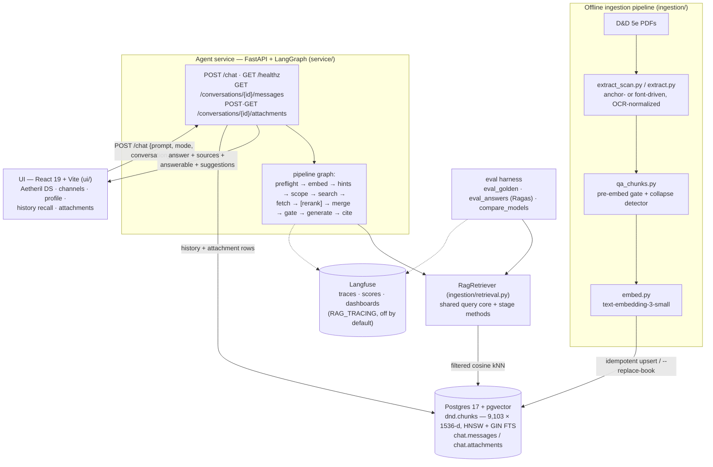
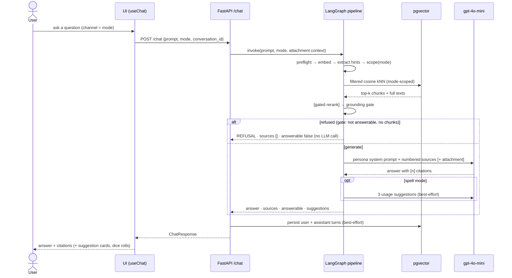
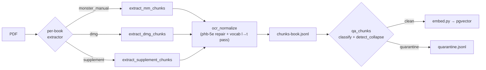

# D&D 5e RAG (Aetheril) — Architecture

A retrieval-augmented chat app for D&D 5th Edition. A user picks a **channel** (Sage · Spell ·
Rules · GM — each a persona with its own retrieval scope), asks about a spell, monster, rule, or
piece of lore, and gets an answer grounded **only** in the ingested rulebook corpus (9,000+ chunks
across 12 5E books in pgvector), with citations — out-of-corpus questions are refused, not
hallucinated. Access is **invite-gated**: accounts are created only through one-time invite links,
every data endpoint requires a session, and conversations are private to their owner. Conversations
persist server-side, and uploaded files (`.txt`/`.md`/`.pdf`) ground subsequent answers in that
conversation.

> Last updated: 2026-07-26 (branch `feat/x5bz.2-invite-auth` — invite-gated auth)
> Deployed: Cloud Run + Cloud SQL, `game-guide-ai-cloud` / us-central1, IAM-locked (x5bz.1)
> Corpus 9,103 chunks / 12 books · retrieval Hit@1 83.3% (eval run 2026-06-15, pre-PHB-OCR-repair)

## System architecture


```mermaid
flowchart TB
    subgraph offline["Offline ingestion pipeline (ingestion/)"]
        direction LR
        PDFs["D&D 5e PDFs"] --> EX["extract_scan.py / extract.py<br/>anchor- or font-driven, OCR-normalized"]
        EX --> QA["qa_chunks.py<br/>pre-embed gate + collapse detector"]
        QA --> EM["embed.py<br/>text-embedding-3-small"]
    end

    DB[("Postgres 17 + pgvector<br/>dnd.chunks — 9,103 × 1536-d, HNSW + GIN FTS<br/>chat.messages / chat.attachments")]

    EM -->|idempotent upsert / --replace-book| DB

    subgraph svc["Agent service — FastAPI + LangGraph (service/)"]
        API["POST /chat · GET /healthz<br/>GET /conversations/{id}/messages<br/>POST·GET /conversations/{id}/attachments"]
        GRAPH["pipeline graph:<br/>preflight → embed → hints → scope → search →<br/>fetch → [rerank] → merge → gate → generate → cite"]
        API --> GRAPH
    end

    RET["RagRetriever (ingestion/retrieval.py)<br/>shared query core + stage methods"]
    EVAL["eval harness<br/>eval_golden · eval_answers (Ragas) · compare_models"]
    LF[("Langfuse<br/>traces · scores · dashboards<br/>(RAG_TRACING, off by default)")]

    UI["UI — React 19 + Vite (ui/)<br/>Aetheril DS · channels · profile ·<br/>history recall · attachments"]

    UI -->|"POST /chat {prompt, mode, conversation_id}"| API
    API -->|answer + sources + answerable + suggestions| UI
    GRAPH --> RET
    EVAL --> RET
    RET -->|filtered cosine kNN| DB
    API -->|history + attachment rows| DB
    GRAPH -.-> LF
    EVAL -.-> LF
```

## Request flow — `POST /chat`


```mermaid
sequenceDiagram
    actor User
    participant UI as UI (useChat)
    participant API as FastAPI /chat
    participant G as LangGraph pipeline
    participant DB as pgvector
    participant LLM as gpt-4o-mini

    User->>UI: ask a question (channel = mode)
    UI->>API: POST /chat {prompt, mode, conversation_id}
    API->>G: invoke(prompt, mode, attachment context)
    G->>G: preflight → embed → extract hints → scope(mode)
    G->>DB: filtered cosine kNN (mode-scoped)
    DB-->>G: top-k chunks + full texts
    G->>G: [gated rerank] → grounding gate
    alt refused (gate: not answerable, no chunks)
        G-->>API: REFUSAL · sources [] · answerable false (no LLM call)
    else generate
        G->>LLM: persona system prompt + numbered sources [+ attachment]
        LLM-->>G: answer with [n] citations
        opt spell mode
            G->>LLM: 3 usage suggestions (best-effort)
        end
        G-->>API: answer · sources · answerable · suggestions
    end
    API->>DB: persist user + assistant turns (best-effort)
    API-->>UI: ChatResponse
    UI-->>User: answer + citations (+ suggestion cards, dice rolls)
```

Gate rules: `sage`/`spell`/`rules` require top-1 cosine distance ≤ 0.50 **and** chunks;
`gm` proceeds with any chunks (creative mode); a conversation **attachment** relaxes the gate
entirely (an off-corpus "what does my homebrew doc say?" must generate). In `gm` mode the graph
also fans out to a stubbed **secondary world-corpus retriever** seam and merges by state.

## Ingestion pipeline (offline)


```mermaid
flowchart LR
    PDF["PDF"] --> EXT{"per-book<br/>extractor"}
    EXT -->|monster_manual| MM["extract_mm_chunks"]
    EXT -->|dmg| DMG["extract_dmg_chunks"]
    EXT -->|supplement| SUP["extract_supplement_chunks"]
    MM --> NORM["ocr_normalize<br/>(phb-5e repair + vocab l→t pass)"]
    DMG --> NORM
    SUP --> NORM
    NORM --> JSONL["chunks-book.jsonl"]
    JSONL --> QA{"qa_chunks<br/>classify + detect_collapse"}
    QA -->|clean| EMB["embed.py → pgvector"]
    QA -->|quarantine| Q["quarantine.jsonl"]
```

## Components

### Offline ingestion pipeline (`ingestion/` — [README](../ingestion/README.md))

Turns damaged OCR scans and born-digital PDFs into clean, typed, embedded chunks.
`extract_scan.py` anchors on textual structure (Armor Class / rarity / spell-level lines);
`ocr_normalize.py` repairs the PHB scan's systematic garble (incl. the vocabulary-checked l→t
pass fed by `build_vocab.py`); `qa_chunks.py` quarantines failure signatures pre-embedding;
`embed.py` upserts with `--replace-book`; `ingest_books.py` orchestrates the lot.

### Vector DB (`vector-db/` — [README](../vector-db/README.md))

- **Postgres 17 + pgvector.** Corpus schema in `vector-db/init/`: `01-extensions.sql`,
  `02-schema.sql` (dnd.chunks + HNSW/GIN indexes), `03-hybrid-search.sql`.
- **Application schema is ordered migrations in `service/sql/migrations/`**
  (`0001_chat_schema.sql`, `0002_auth_schema.sql`, `0003_jobs_outbox.sql`, …) — one
  definition and one path: `service/migrations.py` applies what a database has not
  seen, once, under an advisory lock, before the service serves anything, and
  records each file's checksum in `app.schema_migrations`. A fresh database and an
  old one converge; drift stops startup. The files ship inside the installed
  package. Database access goes through a bounded connection gate (plus a small pool
  for the realtime path) and one transaction boundary (`service/db.py`); multi-step
  writes enqueue their follow-up work in the same
  transaction (`service/jobs.py`). See [migrations.md](migrations.md).
- `dnd.hybrid_search()` (vector+FTS RRF) exists but is **not adopted** — tied Hit@1, slightly
  worse Recall@10 (3q3). `verify_db.py` is an insert+kNN smoke test.

### Retrieval core (shared)

**`ingestion/retrieval.py` — `RagRetriever`** is the single retrieval brain used by both the
service graph and the evals: embed → detect class/entity/content-type hints against the corpus
vocabulary (generic-entity stoplist + ≥3-char entity floor + stemmed ILIKE) → filtered cosine
kNN → full-text fetch → answerability by top-1 distance. **`ingestion/scope.py`** maps mode →
(content-type, book) filters; **`ingestion/rerank.py`** gates the optional cross-encoder to
prose categories. Default mode is pure filtered vector.

### Agent service (`service/` — [README](../service/README.md))

- **`graph.py`** — the whole request pipeline as a LangGraph `StateGraph`; every stage is a
  traceable node (preflight, embed, extract_hints, scope, search, fetch_texts, rerank, merge,
  gate, generate, suggest, cite, refuse). **`rag.py`** is invoke + response mapping plus the
  injection seams (retriever, reranker, LLM client, secondary retriever).
- **`generate.py`** — per-channel persona prompts; grounded generation over **full** chunk
  texts; spell-usage suggestions (best-effort second LLM call); deduped `Source` citations.
- **`history.py`** — server-side conversation persistence (best-effort writes: history failure
  never fails an answer). **`attachments.py`** — upload text extraction + caps; attachment text
  is injected as a sibling context source and cited.
- **`tracing.py`** — env-gated Langfuse tracing (`RAG_TRACING`, off by default): node-level
  spans, token/cost, tagged model/version/mode. See [`observability/OVERVIEW.md`](observability/OVERVIEW.md).
- **Auth (x5bz.2)** — `auth_store.py` (users + invites in the `auth` schema, argon2 via
  `hashing.py`, atomic single-use invite redemption), `session.py` (itsdangerous-signed
  httpOnly session cookie carrying user id + role), `invites.py` (redeemability rules),
  `admin_invites.py` (operator CLI: create/list/revoke). `require_session` guards `/chat`,
  `/conversations/*` and `/auth/me`; `/healthz` and `/metrics/ui` stay open. The service
  **fails closed** if `SESSION_SECRET` is unset. Every auth-store call goes through
  `_auth_lookup`, so a backend that breaks *after* startup answers **503**, never 500 —
  "retry later", not "this request is broken". Design rationale:
  [`adr/invite-auth.md`](adr/invite-auth.md); incident response: [`deploy-gcp.md`](deploy-gcp.md) §10.
- Contract: `ChatRequest{prompt, mode, conversation_id}` → `ChatResponse{answer, sources[],
  answerable, mode, conversation_id, suggestions?}`. Errors: **401 no/expired session** ·
  **403 wrong role (GM channel) or another user's conversation** · 422 validation ·
  502 LLM upstream · 503 backend unavailable · 500 bug; a refusal is a **200** with
  `answerable=false`.

### UI (`ui/` — [README](../ui/README.md))

**React 19 + Vite**, bun-managed, on the **Aetheril design system** (`ui/src/ds/` — Material 3
token layer, warm fantasy palette, light *Parchment* / dark *Tavern*, 10 components, Storybook).
Shell: **Login / Signup** → Landing → Workspace (TopBar brand · **AppHeader channel switcher**
with per-channel accents · LeftNav conversations + UserMenu · ChatPane) + Profile screen.
`App` gates on the session check (`GET /auth/me`), which has four outcomes: *checking* holds a
loading gate, *authenticated* enters the app, **401 — and only 401 —** renders Login, or
**Signup** when the URL carries an invite (`/#invite=<token>` — a root-path link whose token
rides in the URL **fragment**, so it never reaches the server or its request logs; there is no
client router and the built SPA 404s on deeper paths). Anything else (5xx, network failure)
is *unavailable*: a retry screen, not Login — the session may be perfectly valid, and signing
in again would need the same backend that just failed. Identity and role come from the server session;
the GM channel is still hidden in the UI for DMs, but the **server** is what enforces it.
`useChat` recalls stored history; ChatPane uploads attachments; spell answers render suggestion
cards; dice notation renders `DiceRoll`. `api.ts` mirrors `service/models.py` exactly (refusals
are not errors) and sends `credentials:'include'` on every call. Conversation list/titles remain
client-side; display name + avatar tone are local cosmetics.

### Packaging

The repo is an installable package (`pyproject.toml`: packages `service`+`ingestion`,
py-module `config`; extras `test` / `eval` / `rerank` / `extract`). `docker compose up --build`
→ `vector-db` + `service` + `ui` (nginx, :5173); or a single `uvicorn` process serves the built
`ui/dist` plus the API on :8000.

## Campaign schema (GM Workbench)

Storage for the Workbench, added by `1kg.2.1`. Migrations `0004`–`0006`, with
`0009` making a participant **an account's seat at a campaign** (bead `fma`, the
owner's decisions D-1 and D-4: every player holds an account and there are no
guests); stores in `service/campaign_store.py`, `service/participant_store.py`,
`service/table_session_store.py` and `service/audit_log.py`. `1kg.2.2` added
`0012` (the GM's confirmation, offers by address and blocks), the
`service/seat_offer_store.py` store and two routers: `service/campaigns_api.py`,
the GM's campaigns and seats on the `dm`-gated Workbench router, and
`service/seats_api.py`, an account's own offers and seats on `account_router`
(`/seats`, which a player reaches). `1kg.2.3` added the live table session's
lifecycle (`service/table_sessions.py`) and, in its second pull request, two
more route modules: `service/table_session_api.py`, the GM's Start, End, Rotate,
status read and per-screen revoke on the `dm`-gated router, and
`service/table_api.py`, the first `/table/` routes — screen mode's mint and
Leave — on a table router of their own (see *Workbench routes* below).

A seat is **open** (an alias the GM seated while preparing, no account),
**accepted** (by an account), **confirmed** (the GM confirmed who accepted,
`confirmed_at`, D-12 and SEC-50(5)) or **removed** (marked, never deleted).
**The GM offers a seat to an address, never to an account** (D-12): the offer
is a `seat_offers` row, making it reads no account row and no block, and it
**binds to an account only at acceptance**, when the accept route composes the
participant store's `offer` and `accept` in one transaction — so the store's
"offered" row state is transient and never committed. Only a Verified account
whose verified address is the offer's may see or accept it, which on this build
is nobody until `yje.2.1` (`auth_store.verified_address` fails closed). Until
the GM confirms, a seat gets the table slot only (SEC-41's `own_slot` reads
`confirmed_at`). Only an offer followed by that same account's acceptance moves
a seat forward: there is no claiming an open seat by
possession of a link or a code, because that would be the retired enrolment
code under a new name, and a GM is never offered a seat in their own campaign.
Every refusal is one `SeatUnavailable` with a fixed message that names nothing.
The store takes no campaign lock and advances no `authz_revision`; the route
that composes an acceptance (`1kg.2.2`) does both, as for `add` and confirm
(RQ-4, RQ-10). Archive narrows a live session first without the lock and then
changes the fact under it (RQ-5); Remove is a revocation that never takes the
lock, asks for the password (SEC-40) and leaves one `campaign.reconcile` job
(`service/reconciliation.py`) that advances the revision. The single-use enrolment code and the device credential are
retired, and `0009` drops their tables.

### The tables

| Table | Holds | The rule that shapes it |
|---|---|---|
| `campaign.campaigns` | a GM's table: owner, name, created/updated/archived | owner is `NOT NULL` and cascades from `auth.users` |
| `campaign.authz_state` | `authz_revision`, and `lock_token` (never written) | an `AFTER INSERT` trigger on `campaigns` creates it, so no path can leave a campaign without one (RQ-1) |
| `campaign.participants` | a seat: alias, `alias_key`, created, `removed_at`, and (`0009`) the account it is offered to (`user_id`) and when that account accepted it (`accepted_at`) | marked removed, never deleted; the alias is unique within the campaign among seats that are not removed, compared over an `alias_key` the **application** computes (NFKC then `casefold`) so that PostgreSQL's `lower()` and Python's cannot disagree; an account holds at most one live seat per campaign (a partial unique index); `user_id` is `ON DELETE NO ACTION`, so deleting an account that holds a seat, removed or not, is refused until account deletion handles seats (`agent-forge-harness-zkc`); a CHECK keeps an accepted seat from having no account |
| `campaign.table_sessions` | a GM running a table now | at most one `live` session **per GM across campaigns** (a partial unique index), both epochs, and `link_generation`, which **is the admission generation** (SEC-42; renamed in prose only); `start_command_id` (one session per start command per campaign, a partial unique index, so a retried Start answers its session) and `rotate_command_id` (no index: it is read from the row its Rotate already holds, and an index would make Rotate block every screen-grant insert, RQ-3), both from `0016`; `(campaign_id, gm_user_id)` references `campaigns (id, owner_id)`, so the GM **is** the owner (AUD-1); `state` and `ended_at` are kept in step by a CHECK, and a row still `live` past `expires_at` is dead to every reader |
| `campaign.table_credentials` | a **screen grant**: a browser the owner made a table screen (SEC-48, D-13) | bound to the admission generation it was minted in; live only while unrevoked, its session live and unexpired, and its generation the session's current one — the reader's test, never `revoked_at` alone (`1kg.2.3`). The table link and the join are gone (threat model section 15), and `0012` dropped the join counter |
| `campaign.reveal_disclosures` | one Confirm's worth of display: a document, the version it pins, a sorted mask of field keys and the audience kind (`0018`, `1kg.7.1`) | at most one **live** disclosure per document (a partial unique index); `(session_id, command_id)` unique, the Confirm's replay key; its session and its document are both of its campaign and its version is one of its document's (composite keys); `ended_at`/`ended_reason` set together, from a closed set; ended rows are kept for replay only |
| `campaign.reveal_slots` | one audience slot of one session: the table slot or one participant's, and the disclosure it shows (`0018`) | one row per slot per session; one pointer, so a slot shows at most one live projection; it points only at a disclosure of its own session and audience kind; `seq` rises by one each time its content changes; no delete action toward the disclosure, so a shown document cannot be deleted until it is narrowed |
| `audit.events` | one recorded decision | append-only; `campaign_id_tombstone` has **no** foreign key, so rows outlive their campaign |
| `campaign.field_eligibility` | one classified field of a document (`0019`, `1ir.2.1`): the flat field key, its class, a principal list for `participants` / `characters` / `groups`, and who set it (`gm` or `default`) | a revealable field with **no row is unclassified**, and a reset deletes the row; a key off the type's allowlist has no row and is `gm_only` by construction, and an orphan row is ignored (ED-5, ED-24); the key is never `all` (ED-8); only a `gm` row is wider than `gm_only` (ED-7); the list is 1 to 100 ids, strictly ascending, each checked live in this campaign when written; `(document_id, campaign_id)` → `documents`, cascading |
| `campaign.groups` | a GM's named group of seats (`0019`, O-3) | the name is private GM text under the alias rules, unique among live groups by `name_fold` (a partial index); marked removed, never deleted, because a disclosure will remember its group; at most 50 live per campaign |
| `campaign.group_members` | a seat in a group (`0019`) | removal is a DELETE; `(group_id, campaign_id)` and `(participant_id, campaign_id)` are composite foreign keys; a removed seat's row stays and is never read for it |
| `campaign.projection_queue` | a field whose table-namespace rows the projector must rebuild, stamped with the `authz_revision` that queued it (`0019`) | written only by `advance_authz_revision(project=...)`; ids and a key, never a class, a list or text; drained by the projector (`1ir.2.3`) |

### The uncampaigned state

`chat.conversations.campaign_id` is nullable, and **`NULL` is the documented
uncampaigned state**: every conversation that existed before `0006`, and plain
chat from now on. Nothing about `/chat` changes because the column exists;
`service/history.py` is untouched and reading or writing the new columns is
`1kg.2.4`'s.

The reference takes **no delete action**, and is `DEFERRABLE INITIALLY
DEFERRED`. Until `1kg.2.6` decides whether deleting a campaign detaches its
conversations or refuses while any remain, the database refuses — so nothing is
silently detached. One consequence is worth knowing before it is met in a
traceback: if user V has a conversation linked to user U's campaign, **deleting
the account U fails**.

Deferring the check is what makes the *owner's own* conversations a determinate
case. Checked immediately, the answer depended on the firing order of two
referential-integrity triggers on `auth.users`, whose names embed an OID
rendered as text — so a freshly initialised cluster cascaded and a long-lived
one, whose OID counter has six digits, would have refused the same delete.
Checked at commit, the owner's conversations have already gone with the user
cascade and there is nothing left to check: **deleting an account takes its
campaigns and its own conversations with it, everywhere**.

### Conversations

`service/conversation_store.py` (`1kg.2.4`) makes a conversation's **identity and
metadata** server-authoritative. What that does and does not mean:

**Server-authoritative:** the id, the title, the campaign link, the archive flag
and the channel the conversation was started in. A conversation created through
the store is minted server-side — `cnv_` plus 16 CSPRNG bytes, 26 characters,
SEC-4's floor — and exists in `chat.conversations` with its owner from that
moment, so it is in its owner's index immediately and survives a reload or a
second device.

**Not server-authoritative, and deliberately:** the id of every conversation that
already exists. A client-minted `crypto.randomUUID()` is a valid conversation id,
on every route, forever, with no deprecation and no warning. `conversation_id`
carries **no prefix `CHECK` and must never gain one** — which is also why a
conversation id is minted in `conversation_store.py` rather than joining
`service/campaign_identity.py`'s registry, whose members `0004` constrains.

**`POST /chat` is not modified by this work, at all.** A conversation the store
created already has its ownership row, so `claim_conversation`'s
`INSERT ... ON CONFLICT DO NOTHING` is a no-op and its `SELECT` returns that
owner; `create` leaves `selection_strategy`, `manual_alias` and
`catalog_revision` `NULL`, so the first turn still binds model affinity exactly
as it does today (`b8o.2`). Nothing here adds a statement to a request that makes
a model call.

**`started_mode` is the channel, bound once.** It records the channel a
conversation was *started* in — not the mode of a turn, which stays per turn on
`chat.messages.mode` — and it is bound first-writer-wins, like
`selection_strategy`. It is **`NULL` for every conversation that existed before
`0007`**, and that is the honest value rather than a migration in progress: the
channel was never recorded, so it is unknown. Nothing backfills it, nothing
guesses it, and **a chat turn never sets it**.

**`updated_at` moves on a metadata change, never on a chat turn.** The owner's
index orders by `COALESCE(updated_at, created_at) DESC, conversation_id DESC` —
the keys of `conversations_owner_recent_idx`, which is partial on
`archived_at IS NULL` because that is the default query. The consequence is
accepted and worth stating: the index is ordered by metadata changes, not by
recent activity. Ordering by activity would mean a new statement on `/chat`'s
request path.

**Archive is not deletion.** `archived_at` is reversible and destroys nothing.
There is no delete route and no delete store method here; conversation deletion
follows `agent-forge-harness-1ka.5`.

**Ownership is in the query**, every time: each method names the owner in the
same statement as the row, so a conversation that is not the caller's is
indistinguishable from one that does not exist. Where a request names a campaign
— creating inside one, or linking to one — the campaign is resolved **inside the
writing statement** (`... FROM campaign.campaigns WHERE id = %s AND owner_id = %s
AND archived_at IS NULL`) and zero rows written is the refusal. The `campaign_id`
edge is `DEFERRABLE INITIALLY DEFERRED`, so an integrity failure on it would
arrive at `COMMIT` — outside every `try` and after a route had composed its
answer — and no code here is allowed to catch one.

**The routes** (`service/conversations_api.py`, `1kg.2.4` A2) are
`GET|POST /conversations` and `GET|PATCH /conversations/{id}`, on a
`workbench_router` that imports nothing from `service/app.py`, which hands it
the GM gate. They take the Workbench posture from `agent-forge-harness-oe6`'s
scaffolding (*Workbench routes*, at the end of this file): the origin check on
a write, the one `401` body, the `dm` role, validation that answers
`validation_error_body` and never FastAPI's default 422, and **one `404`** for a
conversation that is missing, someone else's, never owned or unreadable. They
**never claim** a conversation. The contract is *The conversation family* in
[`workbench-wire-contract.md`](workbench-wire-contract.md).

**Two postures on one `/conversations` prefix.** The legacy routes —
`GET …/messages` and the attachment routes — keep what they answer today: a
`403` for a conversation that exists and is someone else's, and a claim on
first read of one with content (R-4, R-5). The new routes answer the generic
`404` and claim nothing. A prober can therefore still ask the old route what
the new one will not say; the threat model's §10 records that as accepted for
the pilot rather than leaving it silent.

### Digests, and what is private

The one bearer secret the table model keeps is the **screen grant** (SEC-48): 32
random bytes, of which only the lowercase-hex SHA-256 digest is stored
(`table_credentials.credential_digest`), and every lookup is an exact match on
the unique index over it (SEC-5). The table link token and the join credential
are retired (threat model section 15; `0016` dropped the link's digest, `1kg.2.3`).
A plain-text grant exists only as the return value of the one method that mints
it, and leaves the server only in the `Set-Cookie` of the answer that minted it. `argon2` (`service/hashing.py`) is deliberately
not used for these: they are 256-bit random values with nothing to brute-force,
and a slow hash on a route anyone can call is a denial-of-service lever.

An alias, a conversation title and a campaign name belong in no log line, no
exception, no URL and no audit row (SEC-20). Two different things work towards
that, and they are worth telling apart.

**In the stores it is enforced.** The records hide those fields from `repr()` —
a traceback is a log line — and every refusal names the rule or the key, never
the value. A test sweeps the whole store and audit surface for a canary alias,
title, secret and digest.

**In the ledger it is a closed vocabulary, not a shape rule.**
`0005_audit_events.sql` bounds lengths and types `actor_ref`, `object_ref` and
`campaign_id_tombstone` as free `TEXT` with no CHECK, so `service/audit_log` is
the enforcement — and what it enforces is ED-18(a)'s "closed, per-action
`detail` of ids, codes and keys". `ACTION_DETAIL` says, for each action, exactly
which keys a row of that action may carry and what each one is: a minted id of a
named prefix, one of a closed set of codes, a Workbench field key (ED-2), a
bounded list of them (which is how `1kg.7.1` will record a reveal's mask), a
whole number or a boolean. A key the registry does not list is refused, and the
refusal names neither the key nor the value.

**Two kinds are open by construction, and a caller has to know which.** A
`MintedId` accepts any well-formed body behind its prefix — the tombstone has no
foreign key (ED-26), so nothing can ask whether that row exists — and what it
closes is the prefix and the length. `FIELD_KEY(S)` is a shape: which keys a
document may have belongs to its type, and the ledger does not know the types,
so the caller recording a reveal's mask is the one that must check its keys
against the type's declared keys. Everything else is a closed set.

The columns beside `detail` are closed the same way: `campaign_id_tombstone` is
a minted `cmp_` id, the two references are minted ids or the GM's numeric user
id, `object_kind` is one of five `ObjectKind` members, `reason_code` is one of
the codes its own action declares, and `authz_revision` carries the same `>= 0`
the migration does. The rule this replaced was one shape test over every action
at once, and it could not tell a one-word alias from an identifier —
`{"alias": "Rook"}` passed it, and so did `object_kind="rook"`. Both are refused
now. No kind holds the client-minted command id a reveal row needs; `1kg.7.1`
decides how that is recorded. All of this is stricter than `jobs.check_payload`,
which admits any short string, because a job is read and deleted while an audit
row outlives everything it describes.

### The campaign lock

`UnitOfWork.lock_campaign(campaign_id, shared=...)` holds a campaign's
authorisation still for the rest of a transaction — `FOR SHARE` to read under it,
`FOR UPDATE` to change it — and `advance_authz_revision` is the only code that
writes `authz_revision`, refusing unless the caller holds the lock exclusively.

Three rules are enforced in both the PostgreSQL implementation and the in-memory
twin, so the two cannot disagree about which calls are refused: it is the
**first** lock a transaction takes, it is the **only** campaign that transaction
locks, and a shared holder never upgrades to exclusive in place. Who *blocks*
whom is the database's, and is tested there (`tests/test_campaign_db.py`).
`Database.transaction()` opens every transaction **explicitly READ COMMITTED**, so
no server, database or role default can change what the lock is reasoning about.

### The authorisation revision and the projection revision

Added by `1ir.2.1` (migration `0019`, the shared eligibility ADR's RQ-1 to
RQ-12, the live-session plan's section 4.3). This is the helper contract every
mutation that changes who may be shown something adopts.

**1. The pair is the whole helper.** `lock_campaign(campaign_id, shared=...)`
and `advance_authz_revision(campaign_id, *, project=())`. No other code writes
`authz_revision`. Outside the projector (`1ir.2.3`), no other code writes
`projection_revision` (`service/tests/test_eligibility.py` scans `service/`
for it). Rule 3 and the queue live inside `advance_authz_revision`, which is
refused unless the transaction holds the lock exclusively
(`require_exclusive_campaign_lock` is the same guard, for store writes).

**2. Who calls what.** Every future mutation adds a row.

| Mutation | Owner | Kind (ADR section 4) | Lock | Revision | Projection |
|---|---|---|---|---|---|
| Seat add; seat accept; seat confirm | `1kg.2.2` | locked widening | exclusive | same transaction | rule 3 |
| Seat offer; decline; block | `1kg.2.2` | none (widens nothing) | exclusive | **no** | — |
| Seat remove | `1kg.2.2` | revocation | **never** (step 1) | `campaign.reconcile` job | rule 3, in the job |
| Participant rename | — | none | no | **no** (RQ-10) | — |
| Character link (towards a seat) | the calling route (`1kg.2.2` Participants panel, `1kg.5.2` document side) | locked widening | exclusive | same transaction | rule 3 |
| Character unlink / relink | the calling route | fact-changing narrowing | step 1 never; step 2 exclusive | step 2, same transaction | rule 3 |
| Campaign archive / restore | `1kg.2.2` | narrowing (two steps) / widening | step 2 / exclusive | same transaction | rule 3 |
| Campaign deletion | `1kg.2.6` | fact-changing narrowing | step 1 never; step 2 exclusive | step 2 | rule 3 |
| Session start | `1kg.2.3` | locked widening | exclusive | same transaction | rule 3 |
| End, expiry, Rotate | `1kg.2.3` | revocation | **never** | `campaign.reconcile` job | rule 3, in the job |
| Screen mint, revoke, Leave | `1kg.2.3` | entitlement, not eligibility | as `1kg.2.3` ships them | **no** | — |
| Document archive / delete | `1kg.5.2` | fact-changing narrowing | step 1 never; step 2 exclusive | step 2 | rule 3 |
| Classification | `1ir.2.1` (`EligibilityMutations.classify`) | widening or narrowing | exclusive | same transaction | enqueue if the new class admits anyone, else rule 3 |
| Group create / rename | `1ir.2.1` | none | exclusive / none | **no** | — |
| Group member add | `1ir.2.1` | locked widening | exclusive | same transaction | rule 3 |
| Group member remove; group remove | `1ir.2.1` | fact-changing narrowing | step 1 never; step 2 exclusive | step 2 | rule 3 |
| The projector | `1ir.2.3` | none: it rebuilds rows | exclusive, in slices | **never** | sets `projection_revision := authz_revision` only in the slice that finds the queue empty |
| Approved version (future) | `1ir.2.3` or its successor | widening | exclusive | same transaction | enqueue |
| Enforcement on / off (future) | `1ir.11.1` | narrowing / locked widening | per M-3 / M-8 | same transaction (step 2) | rule 3 |
| ED-24 type migration (future) | the bead that first moves `DOC_TYPE_VERSION` | narrowing | step 1 never; step 2 exclusive | step 2 | rule 3 |
| Roles | — | **none exist** (D-5: ownership is the role; `owner_id` is never updated) | — | — | — |
| Device credentials | — | **retired** (D-4; `0009`) | — | — | — |
| Consent, attestation, announcement, pause writes (`1ir.3.x`, future) | — | they gate capture, not visibility (plan rule 1) | **never exclusively** | **never** | — |

A removed group is never restored; a restore would be a locked widening.

**3. RQ-5's departure, stated plainly.** A revocation (Remove, End, expiry,
Rotate) is effective first, without the lock. Its revision advances in the
`campaign.reconcile` job, not in the revocation's own transaction. Every reader
re-checks seat, session and grant directly (RQ-11), so the interval opens
nothing.

**4. Rule 3.** With no `project` items, `projection_revision` advances with
`authz_revision` **only when it equalled the old `authz_revision`**; with
items, it stays where it is and each item is queued in the same call, stamped
with the new revision. It never catches up: from `(authz 7, projection 7)`, a
widening with items gives `(8, 7)` and a queued item, and a following
narrowing with no items gives `(9, 7)`. Only the projector sets
`projection_revision := authz_revision`, and only in the slice that finds the
queue empty (RQ-8). The previous release's helper leaves `(8, 7)` with an empty
queue — work to do, not a failure. A campaign that existed before `0019` reads
`(n, 0)` for the same reason: there is no backfill.

**5. Lock order for these tables**, added to RQ-3's: `authz_state` → group row
/ eligibility row / membership row (and unlocked reads of documents and seats)
→ the advance, whose queue insert takes `FOR KEY SHARE` on the document → the
session row (`narrow`) → the outbox. A caller that passes `project=` advances
**before** it takes any session or slot row lock. `hold_group` is
`FOR NO KEY UPDATE`, so a rename in flight never blocks a member insert's
`FOR KEY SHARE`.

**6. The ED-24 hand-off.** A future type-migration step deletes orphan rows and
resets moved keys under the narrowing protocol. Until then evaluation ignores
orphans: the allowlist is checked before any row is read.

Nothing in `1ir.2.1` is reachable from HTTP, displayed, audited or enqueued:
`service/eligibility.py` takes an already-authorised `campaign_id`, and its two
required extension points — `TableNamespaceNarrowing` (empty until `1ir.2.3`)
and `ChangeRecorder` (the route bead's audit row, written in the mutating
transaction) — are passed by name, never defaulted.

### One setting interaction to know about

`CAMPAIGN_LOCK_TIMEOUT_S` is bounded 0.05–4 and must be **below**
`DB_POOL_TIMEOUT_S`, which is bounded 1–60: a request waiting for the campaign
lock is holding one of the gate's connections, so a lock wait that outlasts the
gate turns one contended campaign into a 503 for unrelated traffic. The
invariant holds two ways, so that no documented gate can stop the service from
starting. **Unset**, the lock timeout is *derived* from the gate — half of it,
capped at RQ-8's two seconds — and is below it by construction for every value
in 1–60. **Set**, it is checked against whatever the gate is, and one that is
not below it is refused by name at startup rather than in a traceback. The wait
reaches the server in whole milliseconds, which is that GUC's own unit; the
default on the default gate is still exactly 2 s.

Neither setting is read from the environment yet: nothing takes a campaign lock
in this bead, so `Database` derives the lock timeout from its own gate. The bead
that first takes one on a route passes `CampaignLockSettings.from_env(pool=...)`,
the way `service/app.py` already passes `PoolSettings.from_env()`. The
comparison is made in `Database.__init__` as well as in `from_env`, so it does
not wait for that bead: a `Database` built in code with a short gate is refused
at construction rather than silently keeping the default 2 s lock timeout.

A caller may also raise the transaction bound for one long piece of work
(`lock_campaign(..., transaction_timeout_s=...)`, and the same parameter on the
session and participant holds). The value is checked — from one millisecond to
600 seconds — in both units of work: PostgreSQL spells "no timeout" as `0` and
measures this setting in milliseconds, so an unchecked parameter could switch
off the very bound it exists to raise.

### Documents and their versions

`0008_document_schema.sql` adds two tables and `service/document_store.py` the
store over them (`1kg.5.1`). Eight Workbench routes in `service/documents_api.py`
(`1kg.5.2`) serve them — the library, create, read, field patch, history, a
version's content, restore and seal — under `/campaigns/{campaign_id}`, each
reading ownership first in its transaction and none taking the campaign lock;
the pure rules between the store and the wire are `service/document_wire.py`.
Three more, in `service/document_lifecycle_api.py`, archive, unarchive and
delete a document, and every one of their changes takes the lock: archive and
delete narrow the campaign's live table in a first transaction that never
takes it, then take it exclusively first in a second, re-read ownership under
it, change the document, narrow again, advance the authorisation revision and
write a content-free audit row (RQ-5; a lock timeout is "not applied yet",
never a job). Delete takes only an archived document and asks for the
password first, through the same re-authentication as a seat's Remove.

`campaign.documents` holds one document's **live** content as flat JSON, one
value per field key its type declares, plus the two counters. `campaign.document_versions`
holds its history. There is deliberately **no `campaign_id` on the version
table**: every statement against it joins through `campaign.documents` and names
the campaign in the same statement, so a version of another campaign's document
is indistinguishable from one that does not exist (SEC-2).

**The write revision is not the version number.** `write_revision` is the
concurrency token: every committed write advances it by one, and `field_revisions`
records which write last touched each key, so a conflict is decided **per field**
— a write is refused only when a key it *touches* has moved since its base.
A stale write touching untouched fields is **rebased by the store**: the patch is
merged over the row's current content under the row lock and the merged document
is re-validated before the commit, so nothing is left to the caller. A version
`number` is history: consecutive from 1, never reused, never renumbered, and the
current version is `MAX(number)` rather than a pointer column that could disagree
with the rows it names.

**Sealed means immutable; open means staging.** A burst of GM autosaves
accumulates into **one** open working version — `sealed_at IS NULL`, enforced by
a partial unique index — which is rewritten in place, so a document does not grow
a whole-document snapshot per pause. It is sealed by another author's write, by
ten minutes of idleness (`SEAL_IDLE_S`), or by an explicit `seal(...)` that a
route calls. Once sealed a version never changes: every `UPDATE` in the store
carries `AND sealed_at IS NULL`, and the module runs no `DELETE` against that
table at all. Every mutator takes `now`, so none of this needs a timer, a job or
a background sealer.

**Search folds in the application, as the alias does.** `name_key` and
`search_key` are computed by `service/document_store._fold` — control characters
to spaces, NFKC, `casefold`, whitespace collapsed — and stored, so PostgreSQL's
`lower()` and Python's cannot disagree about a final sigma or a dotted capital I.
A search matches `name`, `qualifier` and `tags` only, by `strpos` over the
already-folded column (never `ILIKE`, `lower()` or `LIKE`, which would need `%`
and `_` escaped in the term). `search_key` is **truncated** at 8,000 folded
characters, which is a known limit: a document with very many long tags stops
matching on its later ones, silently. There is **no dedicated search index in
v1** — the four campaign-scoped partial indexes bound the scan and pilot
campaigns hold hundreds of documents. Revisit it when one campaign passes about
5,000 documents; adding a `tsvector` column with a GIN index is a later pure
expansion that nothing here precludes.

**The character-sheet link** is one nullable `linked_participant_id` column with
a partial unique index: a sheet links to at most one participant and a
participant to at most one sheet (AUD-13, AUD-15). It is `ON DELETE SET NULL`
rather than `CASCADE`, which would destroy the sheet that AUD-16 says Remove
keeps; participants are marked removed and never deleted, so it never fires in
the application. **Nothing about visibility is stored on a document or a version**
(ED-6): a reveal's pin is `1kg.7.1`'s slot row and references
`(document_id, number)` from here.

**The library, restore, archive, delete and the link (slice B).**
`list_documents` answers one campaign's page: a category as a set of types,
Recent or Name A-Z ordered exactly as the library indexes key them (`COLLATE
"C"`, the id breaking ties), Active or Archived, and keyset pages anchored on a
document id whose sort key is looked up server-side. "Restore" is two things:
`restore` appends a sealed version equal to an earlier one (CANVAS-26, and a
no-op when the content already matches), while `set_archived(archived=False)`
un-archives (LIB-16); neither brings back a reveal. `delete` is LIB-18's hard
delete of the document and its whole history. `link_character_sheet`,
`unlink_character_sheet` and `sheet_for_participant` hold the document row and
only read the seat. **None of these takes the campaign lock or advances
`authz_revision`**: the two-step orchestration around archive, delete and unlink
(`narrow`, then the exclusive lock, the re-scan and the advance) belongs to the
routes that call them, `1kg.5.2` for documents and `1kg.2.2` for participants.

### What the table may see: disclosures and slots

`1kg.7.1` makes what the table may see **explicit server state**
(`service/reveal_store.py`, `service/reveal_scope.py`, migration `0018`). A
Confirm persists a **disclosure** — one Confirm's worth of display: a document,
the version it pins, the sorted mask of field keys and the kind of audience —
and points **slot rows** at it: the table slot, or one slot per participant
(owner decision O-3: a group display is per-recipient copies of one
disclosure). Nothing about visibility is on a document or a version (ED-6); the
pin is reached slot -> disclosure -> (document, version).

A Confirm is an **update** when the targets are exactly the slots the
document's live disclosure has (the old one ends `updated`), a **move**
otherwise (it ends `moved` and every copy outside the new set is cleared), and
it **replaces** another document's copy in each target slot (that disclosure
ends `replaced` only with its last copy). A target slot is re-pointed, never
cleared and then pointed, so its `seq` rises by exactly one. A narrowing clears
by **scope** (`reveal_scope`): every slot (End, expiry, Rotate, archive,
Stop-all), one member's slots (Remove, A-20), one document's copies (a Stop,
and later a document's archive, deletion or unlink), or none (audio off); the
default is every slot, so a caller that forgets over-clears.

**The fills and the service** (`service/reveals.py`). `narrow` and its
extension point carry a scope and the request's clock (`SlotClear = (unit,
session_id, scope, now)`), and **every production session store is built with
the fill** `reveals.slot_clear_for(PostgresRevealStore())` — `app.py`'s and
`campaigns_api.get_campaign_stores`'s — so every narrowing already shipped
clears exactly the displays it invalidates (RQ-7). `no_slots` stays, as the
empty one tests pass. `campaign.reconcile` is registered with
`reveals.make_reconcile_slots(...)`, which, under the exclusive campaign lock,
narrows each dead session's every slot and each live session's removed seats
as `reconciled`; `reconciliation.reconcile_slots` is the empty one tests pass.
Every production `narrow(` names `clears=` and `now=`, and
`service/tests/test_reveals.py` reads the source to prove it.

| Narrowing | Scope | `ended_reason` | Campaign lock |
|---|---|---|---|
| End (`_close`) | every slot | `gm_end` | never |
| Expiry — the job, found by End, or finalised by Start (`_close`) | every slot | `expired` | never |
| Rotate | every slot | `link_rotated` | never |
| Remove (`remove_seat`) | that member's slots (A-20) | `participant_removed` | never |
| Campaign archive, step 1 and step 2 | every slot | `campaign_archived` | step 2 only, exclusive |
| Group member remove, group remove (`1ir.2.1`), step 1 and step 2 | every slot (`NARROWED`, fail closed: a disclosure does not record its group until `1ir.2.x`) | `narrowed` | step 2 only, exclusive |
| A Stop of one document | that document's copies | `gm_stop` | never |
| Stop-all | every slot | `stop_all` | never |
| The reconciliation | a dead session's every slot; a live session's removed seats | `reconciled` | exclusive |
| `narrow` naming no scope | every slot (fail closed) | `narrowed` | — |
| Later: document archive, delete, unlink (`1kg.5.2`) | that document's copies | `document_archived`, `document_deleted`, `character_unlinked` | — |
| Later: table audio off (`1kg.8.6`, `1kg.8.7`) | no reveal slot | — | — |

A **Confirm** (`Reveals.display`) is a locked widening in a fixed order:
ownership read unlocked (one not-found answer for a stranger, and no lock
before it); replay unlocked; the courtesy check (not live, or a stale epoch, is
a conflict before any lock); the campaign lock **shared**; validation with
reads only — the document not archived, the version sealed, each masked key
revealable, present and non-empty by the contract's per-kind rule, and the
audience (active seats, or *Everyone seated* expanded here to the confirmed
ones); the session row, owner-scoped; replay and state again under it,
including a campaign archived meanwhile; the write and **one** epoch advance;
the audit rows (`reveal.displayed` or `reveal.updated`, and a `reveal.stopped`
per disclosure a move or a replacement took copies from). A **Stop** never
takes the campaign lock, is never refused for state, always advances the epoch,
writes one `reveal.stopped` per disclosure it took copies from (or one naming
its document), and commits before it reads the picture. Neither advances
`authz_revision`, enqueues a job or notifies. Deadlock victims are retried
three times, then busy; the races are proved against PostgreSQL in
`tests/test_reveal_db.py`. No HTTP route exists yet: `1kg.7.2` builds the
routes, the projection and the headers on this service.

| Invariant | Held by |
|---|---|
| I-1 a slot shows at most one live content | one pointer column; `UNIQUE NULLS NOT DISTINCT (session_id, participant_id)` |
| I-2 a document has at most one live disclosure | a partial unique index; the twin refuses too |
| I-3 a disclosure is the table slot or participant slots, never both | `audience_kind` in the slot -> disclosure key |
| I-4 every copy is in its disclosure's session and campaign | composite foreign keys |
| I-5 no slot points at an ended disclosure; a live disclosure has a copy | the store's writers; the test-only auditor `audit_reveal_invariants` |
| I-6 every write of a reveal row holds the session row | each writer takes it itself, `FOR NO KEY UPDATE`; none calls `lock_campaign` |
| I-7 every explicit lock is `FOR NO KEY UPDATE`; no UPDATE changes a key column | only `seq`, `disclosure_id`, `updated_at`, `ended_at`, `ended_reason` are updated |
| I-8 no visibility column on `documents` or `document_versions` | the schema test reads `information_schema` |
| I-9 no reveal row, `repr()` or refusal carries text | ids, versions, mask keys and codes only; the command id is hidden from `repr()` |
| I-10 a slot's `seq` rises by one exactly when its content changes | the shared write and clear |
| I-11 `picture` and both views gate on `state = 'live' AND expires_at > :now` | the application's clock; `by_command`, `live_for_document`, `live_disclosures` and `stale_slots` read dead sessions by design |
| I-12 an own slot is read only for an accepted, confirmed, not-removed seat | `view_for_account`, in the query that finds the session (SEC-41) |
| I-13 **ended disclosures are read by replay only** (`by_command`) | a source scan; never to seed a mask (REVEAL-4), never as a ledger (ED-18) |
| I-14 no default mask is read | a source scan |

A copy for a seat that is not yet confirmed is **held, not stored as held**: it
is written like any copy, the GM's picture marks it `held`, and
`view_for_account` never returns it, because the own slot is joined only for a
confirmed seat. Confirming the seat delivers it from the next read (D-12,
SEC-50(5)). A screen sees the table slot only (SEC-48), and `view_for_screen`
names the campaign, so a live grant read under another campaign is the one
`None` (SEC-46). `participant_id`, `slot_id`, `disclosure_id`, `document_id`
and `version` are GM-side and never reach a table client; `1kg.7.2` builds the
projection from them with its one builder.

## Media assets (GM Workbench)

Storage for a GM's images and audio, added by `1kg.8.1.1` (slice a of `1kg.8.1`):
the media migration (`*_media_assets.sql`), the asset store in `service/asset_store.py`
and the object store in `service/media_objects.py`; then the upload routes of
`1kg.8.1.2` (slice b, below). **It ships dark.** The routes match nothing while
`WORKBENCH_MEDIA_ENABLED` is off (the default), and no store is built or job
kind registered unless `WORKBENCH_MEDIA_STORE` names one. Switching the
capability on is the owner's decision (Q-5), and the $10 cap must rise first.

### The tables

| Table | Holds | The rule that shapes it |
|---|---|---|
| `campaign.assets` | one asset: its kind, what was declared (type, size, alt text), what the server measured (type, size, and dimensions or duration), a state, a failure reason, the command id that created it, and two object keys | never bytes and never a filename; `campaign_id` is **`ON DELETE NO ACTION`**; every CHECK mirrors the wire `Asset` validator, so every row a GM can read converts to a valid `Asset`; one index, `(campaign_id, state)`, and a partial unique index on `(campaign_id, created_command_id)` |
| `campaign.media_usage` | per campaign, `bytes_reserved` and `asset_count` | a table of its own so that quota writes never contend on the campaign row; an `AFTER INSERT` trigger on `campaigns` writes it, and the migration backfilled every existing campaign; cascades with its campaign |

**The states** (MS-3): `uploading` -> `processing` -> `ready` or `failed`;
`processing` may return to `uploading` (MS-6's retry after a queue timeout); any
of those four -> `deleted`, a storage-only **tombstone** the wire contract never
carries. A tombstone keeps no alt text and no measured value, by the database's
own CHECK. The machine is the store's and it is total: a mutator holds its row
(`FOR NO KEY UPDATE`), then decides. Anything that is not the caller's live
asset (missing, another owner's, another campaign's, or a tombstone) is one
`MissingParent` with one fixed message; `IllegalTransition` is raised only for
the caller's own live asset in the wrong state. Every entry into `uploading` or
`processing` enqueues that state's deadline sweep (`asset.sweep_stuck`).

**A key** is `tmp/<32 hex>` for an upload in flight, `assets/<32 hex>` for the
processed original, or `assets/<32 hex>/<name>` for a derivative (`1kg.8.2`).
The hex is 16 CSPRNG bytes minted independently of every input and of the other
key, at insert, and never updated (a column of a non-partial unique index is a
key column, so an update would take `FOR UPDATE`). A key is **not** a name, an
owner, a campaign or a capability: the asset row is the only map from an owner
to a key (MS-2), and no job payload carries a campaign id. The object store
checks one key grammar before any I/O and refuses everything else with one
fixed message.

**The usage invariant**, after every write: `bytes_reserved` is the sum of the
campaign's reservations (the declared size while `uploading` or `processing`,
the real size once `ready`, nothing once `failed` or `deleted`), and
`asset_count` counts the rows in `uploading`, `processing` or `ready`. Every
write to it is one conditional `UPDATE` or an exact subtraction. A create
inserts its row first, inside a savepoint, and only then reserves, so a replayed
command returns its first asset without reserving anything even when the quota
is now full, and a quota refusal rolls back to the savepoint and leaves the
caller's transaction usable. The loser of two racing reservations changes
nothing only because `Database.transaction()` runs READ COMMITTED.

### Locks, ownership and deletion

**The lock order**, which every path keeps: (0) `create` only, the campaign row
`FOR KEY SHARE` in its ownership check, so a create that loses to the campaign's
deletion answers `MissingParent` rather than a foreign-key violation; (1) the
asset row or rows; (2) `media_usage`; (3) the outbox enqueue, **always last**,
because a dedupe-keyed enqueue waits on another transaction's uncommitted job of
the same key. Every path calls `note_row_lock()` and bounds its transaction
before its first lock. Nothing takes `authz_state` or advances `authz_revision`
(an asset has no eligibility of its own, ED-19), and no statement takes
`FOR UPDATE`.

**Two ownership fragments.** Every GM statement names its campaign and, through
`GM_CAMPAIGNS`, the caller as its owner; `yje.2.1` adds the identity ADR's
section 8.1 conjunct (the owner is Verified) there. The campaign primitive alone
uses `OWNER_CAMPAIGNS`, which must **never** gain that conjunct: once a Deleted
GM's campaigns are unavailable, a primitive scoped by the GM fragment would
match nothing and `NO ACTION` would refuse that GM's erasure (`zkc`) for ever.
`tests/test_asset_db.py` checks every statement by the fragment's name, since
the two are the same text until then.

**Deletion.** A GM's delete writes the tombstone, releases the reservation and,
last, enqueues `asset.delete` with `{asset_id, object_key, tmp_key}` and the
asset id as its dedupe key; it returns the job id, and the route (slice c)
hands it to `job_driver.run_after_response`. The handler deletes the objects
and then purges the row (below). **A campaign's deletion** (`1kg.2.6`) must stop
creates first (the store's docstring names one way: lock the campaign row after
`lock_campaign(exclusive)`), then call `delete_campaign_assets`, the primitive:
one owner-scoped `DELETE ... RETURNING` removes every row, the usage is reduced
by exactly what it returned (never zeroed), and one `asset.delete` is enqueued
per removed row that was not already a tombstone. Only then can the campaign row
go; PostgreSQL refuses it, directly or through the account cascade, while any
asset row remains.

### The three jobs (`service/asset_jobs.py`)

`register_jobs(runner, ...)` registers all three kinds; `_build_stores` calls it
when a store is configured, whatever the capability switch says (a deployment
switched off still owes its deletions), and with no store configured nothing is
registered. Every handler
re-reads current state and uses nothing from its payload beyond the ids and keys
it names. **No handler holds a database connection while it calls the object
store**, and every call goes through `via_store`. A handler whose advisory
`JobContext` runs out part-way raises `JobOutOfTime` and is retried; it never
returns early as success, because the runner would then complete, and so
delete, a job that still had work to do. The system statements (the sweep's
read and fenced write, the purge, and the reconcile's key lookup) live in this
module only; they name an asset by its globally unique id.

| Kind | Seeded by | Payload, dedupe key | What it does |
|---|---|---|---|
| `asset.delete` | a GM's delete, and the campaign primitive | `{asset_id, object_key, tmp_key}`, the asset id | deletes the `tmp/` object, every derivative under `object_key/` page by page, then the original; then purges the row, but only while it is still the tombstone. The keys come from the payload, so the bytes go even after the primitive removed the row. Never marked dead (`max_attempts=None`) |
| `asset.sweep_stuck` | every entry into `uploading` (due 1 h later) or `processing` (10 min later), by that asset's own transition | `{asset_id}`, none | fails a row still in the state it read and past that state's bound `timed_out`, with an `UPDATE` fenced on the state and the `state_changed_at` it read; releases the reservation and deletes the objects **only if the fence changed the row**. A lost fence means another transition won, and the bytes are that path's. A row that read `failed` has its objects deleted, idempotently |
| `asset.reconcile_orphans` | `enqueue_reconcile(unit, ...)`; its periodic caller is `1kg.9.5`'s | `{}` or `{"after": <key>}`, none | walks `assets/` then `tmp/` in byte order strictly after its cursor, examining at most `RECONCILE_BATCH` objects, and deletes each examined object older than a day that no live row names (a derivative counts through its parent key). While more remain it enqueues one successor carrying the last key it examined; once the listing is exhausted it enqueues nothing |

**Why the reconcile chain ends.** The listing's bound counts objects examined,
not matches, so its cursor moves on even when every examined object is still
referenced; a pass over N objects is at most floor(N / `RECONCILE_BATCH`) + 1 runs,
because every run but the last examines exactly `RECONCILE_BATCH` objects (when
`assets/` ends exactly at the budget, one more run follows to look at `tmp/`,
even if it finds nothing there), and a new pass starts only when someone calls
`enqueue_reconcile`. No key is ever
reused, so an object no live row names now will never be named again, and the
lookup and the delete need no lock between them. Until `1kg.9.5` schedules it,
the bucket's own lifecycle rule for `tmp/` is production's backstop
(`docs/deploy-gcp.md` section 13).

### Settings, health, and what the table side does not do

`MediaSettings.from_env` reads `WORKBENCH_MEDIA_ENABLED` (strictly `true`,
`false`, `1`, `0` or unset; off by default) and `WORKBENCH_MEDIA_STORE` (unset
by default, meaning no store is built; `filesystem` with an absolute
`WORKBENCH_MEDIA_DIR`; `gcs` is refused by name until slice d; `memory` is built
in code only). "Off" means no route, no store, no bucket and no cost; the store
setting is separate from `enabled` because a deployment switched off must still
finish the deletions it owes. Every refusal names the variable, never its value.
The running service reads them once, at startup, through `startup_settings`,
which adds one rule: the capability cannot be on with no store (refused by
name, so startup fails loudly). Every object-store call outside `service/media_objects.py` goes through
`via_store`, where slice c puts the thread limiter. The store's health signal
for `1kg.9.2` is the read-only `reachable()`.

**Table reads never use this store** (SEC-44(2)). A table's slot resolver finds
its asset in its own `table_principal` query (SEC-16, SEC-41, `1kg.7.x`); the
asset store is GM-side and system-side only.

### Uploading (`service/assets_api.py`, `service/media_processing.py`)

Two Workbench routes on `workbench_router`, each a `MediaRoute` whose `matches`
answers `Match.NONE` while the capability is off, so the router goes on exactly
as for a path that does not exist, in every topology (`SchedulerRoute`'s
precedent; no catch-all). Serving the bytes and deleting an asset are slice c's.

| Route | Answers |
|---|---|
| `POST /campaigns/{campaign_id}/assets` | `201`, the `Asset`, `uploading`: the contract's caps checked and the declared size reserved against the quota before a byte is accepted; `409 cap_reached` when it does not fit; a replayed `command_id` answers the asset it made |
| `PUT /campaigns/{campaign_id}/assets/{asset_id}/bytes` | one raw body, `Content-Type` the declared type, `Content-Length` required (`411`). The answer is the `Asset` once processing has ended: `200` `ready`, or `failed` with its reason — `415` `unsupported_type`, `413` `too_large`, `422` any other |

**The bytes request, in order.** Ownership in the statement (the one 404), the
state (`409` unless `uploading`), the `Content-Type` against the declared type
(`415`). Then, with **no connection held**, the body streams to the asset's
`tmp/` key, counted: the first byte past `ASSET_MAX_BYTES[kind]` ends it
(`too_large`), a body longer or shorter than its `Content-Length` is
`unreadable`, and the first 16 bytes are judged by magic number before anything
is written (`unsupported_type`; SVG and GIF are refused). Then `processing`,
committed; a wait of at most 60 s for the one processing slot per instance, and
past it `503` with `Retry-After` while the asset returns to `uploading`; then the
processing itself in a subprocess (60 s wall clock, `RLIMIT_AS` 512 MB on POSIX,
an environment of `PATH` alone): images header-first against the pixel and side
caps and re-encoded within their family from the pixels alone, audio probed
(one audio stream; cover art dropped, other video refused; at most
`AMBIENCE_MAX_MS` — a one-shot's 30 s is the cue route's) and transcoded to MP3
with every tag, chapter and picture dropped. The processed object is written to
`assets/<hex>`, then `ready` or `failed` committed, then the `tmp/` object
deleted. When the final transition loses (the sweep or a tombstone won), the
object it wrote is deleted too.

**The proxies.** `ui/nginx.conf` gives the bytes path alone a regex location
with `client_max_body_size 20m`, `proxy_request_buffering off` and
`proxy_read_timeout 180s` (RT-10), and no `add_header`; every other
`/campaigns` request keeps the prefix location's settings. Production has no
nginx; Cloud Run's settings, ffmpeg and Pillow in both images, and the bucket are
`1kg.9.5`'s. CI installs ffmpeg for the tests (`.github/workflows/ci.yml`).

## Running it

```bash
cd repos/game-guide-ai
./scripts/up.sh                    # full stack → http://localhost:5173
# or single process (uvicorn serves the built UI + API together):
cd ui && bun run build && cd ..
uv run --with . uvicorn service.app:app --port 8000    # → http://localhost:8000

# offline pipeline (per book)
uv run --with '.[extract]' python ingestion/extract_scan.py "<pdf>" --book-slug <slug> --out ingestion/chunks-<slug>.jsonl
uv run python ingestion/qa_chunks.py ingestion/chunks-<slug>.jsonl
uv run --with "psycopg[binary]" --with openai python ingestion/embed.py --chunks ingestion/chunks-<slug>.clean.jsonl --replace-book

# evaluation (pure vector is the default; PYTHONUTF8=1 on Windows)
uv run --with "psycopg[binary]" --with openai python ingestion/eval_golden.py
uv run --with '.[eval]' python ingestion/eval_answers.py --limit 5
```

## Testing

Python: **pytest** from the repo root — `uv run --with '.[test]' python -m pytest -q`. Suites are
pure (no DB/LLM; retriever, LLM, and store faked): `service/tests/` (app, graph, history,
attachments, tracing), `ingestion/tests/` (extraction, QA gate, retrieval, scope, rerank, evals),
`tests/` (packaging + config invariants). UI: `bun run test` = jsdom unit tests + Storybook
browser tests (Playwright Chromium); `bun run typecheck` / `lint`.

## Current metrics (as of the 2026-06-15 eval run)

- **Corpus:** 9,103 chunks · 12 books · 4,395 distinct entities.
- **Retrieval:** Hit@1 83.3% · spell_lookup Hit@1 96% · Recall@10 94.3%.
- PHB OCR repair + re-ingest (PR #20, 2026-07-02) and the short-entity guard (#25) landed after
  this run; re-run `eval_golden.py` before quoting numbers.

## Known gaps / follow-ups (Beads)

- **x5bz.1.6** — open Cloud Run ingress to testers. The deployment is live but **IAM-locked**;
  opening it is deliberately gated on auth (x5bz.2) being verified in the deployed service.
- **x5bz.3** — cost guard + rate limiting on `/chat`; worth having before external traffic.
- **swe1.5** — notes/GM-lore nav (AppHeader slot reserved); was blocked on auth, now unblocked.
- **agent-forge-harness-1nh** — OCR Wayfinders + Blood Hunter (deferred; needs tesseract/ocrmypdf).
- **agent-forge-harness-ask** — `detect_collapse` false-positives on multi-form monsters; deep
  two-column MM tail.

## The conversation timeline (GM Workbench)

A conversation is read as **exchanges**, newest first: a turn carries its own
outcome, so a page boundary can never separate a prompt from its result. The
wire shapes are `service/workbench_contracts.py`'s (`TimelinePage`, `ChatEntry`,
`ChatAnswer`, `OpaqueEntry`); the read model is `service/timeline.py`, and every
statement it rests on is in `service/timeline_store.py` — the read model holds
no SQL at all, and a test walks its syntax tree to keep it that way.

**The legacy messages endpoint is unchanged.** `GET …/messages` returns exactly
what it returned before — same fields, same oldest-first order, same limit
semantics, same 403, same 503 — and keeps its cold-start claim. The timeline is
a second, additive read of the same rows: nothing is rewritten, backfilled or
deleted, and the read model writes nothing at all. Ownership is resolved through
`owner_of` in one read-only statement, in the same transaction as the read, and
a conversation that is missing, that has no ownership row, or that belongs to
another user is refused identically, from one code path (threat model §8.1,
SEC-2, SEC-3) — and it is never claimed. A legacy conversation whose id does not
fit the contract's `OpaqueId` shape (`^[A-Za-z0-9_-]{1,64}$`, which every id the
shipped UI mints does) is not readable through the timeline route — it answers
that same 404, before any statement runs — and remains readable through the
unchanged legacy route.

**Two sources, one order.** Turns taken after the durable timeline ships carry a
typed entry row; every older turn is **adapted** from its `chat.messages` rows,
with no backfill and no migration of old data. The two are merged by one total
key, descending `(created_at, source_rank, tiebreak)`, and a cursor carries each
source's position independently, because an item read but not taken from one
source must be re-read on the next page. The cursor is unpadded base64url and
encodes ids and times only — never a prompt, an answer or any search text (X-7).

**What an adapted row cannot know, it says with `null`.** `answerable` and
`sources` are `null` — *not recorded* — and never `true` or `[]`, which is what
the client used to invent for a row that never stored them. A legacy `entry_id`
is the decimal `chat.messages.id` of the exchange's oldest row (SEC-4 permits
it: it is only ever resolved inside a conversation the caller owns), so it can
never collide with a minted `ent_` id.

**Every row is read through `entry_or_opaque`.** A row this server cannot
validate — written by a newer version before a rollback, damaged, or carrying a
`mode` no contract knows (`chat.messages.mode` has no CHECK) — becomes an
`opaque` entry in the same place, carrying nothing of the payload. The stored
row is left untouched: never repaired, never rewritten, never dropped, so it
renders again after a roll-forward, and one bad row never takes a page down.
**404, and never a claim.** The route resolves ownership through `owner_of` in
one read-only statement inside the same transaction as the read, and a
conversation that is missing, has no ownership row, or belongs to another user
answers the **identical 404** — the Workbench scaffolding's one body, from
`not_found()` — from one code path (threat model §8.1, SEC-2, SEC-3). That is
deliberately unlike `GET …/messages`, which answers 403 and claims an unowned
conversation that has content — grandfathered, and left as it is. The route is
a Workbench route (`service/timeline_api.py`, see below): the router answers
every authentication failure with the one 401 body and requires the `dm` role
(SEC-2) before the handler reads anything; `limit` and `cursor` are validated
by the route and refused through the one validation handler, so FastAPI's
default 422 can never echo the request back (SEC-23); and it fails closed with
`backend_unavailable` when the store or the database is away.

**The typed entries.** `chat.timeline_entries` holds one row per exchange that
`POST /chat` answered once the durable timeline shipped. The row is the entry's
identity and time — `entry_id` (minted: `ent_` and 128 CSPRNG bits, SEC-4),
`created_at`, and `seq`, which only breaks ties — and `payload` is the validated
wire entry. The write refuses, before any statement runs, a payload that
disagrees with its own row, and anything the contract does not declare: a
document body, an assembled prompt, attachment text, a provider payload or an
owner's user id cannot ride along. No hash or digest of any text is stored
(ED-26). An entry goes with its conversation, and a conversation with its user.

**Two link columns, so no turn renders twice.** `user_message_id` and
`assistant_message_id` name the `chat.messages` rows the entry carries. A legacy
row an entry names is *covered*: it is never adapted again, and it closes any
exchange left open before it, so a lost answer can never pair with a later
turn's prompt. The rule is derived from data rather than from time, so it holds
under rollout, rollback and a failed write, with no watermark and no backfill.
The ids come from `MessageStore.append`'s return value — the one change to
`service/history.py` — never from a second query.

**Best-effort, after the answer.** The write runs after `svc.answer(...)` has
returned and both message rows are written, on one short transaction of its
own; nothing is held across the provider call and nothing is added before it.
It catches everything and logs one content-free line (the mode, the
conversation id and the exception's type), so it can never fail an answer or
change a byte of one. A turn whose entry could not be written — the contract
bounds sources, suggestions and text where `/chat`'s own models do not — reads
back adapted from its rows, with `answerable` and `sources` *not recorded*.

**The merged cursor.** A page is two bounded windows: `limit + 1` entry rows and
`2 * limit + 3` legacy rows. The legacy position moves past covered rows as well
as the exchanges a page takes, or a window full of covered rows would never
move; and while the legacy window comes back full, nothing older than its oldest
row is taken from either source, because an older exchange may still wait
below it. A page may therefore hold fewer entries than asked for — even none —
with a non-null `next_cursor`; the walk still ends, and it never loses, repeats
or reorders an entry.

**Session dividers** (`agent-forge-harness-1kg.3.5`). A `session_divider` entry
marks where a live table session started or ended in a thread, and `/recap`
reads a thread from its latest start. The server writes every divider; no client
and no route can. A Start that opened a session, and a closing whose outcome is
`ended` or `expired` (an End, an expiry, or a Rotate or End of an overdue
session), each enqueue one `timeline.session_divider` job `{session_id,
boundary}`, last in the transaction that made the transition, so End, Rotate
and expiry gain no lock, wait or refusal. A Rotate that rotated moves neither
boundary (REVEAL-17), and a replayed Start or a repeated End enqueues nothing.
The job (`service/session_dividers.py`, statements in
`service/session_divider_store.py`) writes one divider into each conversation of
the session's owner that is linked to the session's campaign, not archived and
created by the boundary's time: the newest 100. A divider's `created_at` is the
boundary's own time (`started_at`, or `ended_at`, which an expiry sets to
`expires_at`), however late the job runs. `0017`'s partial unique index and the
insert's matching conflict target keep one divider per thread, session and
boundary under every job repeat. Dividers are ordinary stored entries: they
page, reload and cascade like every other. Two consequences follow. A thread is
only a divider target once it is linked to a campaign, and nothing in the client
links one yet (`1kg.2.5`), so production writes no divider until it does; there
is no backfill. And a thread created or linked mid-session gets the `end`
without the `start`, so its recap reads from its beginning, which is not all
play when the thread was created before the Start and linked after it.

## Document generation (1kg.5.4)

`service/document_generation.py` turns a GM tool's request into a validated first
document. It is a **library with no route and no executor**: its one production caller
is `1kg.4.4`'s executor under `1kg.4.1`'s invocation API, which owns admission, the cost
guards, fencing and the `401`/`404`. It ships dark: nothing calls it until a tool is enabled.

- **Two halves.** `generate_document(request, client=, alias=, config=, max_attempts=,
  between_attempts=)` opens no unit of work. `persist_generated(unit, store, campaign_id,
  generated, now=)` runs inside the caller's unit — the one that settles the invocation —
  and makes no network call. No connection is held across a provider call (RQ-8), and a
  failed settle rolls the document back: there are no partial documents (X-6).
- **Generatable types** are the registry's tool targets: `npc`, `encounter` and
  `session-notes` (`GENERATION_SPECS`). Each spec names its tool, its basis (creative or
  summary), the keys it must fill, and the keys only the server sets (`session`, `date`,
  `present` for notes; `tags` and every asset key always). `field_catalog` and
  `validate_generated_fields` work for all eight types.
- **The data block.** Every untrusted text travels in one JSON payload between
  `<data id="NONCE">` tags, with a per-call nonce redrawn if the payload contains it.
  Controls and bidirectional overrides in context are replaced with U+FFFD. The payload is
  bounded at 24,000 code points and refused, never truncated, above it (`context_size`
  lets the caller fit first). Preset values never enter the prompt.
- **The envelope.** The model returns exactly `{"fields": {...}, "cited": [...]}`. The
  parser refuses duplicate keys, `NaN`, depth past six, undeclared keys, asset keys and any
  remote reference (`://`, `

    @router.get("/conversations")
    def index(session: SessionData = Depends(gm)) -> ConversationPage: ...

    return router
```

`gm_session` declares `Depends(require_session)` rather than calling it, so the
test suite's default-session override and E2E's overrides reach through it. It
is also the one place the `dm` rule lives: when `yje.4.1` replaces roles with
tiers, it is what changes.

**GM routes only.** `workbench_router` applies the `dm` gate, so it is for GM
routes and nothing else. A legacy route moved onto a router (`iu6`) goes on a
plain `APIRouter`, never this one, or its 401 and 422 bodies change.

**Table routes** (`service/table_api.py`, `1kg.2.3`; threat model SEC-44 to
SEC-49) are on a router of their own whose route class, `TableRoute`, is a
`WorkbenchRoute`: the one 401 body, the validation handler, the census and the
structural check all cover it. It asks for no role and no tier (SEC-41). Its
router-level dependencies are Fetch Metadata — a `Sec-Fetch-Site` present and
not `same-origin`, or `Sec-Fetch-Mode: navigate`, is `403 cross_site` before any
cookie is read (SEC-45) — and then `origin_check`. The principal is not a router
dependency: a live screen-grant cookie decides alone, and only without one is
the application's `require_session` called, directly (SEC-44), so a live screen
is never a 401 and Leave never is. `TableRoute` sets `forwards_cookie_deletion`,
the one attribute `handle_http_exception` reads to let a 401 carry a deleting
`Set-Cookie` and nothing else; it deletes a screen-grant cookie that is no longer
live on every answer from the principal step on, and adds `Cache-Control:
no-store` and `Cross-Origin-Resource-Policy: same-origin` to every answer. A
table route refuses with `inactive()` (SEC-46's one answer) and `cross_site()`,
built in `workbench_api` beside `not_found()`, and imports no GM route module
and no store of GM-private content (T-23, pinned by a test).

**The order of checks, as a client observes it.**

1. Malformed JSON under a JSON content type (`application/json` or `+json`),
   on a route that declares a body model, is a 422 with the Workbench
   validation body *before* the origin check and before authentication:
   FastAPI parses the body before it solves any dependency. Nothing has run
   and no resource is named, which SEC-3 permits in its own words. Any other
   content type reaches the origin check and is refused there. A route that
   reads its body by hand has no such case.
2. The origin check (state-changing methods only) → 403. This runs ahead of
   authentication by inference, not because SEC-3 lists it: an origin refusal
   names no resource and no account, and running it first refuses a forged
   request before an attacker-supplied cookie is looked up. It is structural
   (`workbench_router`'s dependency list); reversing it swaps two entries.
3. Authentication → the one 401 body.
4. Role → 403, naming no resource.
5. Ownership, in the statement → `not_found()`.
6. Validation that depends on the resource, then state (409) — so neither is
   reachable for a resource the caller does not own.

**The answers.**

| Case | Status | Body |
| --- | --- | --- |
| any authentication failure | 401 | `{"detail": "not signed in"}` — outside the envelope, see `workbench-wire-contract.md` |
| missing, someone else's, deleted | 404 | `not_found` / "That isn't available." |
| not a GM | 403 | `forbidden` / "This is a Game Master feature." |
| origin, fetch-site or content type | 403 | `forbidden` / "That request didn't come from this application." |
| a table route's caller who is not entitled | 404 | `inactive` / "There's no live table here." |
| a table route's Fetch Metadata | 403 | `cross_site` / "That request didn't come from this application." |
| validation | 422 | `validation_error_body(...)`, which echoes nothing; the log line carries `redacted_errors(...)`, the method and the route template |

`install_workbench(app)` registers the two application-wide handlers that make
this so. Every answer that is not a Workbench 401 or 422 — every legacy route,
every unknown path, every 405 — is produced by FastAPI's own default handler,
byte for byte; a golden-bytes test pins the legacy answers, and two identity
tests pin that the real app has both handlers installed.

**The origin rule.** For `POST`, `PUT`, `PATCH` and `DELETE`: an `Origin`, if
sent, must name the host the request was sent to (`Origin: null` is refused);
a `Sec-Fetch-Site`, if sent, must be `same-origin`; and a request that carries
a body must declare `application/json`. A request with neither header is not a
browser and is allowed. There is no CORS: no `Access-Control-*` header, and
`OPTIONS` is 405.

The host of `Origin` is compared with the `Host` header; the port only when
`Host` carries one, and the scheme never. The service cannot see its own
scheme (Cloud Run forwards HTTP) and nginx forwards `Host` without the
browser's port, so a stricter comparison would refuse every production and
every E2E request. The allow table, each row tested as a real 200:

| `Host` | `Origin` | Where it comes from |
| --- | --- | --- |
| `127.0.0.1` | `http://127.0.0.1:4173` | E2E through nginx (`proxy_set_header Host $host` drops the port) |
| `localhost:5173` | `http://localhost:5173` | the Vite dev proxy (string target, no `changeOrigin`) |
| `svc-xyz.a.run.app` | `https://svc-xyz.a.run.app` | Cloud Run (TLS ends at the edge) |
| `testserver` | none | not a browser |

*Residual:* where a proxy strips the port, a page on the same host at another
port or scheme passes the `Origin` comparison. That is unreachable in
production (one host, one port) and irrelevant in the E2E stack, and
`Sec-Fetch-Site`, which does compare scheme and port, is enforced whenever a
browser sends it. The reversal is a `WORKBENCH_ALLOWED_ORIGINS` setting.

**Enumerating routes.** `api_routes(app)` is the one way anything here reads
what the app serves. `app.routes` no longer is the route table —
`include_router` appends one private object and the included routes are not in
it — and `fastapi.routing.iter_route_contexts` yields route *contexts*, which
proxy `.path` and `.dependant` but are never an instance of `APIRoute`; the
route object is `ctx.original_route`. `app.openapi()["paths"]` is not used
either, because a route declared with `include_in_schema=False` is missing from
it. The route census, the auth-matrix walk, the proxy guard and the SPA-parity
walk all read the table this way, so a router-mounted route cannot land
unseen; the census fails until a new route's author declares it legacy or
Workbench. The auth-matrix walk reads `api_route_dependants(app)`, each route's
*effective* dependant: a guard passed to `include_router(..., dependencies=...)`
is there and never on the route object's own `.dependant`. The SPA fallback's
routes are left out by their `spa:` name prefix only; the `ui` mount is not an
API route and never appears.

**A route never builds its own 401, 403 or 404.** A structural check in
`service/tests/test_workbench_api.py` reads the syntax tree of every Workbench
route's endpoint module and refuses a 401/403/404 however it is spelled — a
literal, a `status` constant or an `HTTPStatus` member, on one line or split
across several, or handed to a helper of the module's own. The one exemption is a line
carrying `# workbench-api: deliberate-status` with a reason on the same
comment, for a switched-off capability that must answer exactly like a path
that does not exist (`1kg.8.1`'s dark routes). The repository's Python holds
none today, and the test asserts that count.

**Contract parity gates deploy.** The timeline route serves the Workbench
contract, so `contract-parity` is now one of `deploy`'s `needs` and a
top-level clause of its `if:` (see `docs/ci.md`).

## GM tool invocations (GM Workbench)

Bead `1kg.4.1`. A GM asks for a tool with a brief; the answer is a
`ToolInvocation` (`docs/workbench-wire-contract.md`, *The tool-invocation
family*). The rows are `service/tool_invocation_store.py`'s
(`campaign.tool_invocations`, and `campaign.tool_attempts`, **the admission
record**: one row per attempt, written before any provider work, holding no
token, price, alias or provider). The rules are `service/tool_invocations.py`'s;
the three routes are `service/tool_invocations_api.py`'s, on the Workbench
scaffolding.

**Off by default.** A tool runs only when `WORKBENCH_ENABLED_TOOLS` names it,
its registry capability is in `WORKBENCH_CAPABILITIES`, and an executor is
registered for it — and none is registered yet (`1kg.4.3`, `1kg.4.4` and
`1kg.8.3` add theirs). Availability is decided in one function,
`tool_availability`, which `1kg.9.6` replaces. Setting `WORKBENCH_ENABLED_TOOLS`
in production needs E-8's owner-chosen limits, the tool's `1kg.4.6` threshold
and the SEC-39 terms record; `portrait` and `map` are paid under D-3, so
`WORKBENCH_CAPABILITIES=image_generation` stays unset in production until
`yje.4.1`'s entitlement gate covers them. An unknown id in either variable
fails startup.

**Lifecycle.** A POST runs three steps. **T1** takes the GM's
`WORKBENCH_IN_FLIGHT` advisory lock first, decides ownership once (campaign,
conversation-in-campaign, source entry: any miss is the one 404), answers an
existing `invocation_id` by its stored state, then runs the guards — archived,
enabled, the model allowlist, the executor's precheck, the X-5 cap, the pilot
day, the per-user window, in that order, so no refused request spends a token
— and writes the timeline entry, the invocation and its attempt row. The
executor then runs with no connection held. **T2** takes the fence (still
`working`, still this attempt, before its deadline) and only through it stores
the outcome and runs the executor's `finish`, rewriting the entry in the same
transaction. A row past its deadline is settled by whichever path meets it
next (lazy expiry; there is no sweeper): `cancelled` if a cancel was asked for,
else `failed attempt_expired`. An attempt's deadline is 150 s from its start,
and every provider call an executor makes is bounded by what is left of it.

**One clock.** Every time the service writes or compares is the route's clock,
passed into SQL; no statement calls `now()`. The pilot day's chat half is
`calls_today()`'s own database day, so the two agree except within seconds of
UTC midnight.

**Cost guards.** The X-5 cap is two in-flight tool invocations per GM across
every campaign and instance, counted in PostgreSQL under the advisory lock;
`/chat` turns are not counted. The hourly window is `/chat`'s own per-user
window, so a GM who spends it on tools is throttled on `/chat` too. The pilot
day counts today's chat turns plus every GM's tool attempts against
`CHAT_DAILY_CAP`, while `/chat`'s own daily check is unchanged and does not
count tools. Two residuals follow, acceptable only because E-8 forbids enabling
any tool before the owner chooses the limits: once a tool is enabled, the
pilot's daily total can reach twice `CHAT_DAILY_CAP`; and admissions from
different GMs at the edge can overshoot, because the day check is serialised
per GM only. Each provider attempt is recorded in the cost ledger under the
operation `tool_invocation`, with the attempt row's `operation_id`.

**The model.** `resolve_tool_model` is the one place the server chooses the
model (D-8; bead `iov` gives it the tier mapping), and the client can send none.
`model_catalog.WORKBENCH_PROVIDERS` is the provider allowlist (SEC-39, S-5:
OpenAI only), enforced at admission and on the one client an executor can ask
for. No answer, entry or log line of these routes names a model or a provider
(D-9), and no tracing callback rides on a tool call (SEC-24).
