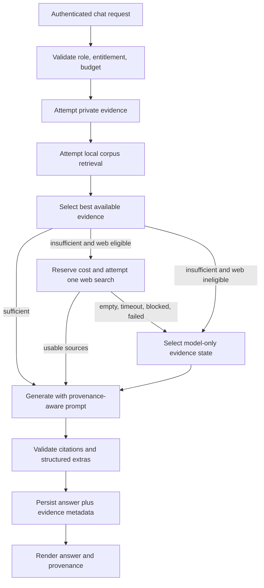

# Plan: additive retrieval and bounded web fallback

Date: 2026-09-16  
Epic: `agent-forge-harness-xiu`  
Status: proposed implementation plan, revised after [plan review](../reports/additive-retrieval-and-billing-plan-review.md)

## Outcome

Retrieval becomes an evidence enhancement, not permission to answer.

For every non-empty, authorized chat request, Aetheril should attempt the best
available evidence and then generate an answer. A corpus miss, embedding outage,
vector-search failure, reranker failure, or web-search failure must not by itself
turn chat off. The final response must accurately disclose which evidence tier
supported it and must never manufacture citations.

The intended order is:

1. user attachment and authorized campaign evidence;
2. local licensed rules corpus;
3. one privacy-safe, metered web lookup when the request is eligible and local
   evidence is insufficient;
4. model-only generation with an honest qualification.

Empty prompts, failed authentication/authorization, content-policy decisions,
unavailable generation models, and exhausted total account spend remain valid
reasons not to generate. They are not retrieval misses and must keep their own
error semantics.

## Why this is necessary

The current graph uses corpus answerability as the branch that decides whether
generation happens:

- `service/graph.py` routes Sage, Spell, and Rules to `refuse` unless retrieval
  returns both chunks and `answerable=True`;
- GM is more permissive but still refuses when retrieval returns no chunks, and
  a conversation attachment already bypasses the gate in every mode;
- `REFUSAL` is hard-coded as “I couldn't find that in the D&D 5e sources I
  have”;
- a missing embedding key or a retrieval-database error returns 503, while
  OpenAI embedding API failures (rate limit, timeout, 5xx) surface through the
  generation-error branch as 429/502, indistinguishable from generation
  failures; and
- the response exposes a binary `answerable` flag even though attachment,
  campaign, web, mixed, and model-only answers have different provenance.

This makes retrieval quality and availability load-bearing for the whole chat
product. It also confuses “not in this corpus” with “the assistant cannot help.”

The strict gate is also a documented product decision, not only an
implementation detail: `docs/ARCHITECTURE.md` promises answers grounded only in
the corpus, with out-of-corpus questions refused rather than hallucinated, and
the `dnd-agent-service` plan made the answerability gate its hallucination
mitigation. `xiu.1.1` therefore decides per mode from evidence; the existing
`service.chat.gate.answerable` metric already records the refusal rate by mode.
Any mode that stops refusing on a corpus miss explicitly supersedes that
promise.

Useful existing seams should be retained:

- the LangGraph stages and their trace boundaries;
- `RagRetriever`, optional reranker, mode scoping, and retrieval evaluations;
- attachment context;
- `SecondaryRetriever`, which is already the intended campaign/world seam;
- `ProviderClientFactory` and the model-routing initiative;
- server-side cost throttles and the privacy-bounded metrics registry; and
- best-effort spell suggestions and structured cards, which already demonstrate
  the correct “garnish must not fail the answer” posture.

## Product invariants

1. **A corpus miss never equals a chat failure.** It changes provenance and may
   trigger a bounded fallback.
2. **Local and private evidence wins.** Web search never replaces a good local,
   attachment, or campaign answer merely because it is available.
3. **Web search is mild.** At most one provider search operation is attempted per
   eligible turn in version 1, behind a short deadline and a cost reservation.
4. **Private text stays private.** Attachment and campaign content is not copied
   into a web query. A query that cannot be safely minimized does not search.
5. **Search failure is non-fatal.** Timeout, empty results, provider outage,
   policy rejection, circuit breaking, or search-budget exhaustion falls through
   to model-only generation.
6. **Provenance is explicit.** A response says whether it used local corpus,
   attachment, campaign, web, mixed, or model-only evidence.
7. **No evidence means no citations.** Model-only responses may explain their
   uncertainty but must not mimic corpus or web citation syntax.
8. **Untrusted evidence cannot instruct the assistant.** Retrieved and web text
   is delimited data, never system-level instruction.
9. **Availability boundaries remain honest.** Auth, ownership, persistence,
   billing, and generation-provider failures are not disguised as retrieval
   degradation.
10. **Retrieval improvement remains valuable.** We continue improving local
    recall, precision, reranking, and evidence fusion because local grounding is
    faster, cheaper, more private, and usually more authoritative.

## Target request flow



Retrieval attempts should produce data, not control flow exceptions:

```text
EvidenceAttempt {
  source_kind,
  outcome: hit | weak | empty | blocked | timeout | unavailable | error,
  confidence_band,
  sources[],
  latency_ms,
  bounded_reason,
  usage,
  price_revision
}
```

An evidence selector combines successful attempts into one of these public
states:

| `evidence_mode` | Meaning | Citation behavior |
|---|---|---|
| `local` | Licensed local corpus supported the answer | Corpus citations |
| `attachment` | User-provided attachment supported it | Attachment citation |
| `campaign` | Authorized campaign knowledge supported it | Private campaign citation |
| `web` | Public web evidence supported it | Canonical web links |
| `mixed` | More than one evidence family materially supported it | Typed citations |
| `model_only` | No usable external evidence was supplied | No evidence citations |

`answerable` remains temporarily for compatibility. During migration it means
“the response has evidence sufficient under the old client contract,” not
“generation was allowed.” New code must use `evidence_mode` and the typed source
list.

## Per-mode behavior

The exact language is finalized by `xiu.1.1`, but implementation should begin
from this policy:

| Mode | Strong local/private evidence | Local miss | Web miss/unavailable |
|---|---|---|---|
| Sage | Grounded synthesis with citations | Search only for an eligible factual question; otherwise general answer | Helpful model-only answer with a compact qualification |
| Spell | Grounded spell/rules answer and best-effort suggestions | Search for a specific factual/rules lookup; creative uses skip search | General spell advice; structured extras remain best effort |
| Rules | Quote/explain verified rules and distinguish interpretation | Prefer official SRD/primary rules sources on the web | General rules explanation explicitly marked as not verified against the rules corpus |
| GM | Blend authorized campaign/local evidence with creative generation | Usually generate directly; search only for explicit factual/current needs | Creative model-only answer |

The application should not apologize on every model-only answer. The provenance
indicator and a short qualification are sufficient. Rules mode deserves the
strongest wording because a user is most likely to treat its output as exact.

## Web fallback policy

### Eligibility

Automatic web fallback requires all of the following:

- local/private evidence is below the evaluated sufficiency threshold;
- the request is factual or asks for current/external information;
- the user has not disabled web use;
- the prompt can be converted to a public query without attachment, campaign,
  participant, or secret text;
- the account/plan permits web search and has budget remaining;
- the provider circuit is closed; and
- the request has enough remaining latency budget.

Creative prompts do not search automatically. A GM asking to invent a tavern,
NPC, hook, or encounter should go directly to generation unless they explicitly
ask for real-world/current research.

### Bounds

Version 1 limits each turn to:

- one search tool call;
- one minimized query;
- a small provider search-context size;
- a short deadline set by measured p95, initially targeted at 2–3 seconds;
- a small normalized source set, initially 3–5 sources; and
- a fixed maximum number of web-context tokens.

No automatic retry occurs inside the provider SDK. A service-owned retry may be
approved only if it remains inside the same one-operation cost and deadline
budget.

### Source policy

Rules queries should prefer primary and official sources, including licensed SRD
material. General questions may use a broader risk-scored allowlist. Returned
sources are normalized to canonical HTTPS URLs, deduplicated, capped, and
delimited as untrusted data. Unsafe schemes, redirect anomalies, malformed URLs,
and denied domains are discarded.

The source policy also enforces the content-rights boundary decided by
`yje.1.1`. A local miss is expected for content that a subscriber's corpus
entitlement excludes, so web fallback must not fetch that same text from a
mirror (for example non-SRD book text copied onto a fan wiki). Known mirrors of
excluded content are denied, and web fallback cannot be enabled for any account
until `yje.1.1` is decided (`xiu.5.5` is blocked by it).

### Privacy and caching

The query builder accepts only the public user question and reviewed bounded
hints. It does not accept raw attachment or campaign context. Queries identified
as personal, campaign-specific, or secret-bearing are not sent externally.

Caching is optional and only applies to normalized, clearly public queries. Cache
keys must not cross tenants when a query contains any user-specific component.
Entries have a short TTL, retain source/price revision, and are invalidated by
provider/domain policy changes.

## Failure contract

| Failure | Behavior |
|---|---|
| Empty/weak local retrieval | Evaluate web eligibility, then web or model-only |
| Embedding unavailable | Record local attempt unavailable; continue |
| Vector database retrieval error | Record local attempt unavailable; continue if auth/history stores are healthy |
| Reranker error | Use pre-rerank local results or continue to lower tier |
| Campaign retriever error | Preserve other successful evidence; never leak campaign text to web |
| Search timeout/outage/empty | Continue model-only |
| Search budget exhausted | Skip search and continue model-only |
| Search source validation removes every result | Continue model-only |
| Generation provider error | Existing typed provider error; no false successful response |
| Authentication/ownership failure | Fail closed with the correct 401/403 |
| Entitlement failure | Paywall/access result; not retrieval degradation |
| Message persistence failure | Apply the separately decided consistency policy; do not label as retrieval failure |

Persistence is already isolated: `_persist_turn` and
`_fetch_attachment_context` swallow their own errors, and the
`_DB_ERRORS -> 503` mapping in `service/app.py` is reserved for retrieval. The
remaining gap, owned by `xiu.2.3`, is stage-specific: query embedding goes
through the OpenAI SDK, so embedding API failures are caught by the
generation-error branch and returned as 429/502, and only a missing key raises
`EmbeddingUnavailableError`. Retrieval stages need typed errors so they degrade
while generation-provider errors keep their existing categories.

Deployment topology limits what can degrade independently today. The corpus,
auth, and chat tables share one `DATABASE_URL`, and embeddings and generation
share one `OPENAI_API_KEY`, so a full database or OpenAI-account outage still
fails closed. The realistic degradable faults are corpus-table or pgvector
problems and endpoint-specific provider problems. The main value of this
initiative is handling corpus misses; outage degradation grows in value once
model routing sends generation to non-OpenAI providers.

## API and persistence changes

`ChatResponse` should evolve toward:

```json
{
  "answer": "...",
  "mode": "rules",
  "evidence_mode": "web",
  "evidence_confidence": "medium",
  "fallback_reason": "local_miss",
  "sources": [
    {
      "kind": "web",
      "title": "...",
      "url": "https://...",
      "domain": "...",
      "snippet": "..."
    }
  ],
  "answerable": true,
  "web": {
    "attempted": true,
    "cached": false
  }
}
```

The current UI `SourceSchema` (`ui/src/schemas.ts`) requires `book` and
present-but-nullable `chapter`, `section`, `entity`, and `page`. New source
variants must be additive so a cached pre-migration bundle can still parse
responses; `xiu.1.2` owns that compatibility.

Provider request IDs, raw cost, internal thresholds, and blocked source details
remain server-side. Durable message history stores the typed public provenance
payload so reload never fabricates `answerable=true` or empty sources.

## Cost posture

Official OpenAI pricing (checked 2026-09-16) lists the Responses `web_search`
tool at **$10 per 1,000 calls** plus search-content tokens. For `gpt-4o-mini`
and `gpt-4.1-mini` those tokens are billed as a fixed block of 8,000 input
tokens per call, not at a variable model rate. The older `web_search_preview`
tool costs $25 per 1,000 calls on non-reasoning models (content tokens free).
The current baseline `gpt-4o-mini` price is $0.15 per million input tokens and
$0.60 per million output tokens; `text-embedding-3-small` is $0.02 per million
input tokens.

With the model-routing plan's 6,000 input and 600 output tokens per answer, one
`gpt-4o-mini` turn with a single `web_search` call costs about $0.0125. Two
searches cost about $0.024, and the preview tool about $0.026, so the billing
plan's figure of $0.015 per web turn holds only with one search per turn.

Integration constraints for `xiu.1.4`:

- generation currently uses Chat Completions through `ChatOpenAI`
  (`service/providers.py`), while hosted OpenAI search requires the Responses
  API; the Chat Completions search models were shut down on 2026-07-23;
- hosted OpenAI search cannot attach to the DeepSeek, Qwen, or Kimi profiles in
  `service/model_catalog.py`;
- `max_tool_calls=1` enforces the one-search bound, and
  `filters.allowed_domains` supports the rules source policy; and
- OpenAI requires web citations to be inline, visible, and clickable.

The recommended shape is a separate acquisition adapter: a standalone search
call that receives only the minimized public query, followed by generation with
whichever model routing selected. It keeps private text out of search by
construction and does not couple search to the generation provider.

Implications:

- embedding is not the meaningful marginal cost;
- an automatic web search can cost roughly an order of magnitude more than a
  normal baseline answer, depending on search context and selected model;
- search must be conditioned on a miss, not offered to the model on every turn;
- the cost ledger records tool calls and search-content tokens separately; and
- exhausting the search allowance disables search, not chat.

The billing initiative owns final per-plan budgets. Until it lands, use the
existing per-user/global guard plus a dedicated low web-search cap and feature
flag.

## Evaluation and launch gates

The evaluation set must cover:

- clear local hits and near misses;
- questions outside the local corpus;
- current facts where web use is appropriate;
- rules questions where only official sources are acceptable;
- creative GM prompts that must not waste a search;
- conflicting local/web evidence;
- attachment and campaign privacy cases;
- injection-shaped retrieved pages;
- embedding, vector, reranker, secondary, search, and model outages; and
- search quota/circuit-breaker behavior.

Launch requires:

- no critical regression in grounded rules correctness;
- materially fewer dead-end refusals;
- zero fabricated citations in deterministic tests;
- no private text reaching the search fake;
- a measured web-search rate inside the approved cost scenario;
- p95 latency inside the product budget; and
- reliable model-only completion during retrieval and search fault injection.

## Delivery phases

### Phase 0 — Decisions and characterization

Start `xiu.2.1` immediately; it only characterizes current behavior. Complete
`xiu.1.1`–`xiu.1.4` and `xiu.4.1`. Establish contracts, provider/privacy
choices, existing-behavior tests, and the evaluation oracle. `xiu.1.1` uses the
refusal-rate baseline from the existing `service.chat.gate.answerable` metric.

### Phase 1 — Additive generation without web

Complete `xiu.2.2`–`xiu.2.4`, the provenance UI (`xiu.5.1`), lossless evidence
history (`xiu.5.2`), and Phase 1 telemetry (`xiu.5.3`), then ship through
`xiu.5.6` behind a flag while web remains disabled. The UI and history pieces
are a safety requirement, not polish: today the UI hides sources and shows no
qualification for `answerable=false` outside GM mode, and history reload
fabricates `answerable=true`, so an unverified Rules answer would otherwise look
grounded. `xiu.2.5` follows when campaign retrieval lands.

### Phase 2 — Bounded web fallback

Complete `xiu.3.1`–`xiu.3.5` (search metering records into the shared
`yje.5.1` cost ledger), threshold calibration and the launch gate (`xiu.4.3`,
`xiu.4.5`), and the full integration suite (`xiu.5.4`). Ship through `xiu.5.5`,
which also waits for Phase 1 and for the content-rights decision `yje.1.1`.
Canary search separately with a very small account allowlist and budget.
Search-provider failure must already be proven non-fatal.

### Phase 3 — Retrieval quality and evidence fusion

`xiu.4.2` and `xiu.4.4` are optional improvements. Adopt each only if it passes
the `xiu.4.5` quality, latency, privacy, and cost scorecard; neither blocks web
fallback.

### Phase 4 — Production rollout

Expand the `xiu.5.6` and `xiu.5.5` canaries, observe, and keep independent kill
switches for additive generation and web fallback.

## Bead map

| Bead | Priority | Work |
|---|---:|---|
| `xiu` | P1 | Additive retrieval and bounded web fallback epic |
| `xiu.1` | P1 | Evidence/fallback contracts |
| `xiu.1.1` | P1 | Per-mode policy decision |
| `xiu.1.2` | P1 | Evidence/source API contracts |
| `xiu.1.3` | P1 | Web privacy and injection threat model |
| `xiu.1.4` | P1 | Search-provider/integration ADR |
| `xiu.2` | P1 | Resilient generation pipeline |
| `xiu.2.1` | P1 | Characterization tests |
| `xiu.2.2` | P1 | Evidence-selection graph refactor |
| `xiu.2.3` | P1 | Retrieval-stage versus generation/auth failure separation |
| `xiu.2.4` | P1 | Provenance-aware prompts and citations |
| `xiu.2.5` | P1 | Independently degradable evidence sources |
| `xiu.3` | P1 | Bounded web fallback |
| `xiu.3.1` | P1 | SearchProvider and production adapter |
| `xiu.3.2` | P1 | Eligibility and query minimization |
| `xiu.3.3` | P1 | Source validation/deduplication/citations |
| `xiu.3.4` | P1 | Search cost guards and safe cache |
| `xiu.3.5` | P1 | Timeout/circuit-breaker/model-only degradation |
| `xiu.4` | P1 | Retrieval-quality improvements |
| `xiu.4.1` | P1 | Evaluation corpus/oracle |
| `xiu.4.2` | P2 | Hybrid retrieval and query analysis |
| `xiu.4.3` | P1 | Threshold/rerank calibration (gates web eligibility) |
| `xiu.4.4` | P2 | Evidence fusion/conflict handling |
| `xiu.4.5` | P1 | Quality/latency/cost launch gate |
| `xiu.5` | P1 | Provenance UI, telemetry, tests, rollout |
| `xiu.5.1` | P1 | Chat provenance UI |
| `xiu.5.2` | P1 | Lossless evidence history |
| `xiu.5.3` | P1 | Bounded telemetry and cost |
| `xiu.5.4` | P1 | Integration/chaos/E2E suite |
| `xiu.5.5` | P1 | Web fallback flags, canary, rollback, runbooks |
| `xiu.5.6` | P1 | Phase 1 model-only rollout behind a flag |

## Coordination

- `agent-forge-harness-1kg`: this initiative supplies the evidence behavior
  used by Workbench chat and tools.
- `agent-forge-harness-b8o`: model selection, provider usage, cost attribution,
  and fallback semantics must remain consistent.
- `agent-forge-harness-yje`: paid-plan and sponsored-account budgets own the
  production web-search allowance.
- `agent-forge-harness-1kg.2` and `.5`: campaign/document evidence is private and
  must plug into the same evidence protocol without being externalized.
- `agent-forge-harness-yje.1.1`: the content-rights decision blocks web
  enablement (`xiu.5.5`) and defines the source policy in `xiu.1.3` and
  `xiu.3.3`.
- `agent-forge-harness-yje.5.1`: owns the shared cost ledger and production usage
  capture; `xiu.3.4` is blocked by it.
- `agent-forge-harness-1kg.1.5` and `1kg.4.2`: `xiu.5.2` reuses the ordered
  migration runner when it exists and owns the evidence payload that the typed
  timeline must round-trip.

## Sources used for current external assumptions

- [OpenAI API pricing](https://developers.openai.com/api/docs/pricing)
- [OpenAI model catalog](https://developers.openai.com/api/docs/models)
- [GPT-4o mini model and token pricing](https://developers.openai.com/api/docs/models/gpt-4o-mini)
- [text-embedding-3-small pricing](https://developers.openai.com/api/docs/models/text-embedding-3-small)
- [OpenAI web search tool guide](https://developers.openai.com/api/docs/guides/tools-web-search)
- [OpenAI deprecations](https://developers.openai.com/api/docs/deprecations)

Prices and provider capabilities are implementation inputs, not constants. Each
enabled price is stored with an effective date and revision and is revalidated
before launch.
