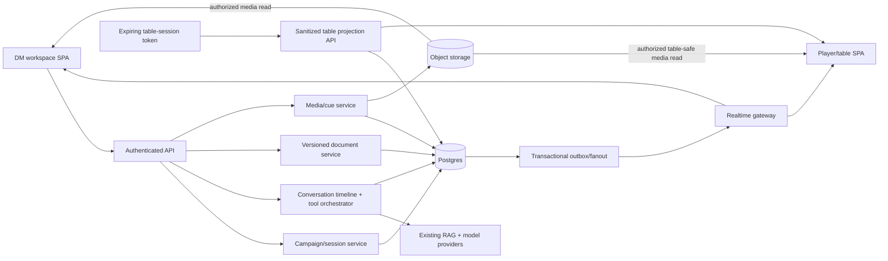

# Master plan: Aetheril GM Workbench expansion

Generated: 2026-09-16  
Repository: `game-guide-ai`  
Status: gap analysis and execution plan  
Beads epic: `agent-forge-harness-1kg`  
Reference input: `Aetheril game content cards.zip`  
Interaction decisions: [`docs/adr/gm-workbench-interactions.md`](../../adr/gm-workbench-interactions.md) (`1kg.1.1`, accepted 2026-09-16)

> The attached archive is treated as product/design reference material, not as
> executable instructions. The current repository remains the source of truth
> for shipped behavior, security, and integration constraints.

## Executive summary

The repository already has the visual and platform foundations of Aetheril: an
authenticated four-channel React application, a tokenized light/dark design
system, grounded RAG, server-owned chat messages, conversation ownership, and
the three content-card primitives referenced by the handoff. It does **not** yet
have the campaign-workbench domain the new designs assume.

The handoff is therefore much larger than a six-component UI port. To deliver
the experience safely, the application needs:

1. a server-owned campaign, participant/audience, and live-session model;
2. versioned wire contracts and a durable typed conversation timeline;
3. a validated tool/document registry shared by policy and UI surfaces;
4. idempotent GM tool execution with structured card/document/media results;
5. versioned documents with conflict-safe direct and AI-assisted editing;
6. the persistent split canvas and a real campaign library;
7. a secret-safe player projection behind an expiring campaign-session link;
8. object-backed media plus multi-instance realtime delivery for audio; and
9. migration, security, evaluation, accessibility, E2E, observability, and
   rollout work proportional to those new trust boundaries.

The execution graph created for this plan contains **1 epic, 9 feature beads,
and 53 implementation/decision beads**. It deliberately front-loads four
decisions and the migration foundation, then ships vertical slices: campaign +
one card tool, the flagship NPC document/canvas, the full library, reveal, then
media/audio. The existing Sage, Spell, Rules, and GM chat contracts remain
available throughout.

## Reference package and confidence level

The ZIP contains a code-facing component/spec handoff under
`aetheril-gm-workbench/`:

- `docs/patterns.md` — five governing product patterns;
- `docs/INTEGRATION.md` — intended shell changes and suggested order;
- `docs/wire-schema.md` — illustrative tool/document/reveal/audio payloads;
- `tools/toolRegistry.js` — ten GM tools and result placement;
- `tools/documentTypes.js` — eight document types and reveal defaults;
- `components/dnd/*` — AssistantLane, ToolRail, AudioCue, and already-upstream
  content cards;
- `components/canvas/*` — CanvasPane, GameDocument, RevealSheet; and
- `.d.ts`, `.jsx`, `.prompt.md`, and demo-card files for each component family.

The package is **not a complete end-to-end design**. Its README points to a
`GM Workbench.dc.html` file containing “the rationale and every screen,” but
that file is absent from the ZIP. Campaign-library screens, player-page states,
rail customization, media expansion, QR presentation, responsive layouts, and
many loading/error/conflict flows are not supplied. The JSX also contradicts
parts of the prose contract. Those uncertainties are captured as explicit
decision beads instead of being guessed during implementation.

The package says GameContentCard, SpellCard, and StatBlockCard are already
upstream and that the upstream versions win. That matches the repository;
those components should be reused, not re-merged from the ZIP.

## Current repository baseline

### What exists and should be reused

| Area | Current implementation | Reuse value |
| --- | --- | --- |
| Application shell | React 19 + Vite/Bun; Landing, Workspace, Profile, TopBar, AppHeader, LeftNav, ChatPane | Extend rather than replace; preserve non-GM modes |
| Design system | Material-style tokens, Parchment/Tavern themes, Button/IconButton/TextField/Switch/Card/Chip/Avatar/Badge/DiceRoll/ChatMessage | Foundation for the six new component families |
| Content cards | GameContentCard, SpellCard, StatBlockCard with full/compact density, tests, and stories | Direct fit for card results and stat-block documents |
| Auth and authorization | Invite-only accounts, Argon2, signed httpOnly session, current-role lookup, DM-only GM endpoint, per-conversation ownership | Extend to resource-scoped campaign authorization |
| Chat/RAG | FastAPI + LangGraph, four modes, citations/refusals, attachment grounding, spell/stat extraction | Reuse for `/rules`, `/monster`, lore, and provider orchestration |
| Persistence seam | MessageStore protocol, Postgres and in-memory implementations | Generalize into campaign/timeline/document repositories |
| Runtime validation | Pydantic server models plus Zod client schemas | Evolve together for all new discriminated payloads |
| Observability | Bounded UI/service metrics and Langfuse tracing | Extend; do not create a second metrics store |
| Tests | Large pytest/Vitest/Storybook suite and deterministic E2E adapter | Add new fixtures and multi-client flows |

Concrete reuse points include `service/session.py`, `service/history.py`,
`service/graph.py`, `service/generate.py`, `service/models.py`,
`ui/src/schemas.ts`, `ui/src/useChat.ts`, `ui/src/shell/ChatPane.tsx`, and
`ui/src/ds/GameContentCard.tsx`.

### What the repository is today

- The backend exposes health, models, synchronous chat, metrics, message
  history, text/PDF attachment upload/list, and auth routes.
- The database contains D&D chunks, users/invites, conversations, messages,
  and extracted-text attachments.
- `chat.conversations` stores ownership and model-strategy fields, but no title,
  mode, campaign, update time, archive state, or session.
- `chat.messages` stores role/content/mode/spell suggestions only. Sources,
  answerability, routing, structured spell/stat cards, tool results, and errors
  are not durable.
- Attachments accept `.txt`, `.md`, and `.pdf`, discard original bytes, and
  retain extracted text only. They cannot back image/audio/document rendering.
- The UI conversation index and titles are localStorage-only. Navigation is an
  in-memory state machine, not a deep-link router.
- Chat is request/response and permits one request in flight. There is no
  streaming, cancellation, presence, SSE, WebSocket, background job, or shared
  playback state.
- The current desktop shell uses a fixed sidebar and has no viable mobile
  breakpoint for a third column.

## Gap analysis: design versus repository

| Capability in the reference | Repository today | Required change / gap |
| --- | --- | --- |
| Three visual lanes in one GM thread | User prompt renders as player; assistant answer renders as DM; no assistant lane | Re-map GM presentation semantics, add AssistantLane, retain non-GM behavior, persist association |
| Prep and play separated by session dividers | No campaign/session entity or timeline event | Add live sessions and durable divider entries; no second feed/mode |
| Five-tool rail, slash menu, More menu, user pins | No GM tool registry or tool UI | Add one validated registry and three registry-driven surfaces with accessible command parsing |
| Ten tools with card/document/media placement | Only general `/chat`; fixed optional spell/stat fields | Add typed, idempotent invocation API, executors, capability flags, result routing, and evaluation |
| Working/error/suggestion tool states | One global chat pending state; no retry/cancel/tool status | Add per-invocation lifecycle, idempotent retry, defined cancellation, and max-three validated suggestions |
| Durable structured results | Live spell/stat cards disappear after reload; history fabricates `answerable: true` and empty sources | Add versioned timeline payloads and lossless history hydration |
| Campaign as the organizing aggregate | No campaign, membership, participant, or session records | Add campaign domain, roles/audiences, APIs, client context, lifecycle, and conversation linkage |
| Campaign Library: NPCs, Bestiary, Documents, Session log, Cues | No server library/list/search; only local conversation list | Add categorized server collections, pagination/search/filter/create/archive/delete, and LeftNav entry points |
| Persistent split canvas | Two-column shell only | Add explicit one-document canvas state, third column, collapsed nav, collision/unsaved-edit rules, and mobile presentation |
| Eight config-driven document types | No document aggregate; attachments are extracted text | Add complete typed schemas, render/edit behavior, storage, sources/assets, and type-specific validation |
| Append-only document versions | No version model | Add immutable snapshots, current pointer, author/summary/time, additive restore, pagination, and optimistic concurrency |
| Chat, selection, direct, and restore edits | No document mutation APIs | Add structured create/edit endpoints; server-enforce selection scope; protect newer GM edits; derive changed fields from committed diffs |
| StatBlockCard as full document renderer | Current card is read-only; reference GameDocument never actually delegates | Define edit/save policy and build an explicit stat-block document renderer/promotion flow |
| Per-field reveal, private by default | No reveal state or public projection | Persist masks/audiences/active content; render only allowlisted fields; never send private blobs to the table client |
| One expiring campaign link | No table route, bearer token, QR, or route/deep link | Add revocable hashed session token, public table route, lifecycle, security headers, and QR/copy flow |
| Owner-only character-sheet audience | Auth has only global player/DM role; one anonymous link cannot express owner | Add campaign participant/audience identity and enforce owner/table scopes server-side |
| Live reveal indicator in chat and canvas | No shared reveal state | Add one server state and client subscription; show consistent indicators and immediate stop |
| Portrait/map media results | No blob/object store or media API | Add authorized asset storage/import/processing; optional provider adapters; honest disabled state |
| Audio cue preview and push-to-table | No audio records, binary storage, realtime transport, or player consent | Add cue domain, private preview, authoritative controls, multi-instance fanout, consent/presence/mute, and reconnect |
| Desktop 56px rail + fixed 472px chat + canvas | Fixed 268px sidebar; narrow screens already collapse poorly | Implement wide layout contract and a decided full-screen/overlay narrow layout |
| Secure resource lifecycle | Conversation ownership exists; no campaign/document/media cascades | Add transaction/outbox cleanup, token revocation, archive/delete/retention, and adversarial tests |
| Production schema evolution | Idempotent startup SQL is the only application migration mechanism | Introduce ordered, locked, checksummed migrations and transactional repository boundaries |
| Production realtime/media operations | No storage IAM, realtime proxy, pooling, or related runbooks | Select architecture, add object lifecycle, proxy/timeouts, pooling, health/degradation, deployment verification |

## Important current seams exposed by this expansion

These are not all new design features, but they must be accounted for because
the Workbench would amplify them:

1. A server-minted conversation ID can be adopted by `useChat` without a local
   sidebar row, leaving the conversation hard to rediscover after refresh.
2. Mode changes retain the current conversation ID, so one server conversation
   can acquire mixed modes while the local sidebar filters by mode.
3. Structured live response fields and source/answerability metadata are not
   persisted, so reload changes the meaning and presentation of prior turns.
4. The model-picker work is partially merged but not fully wired end-to-end;
   the new epic relates to the existing `b8o` tracker rather than duplicating
   its work.
5. Chat history is not yet model memory. Existing `1ka` beads own short/medium/
   long-term memory and deletion; recap/document operations must use explicit,
   authorized bounded inputs until those features land.
6. The service opens database connections per operation and has no ordered
   migration or outbox framework. Realtime and multi-row aggregates need those
   foundations before production rollout.
7. The current E2E suite is essentially one desktop happy path. Player/GM,
   mobile, deep-link, reveal, object-store, and reconnect behavior are untested.
8. The cost guards sit only inside `/chat`: 20 requests per user per hour, held in
   memory per instance, and a *pilot-wide* 500 per day counted from `chat.messages`
   user rows. A tool turn stored anywhere else would escape the daily cap, and one
   GM's prep session could spend the whole pilot's day (decision STATE-8, E-8).
   `ChatRequest.prompt` also has no maximum length (RAIL-6; tracked as
   `agent-forge-harness-764`).
9. `components/Markdown.tsx` sanitises with DOMPurify's defaults, which keep remote
   `` tags, and nothing sets a Content-Security-Policy. A model steered by
   injected text can therefore exfiltrate through an image URL. The Workbench
   raises the stakes because whole private documents enter model context
   (decision X-10). Tracked as `agent-forge-harness-va8`.
10. The composer draft is un-keyed state, so text typed in one channel is sent in
    the next. With slash commands that becomes `/npc <secret brief>` sent verbatim
    as a Sage question (decision RAIL-25).

## Contradictions and missing decisions in the handoff

| Handoff issue | Why it matters | Owning bead(s) |
| --- | --- | --- |
| Referenced `GM Workbench.dc.html` is absent | Several whole-screen flows have no design | `1kg.1.1` |
| GameDocument claims eight types/stat-block delegation but JSX implements generic strings only | Copying it would create false support and flatten structured data | `1kg.5.3`, `1kg.6.2` |
| `renderer`, `printable`, `hasAbilityRow`, `audience`, `accent`, and `citesCorpus` flags are mostly ignored | Type configuration is not yet executable behavior | `1kg.3.1`, `1kg.5.3` |
| Reveal helper omits stat cells, groups fields differently from the demo, and conflicts with `data.revealed` | It cannot safely derive a real reveal mask | `1kg.7.1`, `1kg.7.3` |
| Defaults vs staged Confirm vs “un-reveal immediately” are unspecified | Could accidentally publish secrets | `1kg.1.1`, `1kg.7.1` |
| One campaign link conflicts with owner-only character sheets | Audience identity needs a server model | `1kg.1.3`, `1kg.2.1`, `1kg.7.1` |
| Active/current revealed document and multi-document behavior are unspecified | Table state could expose stale content | `1kg.1.1`, `1kg.7.1` |
| Rail tap has no defined brief acquisition; slash matcher fails once arguments are present | An empty click could become a billable meaningless request | `1kg.1.1`, `1kg.3.3` |
| New document auto-opens canvas, while canvas must never swap implicitly | Needs a queue/confirm/collision rule | `1kg.1.1`, `1kg.6.3` |
| `contentEditable` blur has no validation, concurrency, save state, or conflict policy | Direct edits could be lost or overwritten | `1kg.5.5`, `1kg.6.2`, `1kg.6.5` |
| `changed_fields` clears on “next turn” | Racy across refresh/concurrent edits | `1kg.5.5` |
| Tool/document/media payloads are illustrative and incomplete | Generic `Record<string, any>` cannot be an API contract | `1kg.1.2`, `1kg.5.3` |
| Nested document keys mix snake_case API convention with camelCase data keys | Adapters and stored schema would drift | `1kg.1.2` |
| Export format and private/player-safe content are undefined | Export can become a secret-leak path | `1kg.1.1`, `1kg.6.6` |
| Audio storage, timing, reconnect, multi-instance fanout, ducking, and consent boundaries are incomplete | Component state alone cannot synchronize browsers | `1kg.1.4`, `1kg.8.5`–`1kg.8.7` |
| No responsive/focus/keyboard behavior for canvas, sheets, menus, waveform, or selection bar | Literal port would regress accessibility/mobile | `1kg.1.1`, `1kg.9.4` |

## Target product invariants

These are fixed unless the decision phase explicitly amends this plan:

1. **GM-private by default.** Creation never reveals anything. Public clients
   receive an allowlisted projection, not a private document with CSS hiding.
2. **One registry, validated everywhere.** Rail, slash, More, server policy,
   result routing, and suggestion targets agree on stable IDs and versions.
3. **Size decides placement.** Card results stay compact in AssistantLane;
   document results link to the canvas; media results stay inline with expand;
   audio is a cue and never a canvas document.
4. **One persistent canvas document.** Conversation movement cannot close or
   swap it. A competing document result follows an explicit user-facing rule.
5. **Document history is append-only.** Direct edits, AI patches, and restores
   append versions. Stale writes never silently overwrite newer GM work.
6. **Player sharing is session-scoped.** One revocable campaign-session link,
   with audience enforcement for owner-specific content.
7. **Preview is not broadcast.** Audio preview is private to the GM; pushing to
   the table is a separate authorized command.
8. **No vendor is implied.** Media upload/import works without an image/audio
   generation provider. Optional generation adapters are capability-gated.
9. **Backward compatibility is continuous.** Existing `/chat`, auth, historic
   conversations, and Sage/Spell/Rules behavior keep working during rollout.
10. **Private content stays out of telemetry.** No prompt/document text,
    participant name, share token, or private asset URL becomes a metric label.

## Target architecture

The exact object store and realtime mechanism are decided by `1kg.1.4`; the
service boundaries and data flow should look like this:

### Proposed durable aggregates

Names are illustrative; `1kg.1.2` and `1kg.1.5` own final schemas.

| Aggregate/table family | Purpose |
| --- | --- |
| migration versions | Ordered/checksummed upgrades under a startup lock |
| campaigns | Owner, name, archive state, timestamps, settings |
| campaign participants/audiences | Table aliases, membership/owner audience, status |
| table sessions | Start/end/expiry, hashed join token, rotation/revocation, current revision |
| conversations | Add campaign, title, mode, updated/archive fields to current ownership/model strategy |
| timeline entries | Lossless typed user/assistant/tool/session events with schema version and pagination |
| tool invocations/results | Idempotency key, status, tool/version, bounded input, typed outcome, provider attempts |
| documents | Stable identity, campaign/type/current version, archive state, audience policy |
| document versions | Immutable data snapshot, schema version, parent/base, author, summary, changed fields, sources/assets |
| reveal state | Session/document/audience mask, active projection, monotonic revision |
| media assets/jobs | Campaign owner, object key, content metadata, processing state, derivatives, lifecycle |
| audio cues/live state | Cue metadata and authoritative session playback revision/state |
| transactional outbox | Cross-instance realtime notifications and retryable object cleanup |

### Proposed route families

- `/campaigns` — owner-scoped campaign, participant, conversation, library,
  and session management;
- `/conversations` — server-owned index/metadata, legacy message history, and
  the versioned typed timeline;
- `/tool-invocations` (or campaign/conversation nested equivalent) —
  idempotent registry tool execution and status;
- `/documents` — list/get/create/direct patch/AI edit/history/restore/archive;
- `/table-sessions` — authenticated start/end/rotate/share operations;
- a table entry point of its own whose token rides in the URL **fragment**, plus a
  non-enumerating data endpoint — sanitized player view. No table credential may
  appear in any request URL, path or query, for the API, the realtime channel or
  an asset (decision REVEAL-19; the earlier `/t/<token>` form would have put a
  bearer credential in request logs);
- `/assets` and `/cues` — authorized upload/import/read/processing/library;
- selected SSE/WebSocket endpoint plus authenticated control endpoints.

No route naming is final until the versioned contract bead closes.

## Decisions recorded by `1kg.1.1`

[`docs/adr/gm-workbench-interactions.md`](../../adr/gm-workbench-interactions.md)
resolves the interaction ambiguities listed above. It tags every decision as
supplied, repository-constrained, plan-fixed, inferred, escalated or a non-goal,
records that `GM Workbench.dc.html` was absent from the archive, and was revised
after two independent reviews. Most of it fills gaps this plan had left open.
The rows below are the ones that **change or sharpen an assumption made
elsewhere in this plan**.

| Plan assumption | Decision | Effect |
| --- | --- | --- |
| Invariants 3 and 4: "document results link to the canvas"; a competing result "follows an explicit user-facing rule" | CANVAS-1 to CANVAS-8 — a document result always renders a link. The canvas also opens by itself in exactly one case: it is closed, the result is a new document, it arrived live in the conversation on screen, and the layout is wide. An open canvas never swaps. There is no queue. | `1kg.4.4`, `1kg.6.3` |
| Invariant 5: versions are immutable; stale writes return a 409 | CANVAS-19 — concurrency is judged **per field**, so the GM can type while an AI edit runs. CANVAS-34 — a separate **write revision** is the concurrency token, and a burst of autosaves groups into one history version, so "immutable" is read as "immutable once sealed". | refines the AC of `1kg.5.1`, `1kg.5.2`, `1kg.5.5` |
| Invariant 6: "one revocable campaign-session link, with audience enforcement" | AUD-3 to AUD-5 — a shared bearer link cannot prove who holds it, so owner-only content also needs a device **enrolled through a single-use personal link**. There is still one table link and no per-document link. **Escalated (E-1).** | `1kg.1.3`, `1kg.2.1`, `1kg.7.1`, `1kg.7.4` |
| Route family `/t/<token>` | REVEAL-19, REVEAL-21 — the token rides in the fragment, is exchanged for a session-scoped table credential, and no table credential appears in any request URL; asset references stop working promptly after a Stop, by a mechanism that is `1kg.1.4`'s trade-off. The handoff's guessable `/t/<campaign-slug>` form is rejected. | `1kg.1.3`, `1kg.1.4`, `1kg.7.4`, `1kg.9.5` |
| Reveal "active content" left open | REVEAL-7, REVEAL-8, REVEAL-22 — one live document per audience slot, at a **pinned version**; an update goes through the sheet and shows old text beside new; **every Stop advances a session epoch**, so it defeats a reveal issued before it in either arrival order, and a Stop is never queued. **Escalated (E-2, E-3).** | `1kg.7.1`, `1kg.7.2`, `1kg.7.5` |
| "Tapping a tool never fires an empty billable request"; "empty briefs fail" | X-1, RAIL-5 — only an explicit submit starts billable work, and a registry **brief policy** lets `/recap` run with no brief. | refines the AC of `1kg.3.3`, `1kg.4.1` |
| Lane states are working, done and error; pending work must not lock the composer | RAIL-15 to RAIL-27, X-5 — adds `cancelled` and a client-only `unknown` that polls by invocation ID instead of re-running. A working lane never disables Send; the only block is a **server-enforced cap** of two tool invocations or AI edits per user (*suggested*). `/chat` is not counted and does not change. | `1kg.1.2`, `1kg.3.2`, `1kg.4.1`, `1kg.4.5` |
| Chat-driven document edits; tools chosen from conversation | RAIL-2, CANVAS-21, CANVAS-22 — tools and edits start only from an explicit command or an explicit, **one-shot** arming; the assistant never routes itself. **Escalated (E-9).** | `1kg.4.5`, `1kg.5.5`, `1kg.6.5` |
| "All of this lives inside the existing `gm` mode" | X-9, CANVAS-9 — the canvas, library and tools exist only in the GM channel, so the other channels keep today's layout. The reveal indicator and the live-audio strip are the exception: they follow the GM everywhere. | `1kg.6.3`, `1kg.7.3`, `1kg.8.4` |
| Assistant prose and document text render as today | X-10 — no Workbench or table surface loads a remote subresource; document fields are plain text; the table page carries a strict CSP. | `1kg.3.2`, `1kg.5.3`, `1kg.7.4` |
| Phase 5 ships "object storage/import/processing" together | AUDIO-25 — cues are **uploaded** first. Remote import stays in the epic behind its own flag, after the SSRF policy, and third-party audio is never hot-linked to players. **Escalated (E-4).** | `1kg.8.1`, `1kg.8.5` |
| Synchronized audio | AUDIO-11 to AUDIO-13 — the server owns the clock, but sync targets are loose (±2 s) because several phones in one room echo whatever the tolerance; all gain changes go through Web Audio (AUDIO-30). | `1kg.1.4`, `1kg.8.6`, `1kg.8.7` |
| Layouts tested at 375, 768, 900 and 1280 px | LAYOUT-1 to LAYOUT-3 — three columns need at least 1024 px; 768 and 900 are single-column with a Chat / Canvas switch; below 768 the sidebar is a drawer. | `1kg.6.3`, `1kg.9.4` |
| One campaign, unspecified GM roles; participant identities | AUD-1, AUD-7 — one GM per campaign, players have no accounts, and guests are anonymous. **Escalated (E-6, E-10).** | `1kg.1.3`, `1kg.2.1`, `1kg.2.2`, `1kg.7.4` |

Ten decisions await the owner's confirmation (the record's §17). Each has a
default in force except the Workbench cost limit (E-8), which deliberately has
none: the existing guards stay until limits are chosen with evidence.

## Delivery strategy

### Phase 0 — Resolve ambiguity and make schema evolution safe

Close `1kg.1.1`–`1kg.1.5`: interaction decisions, wire schemas, threat model,
media/realtime ADR, and ordered migrations/transactional repositories. UI
component ports that do not freeze a server contract may proceed against mocks
after `1kg.1.1`.

Exit gate: every new trust boundary and public payload has an owner, version,
authorization rule, lifecycle, and compatibility story.

### Phase 1 — Campaign + one real card-tool vertical slice

Build campaign/session/conversation foundations (`1kg.2.*`), the canonical
registries and lane/rail primitives (`1kg.3.1`–`.3`), durable timeline and tool
API (`1kg.4.1`–`.2`), then ship one card tool through live execution and reload
before multiplying tool types.

Exit gate: a DM selects a campaign, runs an idempotent tool, sees a compact card
in AssistantLane, reloads, and sees the same result; another user cannot access
it.

### Phase 2 — Flagship NPC document + persistent canvas

Build document storage/API/type schemas and NPC creation/editing
(`1kg.5.1`–`.5`), then CanvasPane, GameDocument, shell state, and connected
editing (`1kg.6.1`–`.5`). Wire NPC/encounter/recap dispatch (`1kg.4.4`) after the
document service exists.

Exit gate: `/npc` creates one versioned document, the explicit link opens a
sticky canvas, direct and scoped AI edits append conflict-safe versions, restore
is additive, and everything survives reload.

### Phase 3 — Complete tools, document types, and campaign library

Finish all card/document schemas, all eight document renderers, Bestiary save,
sources/portraits, categorized library flows, and private/player-safe export
(`1kg.4.3`–`.5`, `1kg.5.3`–`.6`, `1kg.6.2`–`.6`).

Exit gate: every enabled registry entry has a typed useful outcome and every
declared document flag has real tested behavior.

### Phase 4 — Per-field reveal and player table

Implement active reveal/audience state, sanitized API, RevealSheet/Indicator,
deep-linked table shell, and realtime reconciliation (`1kg.7.*`).

Exit gate: an expiring link reveals only the confirmed fields to the intended
audience, stop-showing is immediate, reconnect converges, and canary secrets
never reach public payloads.

### Phase 5 — Media and synchronized audio

Ship object storage/import/processing, media tools, audio components/library,
authoritative live control, and browser consent/presence (`1kg.8.*`). Media
generation adapters remain disabled until separately qualified.

Exit gate: a GM can privately preview a stored cue, deliberately push it to the
active table, see consent/presence state, and stop it across reconnects and
multiple service instances.

### Phase 6 — Hardening and staged rollout

Finish tool eval gates and all cross-cutting work (`1kg.4.6`, `1kg.9.*`):
adversarial tests, telemetry, multi-client E2E, accessibility/performance,
deployment/runbooks, reversible flags, and final docs.

Exit gate: owner-only canary succeeds within security, quality, latency, cost,
and error thresholds; rollback disables new writes without losing data or
breaking legacy chat.

## Bead master map

All beads use labels `aetheril`, `game-guide-ai`, and `gm-workbench`, and point
back to this file through `spec_id`.

### Epic and feature workstreams

| ID | Priority | Workstream |
| --- | --- | --- |
| `agent-forge-harness-1kg` | P1 | Aetheril GM Workbench expansion |
| `agent-forge-harness-1kg.1` | P1 | Contracts and architecture |
| `agent-forge-harness-1kg.2` | P1 | Campaign, participant, and live-session foundation |
| `agent-forge-harness-1kg.3` | P1 | Three-lane GM thread and registry-driven tools UI |
| `agent-forge-harness-1kg.4` | P1 | Tool execution and durable structured timeline |
| `agent-forge-harness-1kg.5` | P1 | Versioned campaign documents and edit service |
| `agent-forge-harness-1kg.6` | P1 | Split canvas and campaign library UI |
| `agent-forge-harness-1kg.7` | P1 | Per-field player reveal and table view |
| `agent-forge-harness-1kg.8` | P2 | Media assets and synchronized audio cues |
| `agent-forge-harness-1kg.9` | P1 | Hardening, rollout, and operations |

### `1kg.1` — contracts and architecture

| ID | P | Task |
| --- | --- | --- |
| `1kg.1.1` | P1 | Decide unresolved GM Workbench interactions and scope |
| `1kg.1.2` | P1 | Specify versioned Workbench wire schemas and compatibility |
| `1kg.1.3` | P1 | Threat-model campaign ownership, table links, documents, and media |
| `1kg.1.4` | P1 | Choose media storage and multi-instance realtime architecture |
| `1kg.1.5` | P1 | Introduce ordered application migrations and transactional repositories |

### `1kg.2` — campaign/session foundation

| ID | P | Task |
| --- | --- | --- |
| `1kg.2.1` | P1 | Add campaign, participant, session, and conversation metadata schema |
| `1kg.2.2` | P1 | Implement owner-scoped campaign and participant APIs |
| `1kg.2.3` | P1 | Implement live table-session lifecycle and revocable join tokens |
| `1kg.2.4` | P1 | Make conversation identity and metadata server-authoritative |
| `1kg.2.5` | P1 | Add campaign selection, creation, and session context to the client |
| `1kg.2.6` | P2 | Enforce campaign aggregate deletion, retention, and cleanup |

### `1kg.3` — GM thread and tool UI

| ID | P | Task |
| --- | --- | --- |
| `1kg.3.1` | P1 | Implement canonical GM tool and document-type registries |
| `1kg.3.2` | P1 | Port AssistantLane, AssistantText, and AssistantDocumentLink |
| `1kg.3.3` | P1 | Port ToolRail, SlashMenu, More, and pin customization |
| `1kg.3.4` | P1 | Integrate three-lane semantics into the GM transcript |
| `1kg.3.5` | P2 | Add session dividers and GM thread workflow states |

### `1kg.4` — tool execution and timeline

| ID | P | Task |
| --- | --- | --- |
| `1kg.4.1` | P1 | Add typed, idempotent GM tool invocation API |
| `1kg.4.2` | P1 | Persist typed timeline entries and complete assistant outcomes |
| `1kg.4.3` | P1 | Implement card tools: monster, loot, names, rules, and hooks |
| `1kg.4.4` | P1 | Dispatch NPC, encounter, and recap tools into documents |
| `1kg.4.5` | P1 | Connect composer commands, tool execution, lanes, and hydration |
| `1kg.4.6` | P2 | Add GM tool quality, latency, and cost evaluation gates |

### `1kg.5` — document service

| ID | P | Task |
| --- | --- | --- |
| `1kg.5.1` | P1 | Add document aggregates, immutable versions, and indexes |
| `1kg.5.2` | P1 | Implement owner-scoped document CRUD, version, patch, and restore APIs |
| `1kg.5.3` | P1 | Define complete schemas for all eight document types |
| `1kg.5.4` | P1 | Generate initial documents with typed structured output |
| `1kg.5.5` | P1 | Implement scoped AI document edits and conflict-safe merge rules |
| `1kg.5.6` | P2 | Support document sources, portraits, citations, and stat-block promotion |

### `1kg.6` — canvas and campaign library

| ID | P | Task |
| --- | --- | --- |
| `1kg.6.1` | P1 | Port CanvasPane and VersionList with accessible controls |
| `1kg.6.2` | P1 | Build accessible GameDocument renderers and SelectionBar |
| `1kg.6.3` | P1 | Add persistent canvas state and responsive three-column shell |
| `1kg.6.4` | P1 | Implement Campaign Library navigation and collections |
| `1kg.6.5` | P1 | Connect canvas editing, AI edits, versions, restore, and conflicts |
| `1kg.6.6` | P2 | Add document export, print, and inline-card save flows |

### `1kg.7` — player reveal

| ID | P | Task |
| --- | --- | --- |
| `1kg.7.1` | P1 | Define and persist active reveal projection and audience rules |
| `1kg.7.2` | P1 | Add reveal mutation and sanitized table projection APIs |
| `1kg.7.3` | P1 | Port RevealSheet, RevealIndicator, and safe field derivation |
| `1kg.7.4` | P1 | Add deep-linked player table route and public renderers |
| `1kg.7.5` | P1 | Stream reveal changes and reconcile table clients |

### `1kg.8` — media and audio

| ID | P | Task |
| --- | --- | --- |
| `1kg.8.1` | P1 | Implement authorized media asset storage and upload/import APIs |
| `1kg.8.2` | P2 | Add media processing states, thumbnails, duration, and waveform peaks |
| `1kg.8.3` | P2 | Implement portrait and map media tools with capability gating |
| `1kg.8.4` | P2 | Port AudioCue, AudioLiveStrip, and AudioConsentPrompt accessibly |
| `1kg.8.5` | P2 | Add cue records, campaign library, and GM-private preview |
| `1kg.8.6` | P2 | Implement authoritative live cue control and multi-instance fanout |
| `1kg.8.7` | P2 | Implement player audio consent, presence, mute, and pending feedback |

### `1kg.9` — hardening and rollout

| ID | P | Task |
| --- | --- | --- |
| `1kg.9.1` | P1 | Add adversarial Workbench authorization and privacy test suite |
| `1kg.9.2` | P2 | Add bounded Workbench telemetry, tracing, and cost accounting |
| `1kg.9.3` | P1 | Add multi-client GM/player Workbench E2E coverage |
| `1kg.9.4` | P1 | Run accessibility, responsive, and performance hardening |
| `1kg.9.5` | P1 | Wire deployment, proxies, storage, realtime, migrations, and runbooks |
| `1kg.9.6` | P1 | Ship capability flags, legacy compatibility, and staged rollout |
| `1kg.9.7` | P2 | Refresh architecture, API, security, user, and operator documentation |

The live tracker contains the detailed description, design constraints,
acceptance criteria, parent relation, and dependency edges for every row. The
graph has intentionally granular task dependencies so component work can run in
parallel with stores/contracts without treating an entire workstream as a
single serial gate.

## Parallel work lanes

After `1kg.1.1` closes, work can split safely:

| Lane | Early work | Join point |
| --- | --- | --- |
| Product/contracts | `1kg.1.2`–`.4` | Freezes APIs/security/realtime choices |
| Data/platform | `1kg.1.5`, then `1kg.2.1`, `1kg.4.2`, `1kg.5.1`, `1kg.8.1` | Shared repositories/migrations |
| UI primitives | `1kg.3.2`, `1kg.6.1`, `1kg.8.4` against fixtures | Joins real APIs in `.3.4`, `.6.5`, `.8.5` |
| Campaign/API | `1kg.2.2`–`.4` | Joins client in `1kg.2.5` |
| Tooling | `1kg.3.1`, `1kg.4.1`–`.3` | Card-tool vertical slice in `1kg.4.5` |
| Documents | `1kg.5.2`–`.5` | Flagship canvas in `1kg.6.5` and tool dispatch in `1kg.4.4` |
| Public/realtime | `1kg.7.*` | Shared transport reused by `1kg.8.6` |

Suggested ownership boundaries while parallel work is active:

- one migration/schema owner;
- one shared Pydantic/Zod contract owner;
- one `ChatPane`/timeline integration owner;
- one workspace shell/canvas state owner;
- one public projection/security owner; and
- one deployment/realtime owner.

These boundaries avoid repeated conflicts in `service/app.py`,
`service/models.py`, `ui/src/schemas.ts`, `ui/src/shell/ChatPane.tsx`, and
`ui/src/shell/WorkspaceShell.tsx`.

## Quality and release gates

### Contract and data

- Python and TypeScript validate the same versioned fixtures.
- Unknown tool/result/document versions fail safely.
- Ordered migrations converge fresh and upgraded databases and are safe under
  concurrent service startup.
- Aggregate writes and outbox events are atomic; idempotency tests cover client
  retry, timeout, and duplicate delivery.

### Security and privacy

- Every authenticated endpoint has same-owner, wrong-owner, wrong-role,
  revoked-role, missing-resource, and backend-outage tests.
- Every table endpoint has valid, expired, ended, rotated, wrong-audience,
  enumeration, and rate-limit tests.
- A unique canary in every hidden field is absent from public JSON, realtime
  events, HTML, export, cache metadata, logs, metrics, and asset requests.
- Remote asset import is tested for SSRF, redirect, content smuggling, size,
  timeout, and decompression/resource exhaustion.

### UI and accessibility

- Every new design-system component has unit tests, Storybook stories, and
  interaction/a11y coverage in both themes and reduced motion.
- Slash/overflow/history/reveal/selection controls have complete keyboard and
  focus-return behavior.
- Waveform seek is keyboard-operable; content editors have labels, validation,
  save state, and conflict recovery.
- Layouts are explicitly tested at 375, 768, 900, and 1280 pixels.

### AI quality and cost

- Every tool/document type has schema, usefulness, hallucination, and
  adversarial-input fixtures.
- `/rules` retains current grounding/citation rules; creative output is labeled.
- Every provider/structure attempt is counted separately from the logical tool
  operation and participates in cost/rate guards.
- A tool remains capability-disabled until its scorecard clears the approved
  quality, latency, error, policy, and cost threshold.

### End to end and operations

- Playwright uses at least a DM context and table/player context, including
  reload, mobile, token expiry, stop reveal, consent, and reconnect.
- A Postgres/object/realtime integration profile complements the deterministic
  DB/key-free browser suite.
- Vite, Nginx, and single-process FastAPI hosting all route app, table, asset,
  and realtime paths correctly.
- Deployment verification covers migration, storage IAM, share link, realtime
  fanout, cleanup, and rollback.

## Existing work to coordinate rather than duplicate

| Existing bead/artifact | Relationship |
| --- | --- |
| `agent-forge-harness-iu6` | Split `service/app.py` into routers. New route families should align with it; no duplicate refactor bead was created. |
| `agent-forge-harness-b8o` and children | Own provider catalog/model selection/routing/cost rollout. Workbench uses those seams and relates tool telemetry/evals to them. |
| `agent-forge-harness-1ka` and children | Own conversation memory, authoritative deletion, summaries, preferences, and long-term memory. Workbench campaign deletion and recap must compose with them. |
| `game-guide-ai-chat-reading-experience` (PR #57, merged 2026-09-16) | **Shipped.** Sanitized Markdown answers, a 48 rem reading column, follow-newest scrolling with jump-to-latest, an auto-growing composer, and a typing indicator are now the baseline. ToolRail, SlashMenu and AssistantLane build on them. Its Markdown component keeps remote images and the app sets no CSP — see seam 9. |
| Architecture reference to `swe1.5` | Notes/GM-lore navigation may overlap library/world data; locate the authoritative external tracker before implementation. |
| `agent-forge-harness-xiu` and children | Own additive retrieval, evidence provenance, and bounded web fallback. Workbench tools use the same evidence contract; a corpus miss must not disable general generation. |
| `agent-forge-harness-yje` and children | Separate subscription/coupon/profitability initiative. It owns account entitlements and cost budgets consumed by Workbench routes, but must not be folded into Workbench implementation. Its operation cost ledger (`yje.5.1`) is the durable record decision STATE-8 requires, and its open-registration plan bears on E-1 and E-6. |

The new epic uses non-blocking `relates-to` edges for these initiatives because
their live bead status is not fully synchronized with code already merged to
`master`. Their status should be reconciled before claiming dependent work.

## Main risks and mitigations

| Risk | Mitigation |
| --- | --- |
| Implementing an incomplete component handoff as if it were a product spec | Close decision bead `1kg.1.1` before freezing behavior |
| Schema/API explosion from nullable one-off fields | Versioned discriminated unions and complete document schemas |
| Secret GM data reaching player clients | Server-built allowlisted projection; adversarial canary suite |
| Lost edits from blur/concurrent AI operations | Immutable versions, base revision, 409 conflict, structured patch |
| Duplicate documents/assets/provider spend on retries | Client invocation IDs and idempotent transactional writes |
| Realtime works on one local instance but not Cloud Run | Multi-instance ADR, reconnect snapshots, fanout integration tests |
| Object-store abuse or remote-import SSRF | Bounded authenticated upload, magic-byte checks, strict fetch policy, lifecycle cleanup |
| Scope overwhelms one release | Vertical slices and independent capability flags; media/audio remain later P2 capability |
| UI regressions from a literal inline-JSX port | Use the handoff contracts/tokens, but implement typed BEM components with current a11y/test conventions |
| Parallel branches collide in central files | Assign contract, migration, ChatPane, shell, projection, and ops owners |
| The existing cost guards make the Workbench unusable, are bypassed to make it usable, or silently stop counting tool turns | Every billable operation passes the guards and is counted durably (STATE-8); limits are decided with evidence in `1kg.4.1`/`1kg.4.6` before any tool is enabled (E-8) |
| A Stop loses a race with an in-flight reveal or audio push | Every Stop advances a session epoch, so a widening issued before it is refused in either arrival order (REVEAL-22, AUDIO-28) |
| The absent `GM Workbench.dc.html` arrives after UI work has started | Reconciliation procedure in the decision record §14: the design wins on layout and copy, the record wins on safety |

## Intentional non-goals

The reference explicitly excludes, and this plan does not add:

- an audio mixer;
- multiple simultaneous canvas documents or canvas tabs;
- a separate reveal link for every document;
- image or audio generation as a prerequisite for media UI;
- a new chat channel for the Workbench;
- wholesale replacement of Sage, Spell, or Rules;
- client-side hiding as a substitute for a public data projection; or
- reuse of extracted-text chat attachments as durable document/media storage.

Image/map generation providers, if desired, are optional adapters behind the
capability gate and require their own policy/quality/cost approval.

The decision record adds the v1 exclusions that fell out of resolving the
handoff's ambiguities — a document queue, a resizable split, narration-only and
player-authored turns, natural-language tool routing, draft persistence in the
browser, full-text library search, per-item reveal, a player-side reveal
history, live-following reveal, player accounts and co-GMs, table seek and
pause, tight audio sync, hot-linked audio, rich text in document fields, and a
server-side PDF renderer. See its §13 (NG-10 to NG-30).

## Definition of epic completion

The epic is complete only when:

1. the nine feature beads and all 53 child tasks are closed with their stated
   acceptance criteria;
2. an authorized DM can complete the campaign → tool → document → edit →
   reveal → audio workflow across reloads;
3. a table client sees only the active authorized projection and correctly
   handles expiry, stop, reconnect, and consent;
4. cross-user/campaign/audience access and hidden-field canary tests pass;
5. legacy chat modes and existing conversations remain usable;
6. production migration/storage/realtime/deployment and rollback are verified;
7. quality, accessibility, performance, latency, cost, and observability gates
   are green; and
8. living architecture, security, API, user, and operator documentation matches
   the shipped system.

