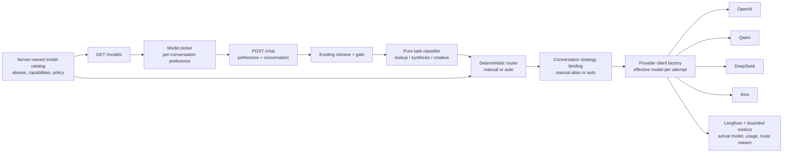

# Research and implementation plan: model picker and hybrid LLM routing

Generated: 2026-07-24  
Repo: `game-guide-ai`  
Beads parent: `agent-forge-harness-b8o`  
Status: reviewed twice. See `docs/forge/reports/game-guide-ai-model-routing-plan-review.md` and
`docs/forge/reports/game-guide-ai-model-routing-plan-review-2.md` for the current verdicts and any
open findings; do not treat this header as a substitute for reading them. Prices and provider
documentation verified 2026-07-24. Design decisions D1–D7 below were added in response to the
second review.

## Executive decision

Build the model picker and a hybrid `Auto` mode, but do not equate “Chinese/open-weight” with
“cheapest” or make any new provider the default before an Aetheril-specific evaluation.

The recommended first release is:

1. Keep `gpt-4o-mini` as the control.
2. Evaluate `gpt-5-nano` as the operationally simplest economy control.
3. Evaluate `qwen-flash-us` as the strongest governance-aware economy candidate and
   `qwen3.7-plus-us` as the balanced candidate.
4. Evaluate direct `deepseek-v4-flash` for price/performance, but keep it out of production traffic
   that contains attachments, campaign notes, or licensed corpus excerpts until DeepSeek supplies
   an acceptable API data-processing/retention commitment.
5. Expose `kimi-k3` only as an experimental premium option if it passes quality and latency gates.
   It is not an economy model for this workload.
6. Store provider credentials only on the server in Google Secret Manager. Do not implement
   end-user “bring your own key” (BYOK) until real user authentication and encrypted per-user
   storage exist.

`Auto` should be deterministic and auditable, selecting an economy model for grounded lookups and
a stronger model for synthesis/creative work. It must not add a separate router-model call. A
conversation pins the **requested routing strategy**, not necessarily one effective model:
`manual:<alias>` remains fixed for the conversation, while `auto` reclassifies every turn and may
select a different eligible model. Changing between `auto` and a manual alias, or changing the
manual alias, starts a new conversation. Kimi K3 is manual/evaluation-only in version 1 and is
never selected by `Auto`.

The picker controls **answer generation only** in version 1. Live retrieval still uses
`text-embedding-3-small` through OpenAI. Changing embedding providers would require re-embedding the
corpus, changing the 1536-dimensional vector contract, and independently revalidating retrieval.
The current generation path is also deliberately stateless: it sends the persona/system prompt,
the retrieved context, and the current user turn, but does not replay stored conversation history.
Adding multi-turn model context or preserved reasoning is a separate design.

## Resolved design decisions (D1–D7)

The second plan review found that several designs below had no attachment point in the current code,
and that several new failure modes had no defined contract. Each gap is now closed by an explicit
decision. **These are settled; an executor should not re-derive them.** Each links to the section
that specifies it in full.

| # | Decision | Resolution | Specified in |
|---:|---|---|---|
| D1 | Behavior when `conversation_id` is null | Stateless single turn: no strategy row is written, the requested preference applies to that turn only, routing is still disclosed | [Conversation affinity](#conversation-affinity) |
| D2 | Where the assembled generation context is built | Extracted into a pure `assemble_context()` in `service/generate.py`, called by both the graph and the eval capture harness | [Context assembly seam](#context-assembly-seam) |
| D3 | Disclosure of spell mode's second (suggestions) LLM call | Attempts carry a `call_purpose` dimension; the response discloses the suggestion route separately | [Public API contracts](#public-api-contracts) |
| D4 | HTTP status per normalized error category | Fixed status/UI table; non-retryable categories never return a retryable status | [Error and status contract](#error-and-status-contract) |
| D5 | Cost attribution for non-OpenAI models in Langfuse | A Langfuse custom model definition ships with every catalog addition, versioned against `price_revision` | [Metrics, cost attribution, and dashboards](#metrics-cost-attribution-and-dashboards) |
| D6 | Growth bound and retention for strategy rows | Rows are created only on rate-limiter-accepted requests, with a validated ID format and a retention job | [Conversation affinity](#conversation-affinity) |
| D7 | Final Qwen candidate list | Residency scope is confirmed and the candidate list frozen before any paid comparison; `qwen3.6-flash` is excluded | [Shortlist](#shortlist), [Checkpoint 3](#checkpoint-3--evaluation-matrix-and-provider-qualification) |

## Why this is the right boundary

The present application has four different “model” concerns that must not be collapsed into one
dropdown:

| Concern | Current implementation | Picker scope |
|---|---|---|
| Answer generation | One process-wide `RAG_DEFAULT_MODEL`, default `gpt-4o-mini` | **Yes** |
| Spell suggestions | A second generation call using the same model | Yes, but route independently to the economy tier |
| Query/corpus embeddings | OpenAI `text-embedding-3-small`, 1536 dimensions | **No** |
| Evaluation judge | Fixed `gpt-4o-mini` plus OpenAI embeddings | No; upgrade the judge separately |

This separation preserves retrieval quality while making the expensive, user-visible generation
step replaceable.

## Current application model map

### Runtime generation

- `config.py:94-100` exposes one global `RAG_DEFAULT_MODEL` and one global temperature.
- `service/generate.py:185-227` creates `langchain_openai.ChatOpenAI` lazily and accepts an injected
  `LLMClient`. The protocol is already provider-neutral at the graph boundary (`invoke(messages,
  config)`), although the live constructor is OpenAI-specific.
- `service/rag.py:65-71` stores one `model` and one `llm_client` for the entire `RagService`.
- `service/graph.py:203-245` sends both the primary answer and spell suggestions through that same
  service-level model.
- `service/app.py:248-283` accepts no model preference and catches only OpenAI’s API error family.
- `service/models.py:59-82` has no request or response routing fields.
- `service/history.py` persists messages for UI history, but `service/generate.py` never reads those
  messages into a provider request. Each answer and spell-suggestion call is currently
  single-turn/stateless.

The useful seam is the injected chat client. The missing pieces are a provider catalog, a
per-request route decision, provider-neutral result/error contracts, and per-conversation strategy
persistence. Model routing must not silently expand the prompt to include conversation history.

### UI request path

- `ui/src/api.ts:94-106` posts only `prompt`, `mode`, and `conversation_id`.
- `ui/src/useChat.ts` has the same three-argument `PostFn`.
- `ui/src/shell/ChatPane.tsx:77-84` reads `mode` and `conversationId` from `AppNav` and invokes
  `useChat`.
- `ui/src/shell/conversationStore.ts` persists conversation metadata locally and is the appropriate
  place for a backward-compatible `modelPreference` field.
- `ui/src/shell/AppHeader.tsx` owns the workspace action band. A compact picker belongs beside the
  theme control, while its selected value comes from the active conversation resolved through
  `AppNav.conversationId`.

The profile screen explicitly defers account settings until pilot authentication. That makes a
local default preference plus per-conversation selection appropriate now; account-level model
preferences can move server-side with the auth work.

### Embeddings

- `ingestion/retrieval.py:52` fixes the live query model to `text-embedding-3-small`.
- `RagRetriever.embed()` always uses the OpenAI client and therefore still requires
  `OPENAI_API_KEY`.
- The vector schema is 1536-dimensional and the corpus was built for that embedding model.
- `ingestion/embed.py` supports an Ollama ingestion backend, but the live query path does not.

Therefore, adding Qwen, DeepSeek, or Kimi for generation does **not** remove the OpenAI dependency.
Embedding migration is a separate feature with a fresh retrieval evaluation and re-ingest.

### Evaluation and observability

- `ingestion/compare_models.py` already injects OpenAI and Ollama generators, but its
  “colon means Ollama, otherwise OpenAI” heuristic is unsafe for multiple hosted providers.
- `ingestion/eval_answers.py` has only six curated answer cases. Existing bead
  `agent-forge-harness-8nv` expands that set to roughly 20–30.
- The judge is fixed to `gpt-4o-mini`. It is not a credible sole judge for Kimi K3,
  Qwen Max, DeepSeek Pro, or other models that may exceed it.
- Langfuse already receives generation observations with model, latency, token, and cost data.
- `service/metrics.py` enforces a strict, privacy-bounded metric allowlist. Its current labels do
  not include provider, logical model, routing strategy, or task class.
- The documented live comparison observed `gpt-4o-mini` at about $0.0011 per call and p95 near
  two seconds; a local Llama run was free at the API layer but around 29 seconds p95.

This is a strong foundation: extend the existing comparison and Langfuse paths instead of adding a
second telemetry stack.

### Deployment and credentials

The in-flight GCP pilot-hosting branch already provisions Google Secret Manager and injects
`OPENAI_API_KEY` and `DATABASE_URL` into a locked Cloud Run service. It also uses Workload Identity
Federation for CI, so CI does not need a downloadable GCP service-account key.

The routing work should extend that foundation, while tightening two details:

- use a dedicated Cloud Run runtime service account rather than the default compute service account;
- pin environment-variable secret references to a numbered version. Google notes that secret
  environment variables are resolved when an instance starts and recommends a specific version
  instead of `latest`. Mounted secret volumes are preferable when live rotation is required.

Coordinate this plan with `agent-forge-harness-x5bz.1` (hosting) and
`agent-forge-harness-x5bz.3` (rate limiting/daily cost guard).

## Candidate model and provider analysis

Prices below are standard pay-as-you-go USD prices per one million tokens, excluding temporary
promotions, taxes, retries, tool calls, and reserved-throughput plans. Provider benchmark claims
are directional only; Aetheril’s own grounded-rules and creative-GM evaluations decide adoption.

### Shortlist

| Model | Context / modes | Input / output | Application role | Important caveat |
|---|---:|---:|---|---|
| OpenAI `gpt-4o-mini` | 128K; structured output | $0.15 / $0.60 | Current control | Existing quality, latency, and operations baseline |
| OpenAI `gpt-5-nano` | 400K; reasoning, structured output | $0.05 / $0.40 | Economy control | Must pass rules/creative eval; cheaper does not guarantee fit |
| DeepSeek `deepseek-v4-flash` | 1M; thinking or non-thinking; JSON/tools | $0.14 / $0.28; cache hit $0.0028 | Economy candidate | Direct API has no documented regional endpoint; downstream-user retention/training terms need written clarification |
| DeepSeek `deepseek-v4-pro` | 1M; thinking or non-thinking; JSON/tools | $0.435 / $0.87; cache hit $0.003625 | Higher-quality candidate | Costs about 2.5× the current baseline in the same-token scenario |
| Alibaba `qwen-flash-us` | Up to 1M; US processing ID | $0.05 / $0.40 for ≤256K | Economy candidate | Older Qwen line; quality must beat or match GPT-5 nano |
| Alibaba `qwen3.6-flash` | 1M; thinking/non-thinking; tools/structured output | $0.165 / $0.99 from Virginia, global scope | **Excluded from v1 (D7)** | “Global” processing scope is not the same as US-only, and it is more expensive than `qwen-flash-us`; it fails the residency preference without offering a price advantage |
| Alibaba `qwen3.7-plus-us` | 1M; thinking/non-thinking; tools/structured output | $0.40 / $1.60 for ≤256K | Balanced candidate | Costs more than the current baseline; use only on quality lift |
| Alibaba `qwen3.7-max-us` | 1M; thinking/non-thinking | $2.50 / $7.50 | Premium creative candidate | Roughly 15.5× baseline in the same-token scenario |
| Moonshot `kimi-k3` | 1M; always thinking; low/high/max effort | $3 cache miss / $0.30 cache hit / $15 output | Experimental premium creative model | Expensive, reasoning-output heavy, and unsafe to switch into an existing conversation |

DeepSeek V4 Flash is a 284B/13B-active mixture-of-experts model; V4 Pro is 1.6T/49B-active.
DeepSeek positions Flash for economical/simple tasks and Pro for stronger reasoning. Both expose
OpenAI-compatible Chat Completions at `https://api.deepseek.com`. The legacy IDs
`deepseek-chat` and `deepseek-reasoner` retire on 2026-07-24; integrations must use the V4 IDs.

Alibaba describes Qwen Flash as the low-cost/low-latency tier, Plus as the balance of
performance/speed/cost, and Max as the strongest complex-task tier. Model Studio exposes
OpenAI-compatible regional endpoints and explicit `-us` IDs for some models. Prefer the US
Virginia endpoint and a US-scoped model ID whenever available; never infer residency from the
location of the endpoint alone.

Kimi K3 is a 2.8T sparse model with native vision and a 1M context. Moonshot itself says K3 still
trails its strongest proprietary comparators overall. It recommends 64 or more accelerators for
self-hosting, so managed API access—not self-hosting—is the economically defensible pilot path.
Full weights are promised for 2026-07-27, which is still in the future as of this document.

### “Open weight” versus managed API

The requested Chinese candidates are economically accessible through managed APIs, but that does
not make every hosted SKU identical to a downloadable checkpoint. Qwen’s regional Model Studio
IDs are managed products with provider-specific pricing and policy; DeepSeek exposes managed V4
SKUs; Kimi K3’s full-weight release is not yet available as of this review. Self-hosting also moves
capacity planning, inference optimization, patching, abuse controls, availability, and data
security onto Aetheril.

Use managed APIs for the pilot. Record the exact hosted model ID and provider in every result.
Consider self-hosting only after measured volume makes its total cost lower than managed service
and a security/operations owner accepts the new burden.

### Western controls

| Model | Input / output per MTok | Comparison role |
|---|---:|---|
| Gemini 3.5 Flash-Lite | $0.30 / $2.50 | High-throughput control |
| Claude Haiku 4.5 | $1 / $5 | Fast quality control |
| OpenAI GPT-5.6 Terra | $2.50 / $15 | Premium proprietary comparison |

Gemini’s current 3.6/3.5 generation APIs deprecate and ignore `temperature`, `top_p`, and `top_k`.
That is direct evidence that the current global `RAG_TEMPERATURE=0.2` must become per-profile
configuration rather than being sent blindly to every provider.

## Cost model

For a same-reported-token comparison, assume one representative Aetheril answer uses 6,000 input
tokens (persona prompt, retrieved context, and user prompt) and 600 output tokens. This does **not**
normalize provider tokenizers or reasoning behavior: the same text can produce different token
counts, and thinking models may emit substantially more billable output. The table shows uncached
real-time list-price cost. It is an estimate, not an invoice:

`cost per 1,000 turns = 6 × input price + 0.6 × output price`

| Model | Cost / 1,000 turns | Cost / 100,000 turns | Versus current |
|---|---:|---:|---:|
| `gpt-4o-mini` | $1.26 | $126 | 1.00× |
| `gpt-5-nano` | $0.54 | $54 | 0.43× |
| `deepseek-v4-flash` | $1.01 | $100.80 | 0.80× |
| `deepseek-v4-pro` | $3.13 | $313.20 | 2.49× |
| `qwen-flash-us` | $0.54 | $54 | 0.43× |
| `qwen3.7-plus-us` | $3.36 | $336 | 2.67× |
| `qwen3.7-max-us` | $19.50 | $1,950 | 15.48× |
| `kimi-k3`, cache miss | $27.00 | $2,700 | 21.43× |
| `kimi-k3`, all input cached | $10.80 | $1,080 | 8.57× |
| Gemini 3.5 Flash-Lite | $3.30 | $330 | 2.62× |
| Claude Haiku 4.5 | $9.00 | $900 | 7.14× |
| GPT-5.6 Terra | $24.00 | $2,400 | 19.05× |

Models excluded from version 1 by D7 (currently `qwen3.6-flash`) are deliberately absent from both
cost tables. Do not read their omission as an oversight, and do not price them back in without
first reopening the residency decision.

Output/reasoning sensitivity matters. At the same 6,000 reported input tokens but 1,800 reported
output tokens, the estimated cost per 1,000 turns becomes:

| Model | 600 output tokens | 1,800 output tokens |
|---|---:|---:|
| `gpt-4o-mini` | $1.26 | $1.98 |
| `gpt-5-nano` | $0.54 | $1.02 |
| `deepseek-v4-flash` | $1.01 | $1.34 |
| `deepseek-v4-pro` | $3.13 | $4.18 |
| `qwen-flash-us` | $0.54 | $1.02 |
| `qwen3.7-plus-us` | $3.36 | $5.28 |
| `qwen3.7-max-us` | $19.50 | $28.50 |
| `kimi-k3`, cache miss | $27.00 | $45.00 |
| `kimi-k3`, all input cached | $10.80 | $28.80 |
| Gemini 3.5 Flash-Lite | $3.30 | $6.30 |
| Claude Haiku 4.5 | $9.00 | $15.00 |
| GPT-5.6 Terra | $24.00 | $42.00 |

Provider-reported token usage from the fixed evaluation corpus—not these hypothetical counts—must
set production tier ceilings.

Three implications matter:

1. `gpt-5-nano` and `qwen-flash-us` are tied on list price in this workload. A new vendor must earn
   its operational and governance overhead through measured quality, latency, or resilience.
2. DeepSeek V4 Flash is about 20% cheaper than `gpt-4o-mini` in this same-token scenario—not an
   order-of-magnitude reduction—unless real cache-hit rates are high.
3. Kimi K3 is more expensive than GPT-5.6 Terra here. Its reported >90% cache-hit rate comes from
   coding workloads and must not be projected onto changing RAG chunks. Its always-on reasoning can
   also create more billable output than the 600-token scenario.

Spell mode currently makes a second LLM call for suggestions, so its total cost and latency are
higher. Route that structured “three suggestions” call to the approved economy model regardless
of the answer tier, unless evaluation shows a material coherence loss.

At pilot volume, hosting and operational time may dominate a sub-dollar-per-thousand-turn model
bill. The cost guard should optimize **quality-adjusted cost**, not raw token price.

## Provider onboarding and API keys

### DeepSeek direct API

1. Create a DeepSeek Platform account, add a small prepaid balance, and create an API key.
2. Store it as `DEEPSEEK_API_KEY`.
3. Use OpenAI-compatible base URL `https://api.deepseek.com`.
4. Start with `deepseek-v4-flash`; enable thinking only for a tested route.
5. Do not use the retiring `deepseek-chat` or `deepseek-reasoner` aliases.
6. Keep production eligibility false until the data-processing questions in the security section
   are resolved.

### Alibaba Cloud Model Studio / Qwen

1. Activate Model Studio in **US (Virginia)**.
2. Create a dedicated workspace/API key and copy it immediately; newer keys are shown once.
3. Store it as `DASHSCOPE_API_KEY`.
4. Use OpenAI-compatible base URL
   `https://dashscope-us.aliyuncs.com/compatible-mode/v1`.
5. Prefer explicit `-us` model IDs such as `qwen-flash-us`,
   `qwen3.7-plus-us`, and `qwen3.7-max-us` when US-only processing is required.
6. Note that custom model/IP scopes and key disable/reset controls documented for other regions are
   limited in the Virginia region. Use a dedicated workspace/key, Secret Manager rotation, spend
   alerts, and the application daily cap as compensating controls. Network egress filtering is not
   part of this plan and would require a separately designed VPC/NAT/firewall control; it would not
   prevent a stolen key from being used elsewhere.

Do not use Alibaba’s Coding Plan or Token Plan key for the application backend: those plans are
restricted to supported interactive coding/agent tools. Use pay-as-you-go Model Studio credentials.
Alibaba can also broker DeepSeek and Kimi models, which reduces integration count but changes model
availability, residency, terms, and price. Direct provider APIs are clearer for the first controlled
evaluation; reconsider a gateway after measurements.

### Kimi direct API

1. Register on the international Kimi API platform and top up at least $1 to unlock K3.
2. Create an Open Platform API key—not a Kimi Code or membership key.
3. Store it as `MOONSHOT_API_KEY`.
4. Use OpenAI-compatible base URL `https://api.moonshot.ai/v1` and model `kimi-k3`.
5. Set `reasoning_effort=low` for initial Aetheril trials; increase only for measured quality lift.
6. Cap `max_completion_tokens` and keep a stable prompt prefix where that is compatible with
   retrieval quality. Streaming is desirable for perceived latency, but is not part of this
   model-picker scope because the current `/chat` response is non-streaming.
7. Keep K3 manual/evaluation-only in version 1. The current application makes stateless,
   single-turn generation calls, so Moonshot’s preserved-thinking continuity feature is not being
   used. If multi-turn provider context is added later, its adapter must replay the required
   reasoning content and forbid incompatible model switches/fallbacks.

### Google Secret Manager and Cloud Run

Use application-owned provider credentials in Secret Manager:

```bash
printf '%s' "$DEEPSEEK_API_KEY" | gcloud secrets create deepseek-api-key --data-file=-
printf '%s' "$DASHSCOPE_API_KEY" | gcloud secrets create dashscope-api-key --data-file=-
printf '%s' "$MOONSHOT_API_KEY" | gcloud secrets create moonshot-api-key --data-file=-
```

For an existing secret, add a version rather than replacing the resource:

```bash
printf '%s' "$ROTATED_KEY" | gcloud secrets versions add deepseek-api-key --data-file=-
```

Operational requirements:

- create a dedicated runtime service account for the Cloud Run service;
- grant `roles/secretmanager.secretAccessor` on each needed secret, not the project;
- reference numbered versions in `--set-secrets`;
- deploy a new Cloud Run revision to activate a rotated environment-variable secret;
- disable the old provider key only after the new revision passes a direct health check;
- enable Secret Manager data-access audit logs;
- create provider spend alerts and preserve the application’s global daily cap;
- never print keys, place them in `.env.example`, return them from `/models`, store them in browser
  storage, or attach them to Langfuse metadata;
- keep local developer keys in the gitignored `.env` only.

CI’s Workload Identity principal needs permission to deploy a revision that **references** the
secrets. It does not need access to secret payloads.

### Why BYOK is deferred

End-user BYOK would require authenticated ownership, encrypted storage, key deletion and rotation,
provider-specific validation, billing/error isolation, incident response, and protection from keys
appearing in support logs or browser storage. The app does not yet have the user/account boundary
needed to do that safely. The version-1 UI selects from owner-funded, server-enabled aliases only.

## Security, privacy, licensing, and residency

The model picker changes the list of subprocessors that receive:

- the user’s prompt;
- up to five full retrieved rulebook chunks;
- optional extracted attachment/campaign text;
- persona instructions; and
- potentially conversation context in future multi-turn generation.

No provider should be enabled solely because it is OpenAI-compatible.

### Provider posture

- **Alibaba Model Studio:** its current privacy notice says transmitted data is not used for model
  training and documents SOC 2 controls. Use an explicit US-scoped model where possible and retain
  the provider terms/DPA in the release record.
- **Kimi API:** its API-specific security FAQ says API input/output is not used for training and is
  used for the current request rather than persistently stored for training. Confirm general
  retention, incident, deletion, and international-transfer terms before production.
- **DeepSeek:** the general privacy policy explicitly excludes the processing rules for downstream
  application end users. It otherwise says inputs may be used for model improvement, may be kept
  while an account exists, and are processed/stored in the People’s Republic of China. The Open
  Platform terms make the developer responsible for consent, disclosure, and rights to submitted
  inputs. Until DeepSeek provides API-specific retention/training/residency terms or a suitable
  enterprise agreement, treat direct DeepSeek as **evaluation-only with synthetic/non-sensitive
  data**.

The app’s private-pilot licensing decision permits a closed tester group on the full corpus; wider
release requires SRD-only mode. Sending licensed book excerpts to an additional provider is a
separate disclosure/contract question. Confirm that the application has the right to transmit those
excerpts and update the privacy notice/subprocessor list before enabling a provider for testers.

### Required controls

- The browser sends only a stable allowlisted model alias such as `qwen-flash-us` or `auto`.
- Base URLs, provider IDs, secret environment names, and arbitrary model strings are server-owned.
  This prevents SSRF, unauthorized providers, unbounded billing, and metric-cardinality attacks.
- Provider eligibility is a policy attribute (`synthetic_only`, `rules_allowed`,
  `attachments_allowed`, `production_allowed`), checked after routing and before invocation.
- A fallback may not cross that policy boundary silently. If no approved fallback exists, return a
  retryable provider-unavailable response.
- Never place prompts, responses, user/conversation IDs, attachment names/content, or provider
  error text in metric labels.
- The public model catalog reports availability and public capabilities, not the reason a key is
  missing or any secret metadata.

This document is technical planning, not legal advice; production activation requires review of
the provider agreements and the corpus license.

## Proposed architecture



### Context assembly seam

**D2.** Today the string that is actually sent to the model is assembled *inside* the graph's
generate node (`service/graph.py:203-227`): it calls `build_context(...)`, then appends the
attachment as a numbered source continuing the `[1..N]` sequence
(`n = len(context_texts(result, CONTEXT_TOP_N)) + 1`). Nothing outside that node can reproduce it.

This blocks the evaluation design. Checkpoint 3 requires capturing one assembled context and
replaying it to every candidate, but there is no seam that stops after the gate, and no function
that returns the assembled string. Reimplementing the assembly in the eval harness would mean the
fixture drifts from production the first time attachment handling changes — and the drift guard
("fail if the ordered identities or hashes differ") would then be comparing a reimplementation
against itself, which verifies nothing.

Therefore, **before** the router or the eval harness is built, extract a pure function:

```text
assemble_context(result, *, attachment_context, attachment_label, top_n) -> str
```

- `service/generate.py` owns it; it has no LangChain, provider, or graph dependency.
- `generate_node` calls it instead of inlining the assembly. Behavior must be byte-identical —
  prove it with a characterization test written before the extraction.
- The eval capture harness calls the same function, so a `RetrievalFixture` records exactly the
  string production would have sent.
- The suggestions path deliberately keeps its own narrower context (`build_context` without the
  attachment block, `service/graph.py:237`). Preserve that difference; do not unify the two.

This is a refactor with no behavior change, and it belongs in Checkpoint 1 so that Checkpoints 3 and
4 both build on it.

### Provider client seam and the existing test surface

The current injection point is one client per service: `RagService(model=..., llm_client=...)`
(`service/rag.py:65,71`), forwarded to both generation calls as
`model=svc.model, client=svc.llm_client` (`service/graph.py:223,241`).

There is a trap here. In `service/generate.py:192-195` and `:222-227`, the `model` argument is only
used **when `client is None`** — it reaches `ChatOpenAI(model=model, ...)` and nowhere else. When a
client is injected, `model` is dead. Every existing test
injects `llm_client` — `service/tests/test_graph.py:85,205,220,280,295`,
`service/tests/test_service.py:138,150,163,174` — and so does
`ingestion/compare_models.py:123`. If routing is added without changing that seam, those tests keep
passing while exercising none of the routing code: a false green.

So Checkpoint 1 must **replace the injected client with an injected `ProviderClientFactory`** and
migrate those call sites in the same change. Add a guard test asserting that a routed generation
resolves its client through the factory rather than a service-level attribute, so the old seam
cannot silently return.

### Server-owned model catalog

Add a typed `ModelProfile` registry, not a free-form dictionary:

```text
alias                 stable public ID, e.g. qwen-flash-us
display_name          user-facing name
provider              bounded enum
api_model             exact provider model/snapshot
base_url              fixed server configuration
secret_env            fixed server configuration
tier                   economy | balanced | premium
capabilities          structured_output, thinking, vision, max context/output
request_profile       supported temperature/reasoning/max-output settings
price_revision        date + input/cached/output rates
data_policy           allowed content classes and deployment scope
enabled               deployment flag AND secret present AND approved policy
fallback_alias        optional, policy-compatible alias
```

Use stable aliases in API and persistence, exact snapshot IDs when a provider offers them, and
keep price metadata versioned. A provider model update is then a reviewed catalog change instead
of silent behavior drift.

The currently installed `langchain-openai` adapter accepts custom `api_key` and `base_url`, so a
shared OpenAI-compatible adapter is a reasonable hypothesis—not an assumed compatibility
guarantee. Hide it behind `ProviderClientFactory`; do not let this implementation detail leak into
request models. Pin a reviewed client version and contract-test each direct provider with sanitized
request/response fixtures and an opt-in live smoke test. The contract must cover
`reasoning_effort`, `max_completion_tokens`, structured output, usage metadata, timeouts, and error
shapes. If the shared wrapper drops or rewrites a required field, use a provider-specific adapter
or the raw OpenAI client for that provider.

Provider profiles control unsupported parameters and normalize provider errors into:

```text
authentication | quota | rate_limit | timeout | content_filter |
invalid_request | upstream_unavailable | unknown
```

The provider boundary must return more than answer text:

```text
GenerationResult
  text
  usage: GenerationUsage
  provider_request_id
  finish_reason

GenerationUsage
  input_tokens
  cached_input_tokens
  output_tokens
  reasoning_tokens
```

Unknown usage fields remain null rather than becoming zero. An attempt observer receives one
record per actual provider call, including failures. Set explicit timeouts and disable automatic
SDK retries (`max_retries=0`); implement bounded retry/fallback in the service so every attempt,
latency, and charge remains attributable. Budget preflight uses a conservative estimated input
plus maximum output, then reconciles against provider-reported actual usage after the call.

### Public API contracts

`GET /models`:

```json
{
  "default": "auto",
  "models": [
    {
      "id": "auto",
      "display_name": "Automatic",
      "description": "Balances speed, cost, and task difficulty."
    },
    {
      "id": "qwen-flash-us",
      "display_name": "Qwen Flash (US)",
      "tier": "economy",
      "supports_attachments": true
    }
  ]
}
```

The endpoint returns only enabled, production-eligible options for normal users. An
operator-only eval command can use experimental profiles without advertising them.

Extend `ChatRequest`:

```json
{
  "prompt": "Create a CR 3 goblin alchemist NPC.",
  "mode": "gm",
  "conversation_id": "uuid",
  "model_preference": "auto"
}
```

Extend `ChatResponse`:

```json
{
  "answer": "...",
  "routing": {
    "requested": "auto",
    "effective": "qwen3.7-plus-us",
    "provider": "alibaba",
    "strategy": "auto",
    "task_class": "creative",
    "reason": "gm_creation",
    "fallback_from": null
  },
  "suggestions_routing": {
    "effective": "qwen-flash-us",
    "provider": "alibaba",
    "reason": "economy_subroute",
    "fallback_from": null
  }
}
```

All fields are bounded enums/aliases. The response provides honest model/fallback disclosure
without returning endpoints, key state, or internal errors.

**D3 — one logical turn can be two provider calls.** Spell mode generates the answer and then makes
a second structured call for suggestions (`service/graph.py:223` and `:241`), and this plan routes
that second call to the economy tier *regardless of the answer tier*. A single `effective` field
cannot describe that, and leaving it undisclosed would quietly contradict the promise that manual
selection wins: a user who picks a premium model still gets economy suggestions.

Three contracts therefore carry the call identity:

- `suggestions_routing` is present only in spell mode, and is `null` when suggestion generation
  failed (the answer must never fail because the garnish did).
- Every attempt record carries a bounded `call_purpose` of `answer` or `suggestions`. Without it,
  answer cost and suggestion cost are indistinguishable and "p95 latency by effective model"
  silently averages two different call classes — which would make the cost-per-successful-answer
  launch gate unmeasurable.
- Trace metadata moves from the run level to the generation-span level. `service/rag.py:131`
  currently stamps one model on the whole graph run via
  `build_trace_config(model=self.model, mode=mode)`, and `service/tracing.py:trace_metadata` takes a
  single scalar `model`. Both must become per-span so each call reports the model that served it.

### Error and status contract

**D4.** Routing introduces failure modes the current API has no vocabulary for. Today the mapping is
narrow and closed: `_LLM_ERRORS → 502`, `_DB_ERRORS → 503`, `EmbeddingUnavailableError → 503`
(`service/app.py`), where `_LLM_ERRORS` is `(openai.APIError,)` (`service/app.py:65`). The UI
handles only `422` and `503` and otherwise renders `Unexpected response (<status>)`
(`ui/src/api.ts:115-136`).

That gap is load-bearing: without this table, the `409` this plan relies on to trigger the
"start a new conversation" flow would reach the user as **"Unexpected response (409)"** with no
recovery path, and a non-retryable authentication failure would be reported as a retryable `502`.

| Normalized category | Status | Retryable | UI treatment |
|---|---:|---|---|
| conversation strategy mismatch | `409` | No | Offer “Start a new conversation with this model?” |
| budget / daily cap exceeded | `429` | No | Explain the cap; no retry affordance |
| `rate_limit` | `429` | Yes | Retry with backoff; surface retry-after when provided |
| `content_filter` | `422` | No | Explain the refusal; do not retry |
| `invalid_request` | `422` | No | Generic rejection; log for operators |
| `authentication`, `quota` | `502` | No | Generic unavailable; alert operators, never fall back |
| `timeout`, `upstream_unavailable`, `unknown` | `502` | Yes | Retry affordance |

Every status in this table needs matching UI handling in `ui/src/api.ts`; that work belongs to
Checkpoint 2, alongside the picker, not to a later cleanup.

### Conversation affinity

Add a small server-side `chat.conversations` strategy record keyed by `conversation_id`, or an
equivalent atomic binding store:

```text
conversation_id primary key
selection_strategy     auto | manual
manual_alias           nullable; required only for manual
catalog_revision
created_at
```

The **first accepted request**, before any provider call, atomically inserts this record. The
binding remains even if the provider call fails; this avoids two concurrent first messages
creating different policies or duplicate provider work. A concurrent request with the same
strategy may continue after reading the winning record. A mismatching request receives `409`
before any provider call and tells the UI to start a new conversation (see
[Error and status contract](#error-and-status-contract) for the UI treatment).

#### D1 — a null `conversation_id` is a stateless single turn

`conversation_id` is optional and nullable today, and that is a supported path rather than an edge
case: `service/models.py:62` declares it `str | None`, the browser explicitly posts
`conversation_id: conversationId ?? null` (`ui/src/api.ts:105`), and both `_persist_turn` and
`_fetch_attachment_context` early-return when it is `None` (`service/app.py:210`, `:227`).

A design keyed on `conversation_id` as a primary key has nothing to bind in that case. The rule:

- **No strategy row is written.** There is no key, so there is nothing to make atomic.
- The requested `model_preference` (including `auto`) **applies to that turn only** and is validated
  and policy-checked exactly as it would be for a keyed conversation.
- `routing` is still fully disclosed in the response — a caller without a conversation still learns
  which model answered.
- `409` is impossible on this path, because there is no prior binding to conflict with.

Do not "fix" this by synthesizing a server-side conversation ID. That would invent persistence this
plan does not scope and would silently create a row for every anonymous request.

#### D6 — bounding strategy-row growth and retention

The key is a UUID the browser invents (`crypto.randomUUID()`,
`ui/src/shell/conversationStore.ts:63`) and stores only in localStorage, and the pilot has no
authentication yet. Two consequences must be designed for rather than discovered:

- **Unbounded growth.** A client can post arbitrary `conversation_id` values and create one row per
  request, before any provider call and therefore before any cost guard notices. This plan already
  bounds metric cardinality; row cardinality needs the same treatment. Create the row only on a
  request that has already passed validation and the rate limiter owned by
  `agent-forge-harness-x5bz.3`, and reject IDs that are not well-formed UUIDs.
- **Orphans.** Clearing localStorage or switching browsers strands rows permanently. Add a retention
  job that deletes strategy rows with no corresponding `chat.messages` activity beyond a documented
  window, and state that window in the deployment runbook.

For manual routing, `manual_alias` is the effective alias unless a visible, policy-compatible
fallback is used. For `auto`, only the strategy is bound: the task class and effective alias are
resolved anew for every turn and recorded on that turn’s attempts/trace, not on the conversation
row. Thus a rules lookup followed by NPC creation can use different models without violating
conversation affinity.

The UI extends its normalized conversation row with `modelPreference`, defaulting legacy rows to
`auto`. The model picker is editable before the first prompt. After the conversation starts, a
change uses a clear “Start a new conversation with this model?” flow.

### Deterministic hybrid routing

Use existing graph signals after retrieval/gating and before generation. Do not pay another LLM to
choose an LLM.

Classify each turn into a bounded `TaskClass`:

| Task class | Signals | Initial tier |
|---|---|---|
| `lookup` | rules/spell/sage, answerable corpus hit, short direct question, no attachment | economy |
| `synthesis` | comparison, multiple constraints, attachment grounding, longer prompt/context | balanced |
| `creative` | GM creation, NPC/encounter/stat-block/worldbuilding intent | premium or best evaluated creative model |

Initial rules should be conservative and inspectable. Record a bounded reason code such as
`rules_lookup`, `spell_lookup`, `attachment_synthesis`, `gm_creation`, or `manual_override`.
Manual selection wins when the chosen profile is enabled and content-policy compatible.
`Auto` classifies every turn; it does not reuse the previous turn’s effective model. Kimi K3 is
excluded from `Auto` in version 1 because it is premium/evaluation-only and any future multi-turn
reasoning continuity requires a provider-specific design.

Do not automatically send all GM traffic to the most expensive model: GM can still ask simple
rules questions. Conversely, the phrase “NPC” should not be the only complexity test. Build a pure
classifier from mode, prompt features, attachment presence, retrieval confidence/content types,
and requested output shape, then tune it from eval and production evidence.

Fallback order is per profile, not global. A fallback must:

1. satisfy the same content/data policy;
2. fit the prompt/context and required capability;
3. fit the daily/request budget;
4. be reported in the response and trace;
5. occur only for retryable provider failures.

Authentication, malformed requests, policy rejection, and content filtering are not silent
fallback conditions.

If an `Auto` decision or fallback would move content to a different provider or residency scope,
the catalog policy must either prove that the user’s accepted policy permits that transfer or stop
with a disclosed unavailable response. The picker should disclose provider/residency scope for
manual choices and explain that `Auto` may use any currently eligible provider.

## Metrics, cost attribution, and dashboards

Keep Langfuse as the durable model observation store and extend the existing metrics standard.

For every generation attempt, record:

- requested alias, effective alias, provider, exact API model/snapshot;
- `call_purpose` (`answer` | `suggestions`) — see D3; without it the two calls in a spell turn are
  indistinguishable and per-model latency/cost aggregates are wrong;
- routing strategy, task class, bounded reason, and fallback source;
- mode, environment, and release;
- request count, retry count, success/error category;
- time to first token when streaming, total generation duration, and end-to-end chat duration;
- input, cached-input, output, and reasoning tokens when reported;
- provider-reported cost where available, otherwise an estimate with `price_revision`;
- answerable/refusal outcome.

The normalized `GenerationResult` and attempt-observer boundary is the source of this telemetry.
The service records every retry and fallback separately; a logical chat result may therefore have
multiple attempts but exactly one terminal outcome. Never infer usage from answer text or from a
single final model name.

Use native Langfuse model observations for token/cost/latency and bounded metric points for routing
and error/fallback outcomes.

**D5 — native Langfuse cost does not work for a new provider until its model is registered.**
Langfuse derives cost by matching an observation's model name against its own model-price table.
`gpt-4o-mini` matches out of the box, which is why cost attribution works today. `qwen3.7-plus-us`,
`deepseek-v4-flash`, and `kimi-k3` will not match: the observation still records tokens, but cost
resolves to null. Nothing raises, no test fails, and the dashboard renders blank or zero — which
would leave the quality-adjusted-cost and cost-per-successful-answer launch gates measuring nothing
while appearing to work.

Therefore, for each enabled alias:

- register a Langfuse **custom model definition** (match pattern, unit, and input/cached/output
  prices) in the same reviewed change that adds the catalog entry;
- version that definition against the catalog's `price_revision` so a price change updates both;
- verify it — an observation for every non-OpenAI alias must resolve a non-null cost before that
  alias is enabled for traffic.

This is Langfuse configuration rather than application code, so it will be missed unless it is an
explicit, owned checklist item in Checkpoint 5 and in the release record.

Extend `MetricLabels` only with catalog-bounded values; do not use raw model strings or provider
messages. Two mechanical details matter, because both fail at runtime rather than at typecheck:

- `MetricLabels` is shared by the service and the browser-posted UI metrics and is declared
  `ConfigDict(extra="forbid", strict=True)` (`service/metrics.py:24`). Adding routing labels is a
  cross-surface contract change; keep `_SERVICE_LABELS` and `_UI_LABELS` as separate frozensets so
  routing labels never leak into the UI metric surface.
- `route_template` is a closed `Literal["/", "/chat", "/metrics/ui"]` (`service/metrics.py:29`) and
  must gain `/models` before any metric is recorded against the new endpoint.

The dashboard needs:

- quality, p50/p95 latency, errors, and cost per successful answer by effective model;
- manual versus auto route mix;
- route reasons and fallback rate;
- cache-hit rate;
- cost by mode/task class;
- quality-adjusted cost and cost per accepted answer;
- daily cap consumption and rejected-over-budget count.

`ingestion/metrics_summary.py` remains the credential-free/offline summary seam. Add provider and
routing dimensions to its existing observation queries and committed fixture rather than creating
a parallel CLI style.

## Evaluation and rollout gates

General coding/math benchmarks do not answer whether a model is a good D&D guide. Build one
versioned Aetheril matrix:

| Workload | Required measurements |
|---|---|
| Rules and spell lookup | key facts, faithfulness, citation correctness, refusal precision/recall |
| Sage explanation | factual accuracy, clarity, citation support, useful synthesis |
| GM/NPC/encounter creation | rules validity, requested structure, creativity, tone, constraint adherence |
| Stat blocks | parseable structure, arithmetic consistency, action economy, CR plausibility |
| Attachments | grounding, instruction following, privacy-policy eligibility |
| Spell suggestions | exact three-style JSON contract, usefulness, answer/suggestion coherence |

Expand the existing curated answer set first (`agent-forge-harness-8nv`) and add a separate
creative/structured scenario set. Run at least three samples per stochastic creative case.

Use a two-phase evaluation so generation candidates never receive independently retrieved context:

1. **Capture:** run retrieval once per case and build an in-memory or access-controlled
   `RetrievalFixture` containing the question, mode, ordered chunk IDs, full-text hashes, retrieval
   revision, and assembled context. The assembled context **must** come from the shared
   `assemble_context()` extracted in D2 — never from a copy of the generate node's logic, or the
   drift check below degenerates into comparing a reimplementation against itself.
2. **Replay:** invoke every candidate generator against that exact assembled context and fail the
   comparison if the ordered identities or hashes differ.

Note that `RagService` exposes no retrieval-only entry point today: `answer` and
`answer_with_contexts` (`service/rag.py:103`, `:113`) both invoke the full compiled graph through
generation, and the graph has no interrupt after `gate` (`service/graph.py:278-306`). The capture
phase needs that seam. Prefer running the graph up to the gate and reading `state["result"]`, then
calling `assemble_context()` on it — that keeps the real preflight, scope, rerank, and gate logic in
the capture path rather than bypassing it with a direct retriever call.

Do not commit licensed context text. Commit the case identifiers, chunk IDs/hashes, retrieval
revision, aggregate scorecards, and instructions for authorized local reproduction.

Use layered grading:

1. deterministic facts, JSON/schema, citations, and arithmetic where possible;
2. a fixed frontier judge that is not the candidate model, as a secondary signal;
3. blind human pairwise review by two reviewers for creative output and close decisions.

Do not use `gpt-4o-mini` as the sole judge for stronger candidates. Judge cost is offline and small;
quality of the decision matters more than minimizing it.

Minimum launch gate:

- no material regression in grounded faithfulness or refusal behavior;
- 100% structured-output contract pass for spell suggestions/stat-block format cases;
- p95 latency within the reviewed tier budget;
- error/fallback rate below the reviewed threshold;
- measured cost per successful answer below the tier ceiling;
- privacy/data-policy approval for the content class;
- a canary with owner-only access before any tester sees the model.

Roll out in stages: offline synthetic eval → owner-only live eval → 5% `Auto` shadow decision
(record route, still use baseline) → small canary → explicit picker → `Auto` default only after the
evidence holds.

## TDD specification

Tests assert behavior at public boundaries, not private factory call order.

| # | Behavior | Test seam |
|---:|---|---|
| 1 | Catalog exposes only enabled/approved aliases and never exposes keys, secret names, or base URLs | catalog + `GET /models` tests |
| 2 | Unknown/raw model strings and extra request fields are rejected | Pydantic/HTTP contract tests |
| 3 | Each profile emits only supported parameters; global temperature is not sent to incompatible models | provider factory tests with fake clients |
| 4 | Pinned provider clients preserve required request fields, usage/error metadata, and server-owned endpoint/secret behavior | sanitized contract fixtures + opt-in live smoke tests |
| 5 | Provider errors map to bounded categories and only retryable failures can fall back | service tests |
| 6 | The first accepted request atomically binds `auto` or a manual alias before generation; a failure does not unbind it; a concurrent mismatch gets `409` and creates no LLM call | route-store + concurrent HTTP tests |
| 6a | A request with a null `conversation_id` honors `model_preference` for that turn, writes no strategy row, and can never return `409` | service tests |
| 6b | Each normalized error category returns its mapped status, and non-retryable categories never return a retryable status | service error-mapping tests |
| 6c | The UI renders a recovery affordance for `409` and `429` rather than the generic unexpected-response message | `ui/src/api.ts` + component tests |
| 7 | Manual selection wins when eligible and is rejected when content policy forbids attachments/rules | router policy tests |
| 8 | Lookup, synthesis, and creative fixtures produce deterministic tier/reason decisions; two unlike turns in one `auto` conversation may resolve different effective aliases | pure router table + service tests |
| 9 | Spell suggestions use the economy subroute without changing the primary answer route | graph tests |
| 9a | A spell turn emits exactly two attempts with distinct `call_purpose` values, and `suggestions_routing` discloses the second model even when it differs from a manual selection | graph + service tests |
| 9b | `assemble_context()` produces byte-identical output to the pre-refactor generate node for corpus-only, attachment-only, and corpus+attachment cases | characterization tests (written before the D2 extraction) |
| 10 | Response and Langfuse observation report the actual effective/fallback model | service/tracing tests |
| 10a | Each generation span carries its own model rather than one run-level model | tracing tests |
| 11 | `GenerationResult` preserves token/cached/reasoning usage, request ID, and finish reason; service-owned retries/fallbacks emit one observable attempt each | provider/result/usage tests |
| 12 | Metrics reject high-cardinality/private labels and telemetry failure remains fail-open | metrics tests |
| 12a | Every enabled non-OpenAI alias resolves a non-null Langfuse cost (D5); a missing custom model definition fails the enablement check rather than silently reporting null | catalog/observability verification |
| 12b | Strategy rows are created only for well-formed IDs on rate-limiter-accepted requests, and the retention job removes inactive rows | route-store tests |
| 13 | Legacy UI conversations normalize to `auto`; active picker follows `AppNav.conversationId`; post sends the frozen preference | store/component/API tests |
| 14 | Changing a started conversation offers/creates a new conversation and never mutates the old route | component test |
| 15 | Eval registry resolves explicit provider aliases, captures retrieval once, rejects context identity/hash drift, and emits comparable scorecards without committed licensed text | offline capture/replay eval tests |
| 16 | Cloud deployment references numbered Secret Manager versions and contains no literal provider key | deployment contract tests |

Refactor watch list after green:

- one catalog is the source of aliases, public metadata, provider configuration, and bounded metric
  enums;
- routing remains pure and independent of LangChain/provider clients;
- secret resolution stays at process startup/client construction, never in request models;
- provider differences remain behind profiles/adapters;
- route binding is atomic under two concurrent first messages;
- fallback policy stays separate from difficulty classification;
- no broad rewrite of the graph, conversation UI, or embedding pipeline.

## Build sequence and PR structure

### Checkpoint 1 — model catalog, provider clients, and secure configuration

Red:

1. Add characterization tests pinning the current assembled-context output (corpus-only,
   attachment-only, corpus+attachment) **before** any refactor, so the D2 extraction is provably
   behavior-preserving.
2. Add catalog/public-contract tests, parameter compatibility tests, provider-neutral error tests,
   normalized generation-result/attempt tests, and deployment-secret contract tests.
3. Prove the current process-wide constructor cannot satisfy them.

Green/refactor:

1. Extract `assemble_context()` into `service/generate.py` (D2) and call it from the generate node.
   No behavior change; the characterization tests above stay green. Checkpoints 3 and 4 depend on
   this seam existing.
2. Add `ModelProfile`, the allowlisted catalog, public `GET /models`, and a cached
   `ProviderClientFactory`.
3. Replace the service-level `llm_client` injection with the factory and migrate every existing
   call site — `service/tests/test_graph.py`, `service/tests/test_service.py`, and
   `ingestion/compare_models.py:123`. Add the guard test from
   [Provider client seam](#provider-client-seam-and-the-existing-test-surface); without this
   migration the existing suite would keep passing while covering none of the routing code.
4. Introduce `GenerationResult`, `GenerationUsage`, and the attempt observer; keep
   `gpt-4o-mini` answer behavior unchanged while preserving usage metadata.
5. Set provider SDK clients to `max_retries=0` **and land the bounded service-owned retry in the
   same change**. Disabling SDK retries is itself a behavior change to the baseline — `ChatOpenAI`
   retries by default — so the two must ship together or the baseline temporarily loses resilience.
   Verify that baseline retry behavior and the existing `service.chat.*` latency/error metrics are
   preserved end to end, and note in the PR that attempt-level records now exist where none did.
6. Pin and prove the client compatibility surface with sanitized DeepSeek/Qwen/Kimi
   request/response fixtures and opt-in, spend-capped live smoke tests. Use a provider-specific
   adapter when the shared OpenAI-compatible client cannot preserve required fields.
7. Add disabled-by-default DeepSeek, Qwen, and Kimi profiles.
8. Extend `.env.example` with variable names/placeholders only and the GCP runbook/deploy script
   with numbered Secret Manager references and a dedicated runtime service account.
9. Add provider health/eval commands that report aliases/status, never secrets.

Demo: run catalog/health locally with no new keys (only the baseline appears), then inject fake
credentials in tests and show the public options without secret metadata.

### Checkpoint 2 — per-conversation manual picker

Red:

1. Add API, route-binding, store-normalization, picker, and post-wiring tests.
2. Add concurrent first-request tests, failure-retains-binding tests, and a conflict test for
   changing a started conversation.
3. Add a null-`conversation_id` test (D1): the preference applies to that turn, no strategy row is
   written, and `409` is unreachable.
4. Add error-mapping tests for every row of the
   [error and status contract](#error-and-status-contract), plus UI tests proving `409` and `429`
   render a recovery affordance rather than the generic unexpected-response message.

Green/refactor:

1. Extend request/response types and atomically bind the requested strategy before the first
   provider call: `auto` only, or a manual alias. Keep the binding after provider failure. Apply the
   D1 null-conversation rule and the D6 creation bound.
2. Implement the normalized error → status mapping in `service/app.py`, replacing the current
   catch-all `_LLM_ERRORS → 502`, and add the matching branches to `ui/src/api.ts`.
3. Extend the UI conversation store with `modelPreference`, default legacy rows to `auto`, and add
   an accessible header picker.
4. Freeze that strategy at first send; a later strategy/manual-alias change starts a new
   conversation. Do not persist one effective model for `auto`.
5. Report requested/effective routing in the response and answer UI, including fallback and — in
   spell mode — the separate `suggestions_routing` disclosure (D3).

Demo: create conversations with two enabled fake models, verify independent persisted selections,
reload history, and demonstrate the new-conversation flow on a model change.

### Checkpoint 3 — evaluation matrix and provider qualification

Red:

1. Add explicit provider registry tests, retrieval capture/replay identity tests, and
   creative/structured fixture graders.
2. Require a scorecard to include quality, usage, cost, latency, errors, and policy eligibility.

**Before any of the steps below, and before spending anything (D7):** confirm from Alibaba's own
documentation which Qwen IDs are genuinely US-scoped versus globally routed at the Virginia
endpoint, and record the answer in the release record. This closes open decision 4, which otherwise
gates the whole comparison. The frozen v1 candidate list is `gpt-4o-mini` (baseline), `gpt-5-nano`,
`qwen-flash-us`, `qwen3.7-plus-us`, `deepseek-v4-flash` (synthetic data only), and `kimi-k3`
(manual/evaluation-only); `qwen3.6-flash` is excluded. Any change to this list is a reviewed plan
amendment, not an executor decision.

Green/refactor:

1. Replace the OpenAI/Ollama name heuristic with explicit catalog-backed eval factories. Note that
   the current rule is `_ollama(label) if ":" in label else _openai(label)`
   (`ingestion/compare_models.py:66`), so every new alias would silently be sent to OpenAI's
   endpoint until this is replaced.
2. Add the two-phase `RetrievalFixture` capture/replay path built on the D2 `assemble_context()`
   seam; never rerun retrieval per candidate, and never commit licensed context text.
3. Complete/consume `agent-forge-harness-8nv` and add reviewed GM/NPC/stat-block cases.
4. Upgrade the fixed judge and add blind human review instructions.
5. Run owner-funded live comparisons across exactly the frozen list from step 0 (synthetic only
   where policy requires).
6. Commit aggregate scorecards and context IDs/hashes, not licensed contexts or provider keys.

Demo: reproduce the offline scorecard and show the adoption decision for each alias.

### Checkpoint 4 — deterministic `Auto` routing, budget, and fallback

Red:

1. Add pure lookup/synthesis/creative routing tables and policy-compatible fallback tests.
2. Add a second-turn test proving `auto` can move from economy lookup to qualified creative model.
3. Add daily/request-budget tests coordinated with `agent-forge-harness-x5bz.3`.

Green/refactor:

1. Insert the pure task classifier/router after retrieval/gating and before generation.
2. Route spell suggestions to the economy subroute.
3. Resolve `auto` per turn; exclude Kimi K3 and policy-incompatible provider/residency changes.
4. Add conservative budget preflight plus actual-usage reconciliation, explicit timeout, and
   policy-compatible fallback behavior.
5. Ship `Auto` in shadow mode first, then canary behind an environment flag.

Demo: show identical prompts routing deterministically, a retryable failure using an approved
fallback, a policy boundary refusing fallback, and a budget cap making no provider call.

### Checkpoint 5 — routing observability and controlled rollout

Red:

1. Extend metrics/tracing/summary fixtures for route, fallback, usage, `call_purpose`, and cost
   attribution.
2. Add canary/feature-flag and privacy-label tests.
3. Add the D5 check: an observation for each enabled non-OpenAI alias must resolve a non-null cost.

Green/refactor:

1. Extend Langfuse observations and the bounded metrics catalog. Add `/models` to `route_template`
   and keep `_SERVICE_LABELS` / `_UI_LABELS` separate so routing labels never reach the UI metric
   surface.
2. **Register a Langfuse custom model definition for every enabled alias (D5)**, versioned against
   the catalog's `price_revision`. This is Langfuse configuration rather than application code, so
   name an owner and put it in the release checklist — otherwise cost silently resolves to null and
   the cost-based launch gates measure nothing.
3. Add dashboard/offline views for quality-adjusted cost, latency, errors, route mix, and fallback.
4. Run shadow/canary gates and document rollback: disable alias, pin baseline, deploy new revision.
5. Enable only providers that pass quality, budget, data-policy, **and cost-attribution** gates.

Demo: route a controlled batch, reproduce its offline dashboard, and disable a candidate without a
code rollback.

### Recommended pull requests

Each implementation PR title must exactly match its Beads task title. Every body uses the
repository-required sections: `Summary`, `Test Plan`, `AC checklist`, and `Screenshots`.

| PR / Bead | Exact PR title | Scope / checkpoint | Depends on | Screenshots |
|---|---|---|---|---|
| Research / `agent-forge-harness-b8o` | `[game-guide-ai] Model picker, hybrid routing, and provider onboarding` | This plan and its independent review | None | N/A — documentation only |
| `agent-forge-harness-b8o.1` | `[game-guide-ai] Provider catalog, usage contract, and secure API-key onboarding` | Checkpoint 1 | GCP hosting seam `agent-forge-harness-x5bz.1` | N/A — backend/deployment |
| `agent-forge-harness-b8o.2` | `[game-guide-ai] Per-conversation model picker and manual routing` | Checkpoint 2 | `b8o.1` | Required before/after picker states and responsive header |
| `agent-forge-harness-b8o.3` | `[game-guide-ai] Qualify generation models with Aetheril evaluation matrix` | Checkpoint 3 | `b8o.1`, case expansion `agent-forge-harness-8nv` | N/A — evaluation/decision |
| `agent-forge-harness-b8o.4` | `[game-guide-ai] Deterministic Auto routing, cost guards, and fallback` | Checkpoint 4 | `b8o.2`, `b8o.3`, cost guard `agent-forge-harness-x5bz.3` | N/A unless routing disclosure UI changes |
| `agent-forge-harness-b8o.5` | `[game-guide-ai] Routing metrics, dashboard, and controlled rollout` | Checkpoint 5 | `b8o.4` | Dashboard before/after required if its UI changes |

The Beads database contains the internal `b8o.2 → b8o.1`, `b8o.3 → b8o.1`,
`b8o.4 → {b8o.2, b8o.3}`, and `b8o.5 → b8o.4` graph. The three pre-existing coordination Beads
live in the harness tracker rather than the sub-repo database, so they remain explicit external
gates in the plan and each child’s notes instead of unverifiable local dependency edges.

No implementation PR should mix embedding migration or user BYOK into this workload.

## Likely files

Create:

- `service/model_catalog.py`
- `service/model_router.py`
- `service/providers.py`
- focused service/router/provider tests
- `ui/src/shell/ModelPicker.tsx` and tests
- a versioned creative/structured eval fixture with no licensed verbatim content
- a strategy-row retention job plus its runbook entry (D6)

Modify:

- `config.py`
- `service/models.py`, `service/app.py`, `service/rag.py`, `service/graph.py`,
  `service/generate.py` (D2 `assemble_context()` extraction), `service/history.py`,
  `service/tracing.py` (per-span model, D3), `service/metrics.py` (`call_purpose`,
  `route_template` gains `/models`)
- `ui/src/api.ts` (new status branches, D4), `ui/src/useChat.ts`, `ui/src/shell/ChatPane.tsx`,
  `ui/src/shell/AppHeader.tsx`, `ui/src/shell/conversationStore.ts`
- `service/tests/test_graph.py` and `service/tests/test_service.py` — migrate the `llm_client`
  injection seam to the provider factory; this is required work, not incidental churn
- `ingestion/compare_models.py`, `ingestion/eval_answers.py`,
  `ingestion/metrics_summary.py`
- `.env.example`, `docs/observability/metrics-standard.md`,
  `docs/observability/dashboard.md`, `docs/deploy-gcp.md`, `scripts/deploy.sh`
- corresponding tests and deployment contract tests

## Dependencies and scope boundaries

- Hosting/secrets foundation: `agent-forge-harness-x5bz.1`.
- Rate limit and daily cost guard: `agent-forge-harness-x5bz.3`.
- Larger grounded-answer eval set: `agent-forge-harness-8nv`.
- Invite-based authentication is needed before account-scoped preferences or BYOK.
- SRD-only mode remains required before any release wider than the closed pilot.

Out of scope:

- embedding provider/model migration;
- self-hosted GPU inference;
- end-user API-key storage;
- replaying conversation history or provider reasoning content into generation;
- streaming transport for `/chat`;
- unbounded custom model/base URL entry;
- fine-tuning;
- a new observability database;
- provider selection by a second LLM.

## Open decisions that require evidence, not preference

These require external evidence. They are distinct from D1–D7, which are **already decided** and
must not be reopened by an executor.

1. Which economy candidate meets the rules-quality gate: GPT-5 nano, Qwen Flash US, or DeepSeek V4
   Flash?
2. Does a stronger model materially improve GM/NPC output enough to justify the added cost?
3. Will DeepSeek contractually confirm acceptable downstream API retention/training/residency?
4. Which Qwen models are actually US-scoped versus globally routed at the Virginia endpoint?
   **Blocks Checkpoint 3 step 0** — it must be answered before any paid comparison runs, not
   alongside them.
5. What p95 and per-successful-answer budget should each tier enforce?
6. Does provider fallback require explicit user opt-in when the provider/data region changes?

The implementation should not guess these answers. The evaluation, provider agreements, and
pilot telemetry close them.

## Validation commands for implementation

From the repository root:

```bash
uv run --with '.[test]' python -m pytest -q
cd ui
bun install --frozen-lockfile
bun run typecheck
bun run lint
bun run test
bun run build
```

Provider live tests remain opt-in, synthetic, spend-capped, and skipped without their corresponding
secret. Pull-request CI must never require live provider keys.

## First-party sources

Provider/model facts and prices:

- DeepSeek [current models and pricing](https://api-docs.deepseek.com/quick_start/pricing/) and
  [V4 release](https://api-docs.deepseek.com/news/news260424/)
- DeepSeek [Open Platform terms](https://cdn.deepseek.com/policies/en-US/deepseek-open-platform-terms-of-service.html)
  and [privacy policy](https://cdn.deepseek.com/policies/en-US/deepseek-privacy-policy.html)
- Alibaba Model Studio [overview](https://www.alibabacloud.com/help/en/model-studio/what-is-model-studio),
  [model pricing](https://www.alibabacloud.com/help/en/model-studio/model-pricing),
  [API keys](https://www.alibabacloud.com/help/en/model-studio/get-api-key), and
  [security/privacy](https://www.alibabacloud.com/help/en/model-studio/privacy-notice)
- Kimi [API overview](https://www.kimi.com/help/kimi-api/api-overview),
  [K3 selection guidance](https://www.kimi.com/help/kimi-api/api-model-selection),
  [K3 API pricing](https://platform.kimi.ai/docs/pricing/chat),
  [API-key troubleshooting](https://www.kimi.com/help/kimi-api/api-troubleshooting),
  [data security](https://www.kimi.com/help/kimi-api/api-data-security), and
  [K3 technical blog](https://www.kimi.com/blog/kimi-k3)
- OpenAI [`gpt-4o-mini`](https://developers.openai.com/api/docs/models/gpt-4o-mini),
  [`gpt-5-nano`](https://developers.openai.com/api/docs/models/gpt-5-nano), and
  [current model catalog](https://developers.openai.com/api/docs/models)
- Anthropic [Claude API pricing](https://platform.claude.com/docs/en/about-claude/pricing)
- Google [latest Gemini models](https://ai.google.dev/gemini-api/docs/latest-model) and
  [Gemini pricing](https://ai.google.dev/gemini-api/docs/pricing)

Secrets:

- Google Cloud Run [configure secrets](https://cloud.google.com/run/docs/configuring/services/secrets)
- Google Secret Manager [best practices](https://cloud.google.com/secret-manager/docs/best-practices)
