# Delivery plan: Live Session Assistant

Date: 2026-09-16
Status: validated plan, revision 4 (after plan review turns 1 and 2 and a verification pass); Beads created under epic `agent-forge-harness-1ir` (see §10)
Master plan: `docs/forge/plans/live-session-assistant.md`
Research:

- `docs/forge/research/live-session-assistant-gap-analysis.md`
- `docs/forge/research/live-session-assistant-threat-model.md`
- `docs/forge/research/live-session-assistant-cost-model.md`

Reviews:

- `docs/forge/reports/live-session-assistant-plan-review.md` (turn 1, with resolutions)
- `docs/forge/reports/live-session-assistant-plan-review-2.md` (turn 2, with resolutions)

## 1. Delivery principles

1. **Gates before exposure.** Every phase ends in an explicit **P0 gate bead**.
   No capability flag is enabled for real users until that gate closes with
   recorded evidence.
2. **Player displays come last.** Live-card content in Workbench slots and
   player-visible portraits require all of the following, every one required by
   the Phase 4 gate (`LSA-13.5`):
   - the Phase 3 gate (`LSA-13.4`);
   - the eligibility model (`LSA-1.2`);
   - projection freshness and worker authorization contexts (`LSA-2.5`);
   - the disclosure ledger (`LSA-2.8`);
   - the egress filter (`LSA-11.5`);
   - the adversarial suite across all 16 test families (`LSA-13.6`) and the
     external review (`LSA-13.9`);
   - the Workbench adversarial suite (`1kg.9.1`).

   Every Phase 4 display needs a GM action, and the live-card hand-off into
   Workbench reveal (`LSA-4.7`) also waits for G4. Phase 5 display rules
   additionally need their own gate (`LSA-13.11`) and a canary enablement
   (`LSA-13.13`).
3. **Consume shared foundations; don't fork them.** The plan takes these from
   other initiatives through blocking edges (§5):
   - **GM Workbench (`1kg`):** campaigns, participants, table sessions,
     documents, the reveal projection, the table stream, and media;
   - **billing (`yje`):** the cost ledger, COGS reservations, entitlements, and
     production spend controls;
   - **retrieval (`xiu`):** evidence contracts.
4. **One permission model.** Eligibility, display, and the disclosure ledger are
   decided once (`LSA-1.2`) with the Workbench owner, including the amendments
   this plan requests (master plan §2.5) and their fallbacks. `LSA-1.2` blocks
   the four Workbench beads where audience schemas freeze.
5. **Consent and visibility before capture, from the first phase.** Every
   capture, push-to-talk included, happens inside a Workbench table session
   after per-participant consent in the Workbench table client, a roster check,
   and a captured announcement. Every table device shows capture state with
   pause and withdrawal (`LSA-3.1`, `3.2`, `3.5`, `3.6`).
6. **Vertical slices with demos.** Each phase ends in something a GM can run.

## 2. Phase and gate overview

```mermaid
flowchart LR
    G0{{"G0 · LSA-13.1<br/>decisions, threat model,<br/>legal review"}} --> P1["Phase 1<br/>consent + PTT,<br/>GM-only cards"]
    P1 --> G1{{"G1 · LSA-13.2<br/>GM-only PTT<br/>privacy & security"}}
    G1 --> P2["Phase 2<br/>timed listening, safety signals,<br/>candidates, transcript upload"]
    P2 --> G2{{"G2 · LSA-13.3<br/>consent roster, indicators,<br/>safety signals, auto-pause"}}
    G2 --> P3["Phase 3<br/>automatic GM suggestions"]
    P3 --> G3{{"G3 · LSA-13.4<br/>suggestion safety<br/>& quality"}}
    G3 --> G4{{"G4 · LSA-13.5<br/>player-display<br/>adversarial gate"}}
    G0 --> P4B["Phase 4 build (flagged off)<br/>eligibility projection, ledger,<br/>slot delivery, portraits"]
    P4B --> ADV["Adversarial suite LSA-13.6<br/>+ external review LSA-13.9"]
    ADV --> G4
    G4 --> P4E["Phase 4 enable<br/>canary LSA-13.10"]
    P4E --> P5["Phase 5<br/>display rules, player recaps,<br/>session listening"]
    P5 --> G5{{"G5 · LSA-13.11<br/>automation verification"}}
    G5 --> P5E["Phase 5 enable<br/>canary LSA-13.13"]
```

Phase 4 **construction** may start once G0 and the Phase 1 authorization
foundation (`LSA-2.3`, `2.4`) are done, behind flags that stay off. It shares
the sanitized projection with Workbench reveal (`1kg.7.2`), so early construction
reduces schedule risk. Phase 4 **enablement** strictly follows G3 and G4.

## 3. Phases

### Phase 0 — Permissions, threat model, and decisions

| | |
| --- | --- |
| **Goal** | Settle every decision that would otherwise be guessed during implementation |
| **Work** | `LSA-1.1`–`1.8` (legal sub-reviews `1.4.1`–`1.4.4`); canary leak-test harness `LSA-1.10`; policy oracle `LSA-1.12`; synthetic evaluation corpus `LSA-7.1` and STT bake-off `LSA-7.2` |
| **Can start now** | `LSA-1.1`, `1.2`, `1.3`, `1.4.1`–`1.4.4`, `1.6`, `1.7`, `1.10`, `3.4`, `7.1` (no open blockers) |
| **Exit gate** | **G0 `LSA-13.1`**: decisions recorded; threat model reviewed; legal guidance converted into requirements; transcription options chosen with processor terms checked; leak-test harness and oracle working |
| **Demo** | A harness test proving a deliberately injected canary fails a player-path assertion (`LSA-1.10`); oracle property run on fixtures (`LSA-1.12`); STT bake-off report (`LSA-7.2`) |

### Phase 1 — Push-to-talk with GM-only results (MVP)

| | |
| --- | --- |
| **Goal** | Inside a Workbench table session, after every present person consents and a spoken announcement is captured, the GM holds a button, asks about the campaign or rules, and gets an evidence-labeled GM-only card. Every table device shows capture state and can pause or withdraw. No audio is persisted. |
| **Work** | Decisions `LSA-1.9` (pricing, allowances, shedding) and `1.13` (database roles and projector lock); authorization foundation `LSA-2.1`–`2.4` (including the transaction helper and locked projector in `2.3`); audit log `LSA-2.6`; consent and indicators `LSA-3.1`–`3.6`; push-to-talk `LSA-4.1`–`4.6`; entities `LSA-5.1`–`5.4`; privacy `LSA-6.1`–`6.3`; quality `LSA-7.3`; cost `LSA-8.1`, `8.2`; rollout `LSA-13.8`; documentation `LSA-13.12` |
| **External blockers** | 18, listed in §5.2, including the Workbench table client (`1kg.7.4`) and production spend controls (`yje.6.6`) |
| **Exit gate** | **G1 `LSA-13.2`** |
| **Demo** | (1) `uv run --with '.[test]' python -m pytest -q service/tests`, including the live suites. (2) Storybook push-to-talk, consent, and table-chip stories: `cd ui && bun run storybook`. (3) Playwright with deterministic STT and LLM fakes, `cd ui && bun run test:e2e`: a participant device and a guest device consent through the table client, the GM captures a clip, both devices show "Capturing now", the guest pauses, the next clip is refused, and a GM-only card appears for the earlier clip. |
| **Players** | Players see nothing from the assistant in Phase 1. A GM who wants to show a field uses Workbench reveal directly. |

### Phase 2 — Timed listening, anonymous safety signals, candidates, and transcript upload

| | |
| --- | --- |
| **Goal** | 5/15/30-minute windows with capture state on every table device; anyone can pause; late joiners pause capture; anonymous safety signals; spoken consent concerns auto-pause; candidates listed without interruptions; transcript upload |
| **Work** | Transport decision `LSA-1.11`; `LSA-9.1`–`9.9`; transcript review `LSA-6.4`; classification queue `LSA-2.7`; consented human recordings `LSA-7.4`; multi-client E2E `LSA-13.7` |
| **External blockers** | `1kg.1.4` realtime architecture; `1kg.7.5` reveal streaming; `yje.6.6` production spend controls |
| **Exit gate** | **G2 `LSA-13.3`** |
| **Demo** | Multi-client Playwright: the GM starts a 5-minute window; two table devices show the indicator; a late-joining device pauses capture until it answers; a participant sends a safety signal and the GM sees an unattributed notice; pause stops capture within budget; candidates appear |

### Phase 3 — Automatic GM suggestions

| | |
| --- | --- |
| **Goal** | Proactive GM-only cards within the interruption budget; continuity warnings; opt-in hidden-information prompts; spoken safety phrases quiet the assistant; GM recap drafts; audio upload; out-of-game redaction; plan entitlements; margin reporting |
| **Work** | `LSA-10.1`–`10.8`; `LSA-6.5`; `LSA-8.3`, `8.4` |
| **External blockers** | `1kg.8.1` media storage (audio upload); `yje.4.1` entitlements |
| **Exit gate** | **G3 `LSA-13.4`** |
| **Demo** | Scripted session replay with fakes: cards respect cooldowns and focus mode; a safety phrase quiets the assistant without creating a card or storing the span; a registry test proves no GM-only trigger can target a player slot |

### Phase 4 — Permission-safe player displays and NPC portraits

| | |
| --- | --- |
| **Goal** | The GM displays live-card content to the table slot (public fields only) or to participant slots (eligible fields only), with View-as preview, Stop, retract, a disclosure ledger shared with Workbench reveal, and audience-scoped portraits |
| **Work** | `LSA-11.1`–`11.6`; read-side freshness and typed caches `LSA-2.5`; disclosure ledger `LSA-2.8`; portraits `LSA-5.5`; adversarial suite `LSA-13.6`; external review `LSA-13.9`; canary enablement `LSA-13.10`; Reveal hand-off `LSA-4.7` after the gate |
| **Scope** | Participant-slot displays of NPC and other non-owner types, and group displays, depend on the Workbench amendments decided in `LSA-1.2` (master plan §2.5); otherwise Phase 4 uses the recorded fallbacks. |
| **External blockers** | `1kg.7.1` reveal projection and audience rules; `1kg.7.2` sanitized projection; `1kg.7.3` RevealSheet (for `LSA-4.7`); `1kg.7.5` reveal streaming; `1kg.8.1` media; `1kg.9.1` Workbench adversarial suite. `yje.2.3` (revocable GM sessions) is recommended before broad rollout. |
| **Exit gate** | **G4 `LSA-13.5`** (requires G3) before any enablement; canary through `LSA-13.10` |
| **Demo** | Multi-client E2E: the GM displays an eligible NPC name and portrait to participant A's slot only (or, under the AUD-9 fallback, a linked character-sheet field); participant B's and the guest's DOM and frames never contain it; Stop removes it from A; canary suite green |

### Phase 5 — Mature live-session automation

| | |
| --- | --- |
| **Goal** | GM-authored display rules that re-display only disclosures that ended cleanly, with one-tap approval for every first disclosure (under the X-2 fallback, rules only propose displays); player-space resolver over eligible aliases; deterministic rules excerpts on the table slot if the rules-excerpt amendment is accepted (first display by approval); player recaps drafted for a fixed target slot and approved by the GM; session-length listening with hourly reconfirmation; research spikes on diarization, on-device and tab-audio capture, and streaming STT |
| **Work** | `LSA-12.1`–`12.11` (counsel review `12.10` precedes the internal dogfood `12.11`); gate `LSA-13.11`; canary enablement `LSA-13.13` |
| **External blockers** | `yje.4.6` corpus entitlements (rules excerpts), with the licensing review in `yje.6.1` |
| **Exit gate** | **G5 `LSA-13.11`**; canary through `LSA-13.13` |
| **Demo** | A rule "re-display Ireena's name and portrait when mentioned" fires only on a confirmed player-space match after a clean earlier disclosure (under the X-2 fallback, it proposes the display and the GM approves); a player saying a GM-only NPC's name displays nothing |

## 4. Recommended MVP and non-goals

The MVP is **Phase 0 + Phase 1**, as specified in master plan §7:

- capture only inside a Workbench table session, after per-participant consent
  and age attestation in the Workbench table client, a GM notice attestation
  with roster check, and a captured announcement; late joiners pause capture;
- a capture chip, **Pause for everyone**, and **Withdraw** on every table
  device; one-time deletion codes for guests;
- GM push-to-talk (30 s default, 60 s maximum) with GM-only output;
- no raw-audio retention; envelope-encrypted transcripts with a 7-day default;
- clear microphone indicators and a microphone `Permissions-Policy`;
- authorization-bound GM retrieval with database roles and forced RLS;
- evidence-labeled cards with correction, rendered with no remote subresources
  (`va8` fixed first);
- content-free audit log, logs, traces, and bounded metrics;
- live allowances on the shared reservation service, with chat headroom;
- player sharing only through the Workbench's deterministic, GM-approved reveal.

**Non-goals for the MVP:**

- timed, session, continuous, background, or wake-word capture; capture outside
  a table session or without every present person's consent;
- automatic cards of any kind;
- AI-generated content for participants or guests; live-card shares; automatic
  portraits;
- player push-to-talk or any player-initiated capture;
- diarization, voiceprints, emotion, distress, age, or identity inference;
  per-player analytics;
- raw-audio storage, audio upload, recording import;
- Discord, Zoom, Meet, or Teams bots; VTT integrations; tab or system audio;
- web search from transcripts; text-to-speech;
- minors, schools, youth organizations; non-English;
- companion desktop apps or on-device transcription;
- cross-campaign learning or any training on user audio or transcripts.

## 5. Cross-initiative dependencies

### 5.1 Edge inventory

Generated from the bead specification and the tracker snapshot used for
validation:

- 57 external beads;
- 41 blocking edges from existing beads into this plan;
- 4 blocking edges from this plan into existing beads;
- 51 relates-to edges.

| External bead | Title | Status | Blocks our beads | Blocked by our beads | Relates to |
| --- | --- | --- | --- | --- | --- |
| `1ka` | Conversation memory and response personalization (short/medium/long term) | open | — | — | `1ir`, `1ir.6.3` |
| `1ka.5` | Conversation deletion and memory lifecycle foundation | open | — | — | `1ir.1.7`, `1ir.6.2` |
| `1kg` | Aetheril GM Workbench expansion | open | — | — | `1ir` |
| `1kg.1.1` | Decide unresolved GM Workbench interactions and scope | closed | — | — | `1ir.1.2` |
| `1kg.1.3` | Threat-model campaign ownership, table links, documents, and media | open | — | — | `1ir.1.2`, `1ir.1.3`, `1ir.3.1` |
| `1kg.1.4` | Choose media storage and multi-instance realtime architecture | open | `1ir.1.11` | — | `1ir.2.5`, `1ir.5.5`, `1ir.11.4` |
| `1kg.1.5` | Introduce ordered application migrations and transactional repositories | open | `1ir.2.1`, `1ir.2.6` | — | `1ir.1.13` |
| `1kg.2.1` | Add campaign, participant, session, and conversation metadata schema | open | `1ir.2.1`, `1ir.3.1` | `1ir.1.2` | — |
| `1kg.2.2` | Implement owner-scoped campaign and participant APIs | open | `1ir.3.1` | — | `1ir.2.1` |
| `1kg.2.3` | Implement live table-session lifecycle and revocable join tokens | open | `1ir.3.1`, `1ir.9.3`, `1ir.11.2` | — | `1ir.2.1` |
| `1kg.2.4` | Make conversation identity and metadata server-authoritative | open | `1ir.2.4` | — | — |
| `1kg.2.5` | Add campaign selection, creation, and session context to the client | open | `1ir.4.1`, `1ir.4.6` | — | — |
| `1kg.2.6` | Enforce campaign aggregate deletion, retention, and cleanup | open | `1ir.6.2` | — | `1ir.1.7` |
| `1kg.3.2` | Port AssistantLane, AssistantText, and AssistantDocumentLink | open | `1ir.4.6` | — | — |
| `1kg.4.3` | Implement card tools: monster, loot, names, rules, and hooks | open | — | — | `1ir.4.6` |
| `1kg.4.4` | Dispatch NPC, encounter, and recap tools into documents | open | — | — | `1ir.10.7` |
| `1kg.5.1` | Add document aggregates, immutable versions, and indexes | open | `1ir.2.1` | `1ir.1.2` | — |
| `1kg.5.2` | Implement owner-scoped document CRUD, version, patch, and restore APIs | open | `1ir.2.7`, `1ir.5.1` | — | — |
| `1kg.5.3` | Define complete schemas for all eight document types | open | `1ir.2.1`, `1ir.5.1` | `1ir.1.2` | — |
| `1kg.7.1` | Define and persist active reveal projection and audience rules | open | `1ir.11.1` | `1ir.1.2` | — |
| `1kg.7.2` | Add reveal mutation and sanitized table projection APIs | open | `1ir.11.1` | — | `1ir.2.8` |
| `1kg.7.3` | Port RevealSheet, RevealIndicator, and safe field derivation | open | `1ir.4.7` | — | `1ir.2.7` |
| `1kg.7.4` | Add deep-linked player table route and public renderers | open | `1ir.3.2` | — | `1ir.11.6` |
| `1kg.7.5` | Stream reveal changes and reconcile table clients | open | `1ir.9.3`, `1ir.11.2` | — | `1ir.1.11` |
| `1kg.8.1` | Implement authorized media asset storage and upload/import APIs | open | `1ir.5.5`, `1ir.10.8`, `1ir.11.4` | — | — |
| `1kg.8.4` | Port AudioCue, AudioLiveStrip, and AudioConsentPrompt accessibly | open | — | — | `1ir.1.8` |
| `1kg.8.6` | Implement authoritative live cue control and multi-instance fanout | open | — | — | `1ir.9.3` |
| `1kg.8.7` | Implement player audio consent, presence, mute, and pending feedback | open | — | — | `1ir.1.8` |
| `1kg.9.1` | Add adversarial Workbench authorization and privacy test suite | open | `1ir.4.7`, `1ir.13.5` | — | — |
| `1kg.9.2` | Add bounded Workbench telemetry, tracing, and cost accounting | open | — | — | `1ir.6.3` |
| `1kg.9.3` | Add multi-client GM/player Workbench E2E coverage | open | — | — | `1ir.13.7` |
| `1kg.9.5` | Wire deployment, proxies, storage, realtime, migrations, and runbooks | open | — | — | `1ir.1.13`, `1ir.3.4` |
| `1kg.9.6` | Ship capability flags, legacy compatibility, and staged rollout | open | — | — | `1ir.13.8` |
| `1kg.9.7` | Refresh architecture, API, security, user, and operator documentation | open | — | — | `1ir.13.12` |
| `b8o` | Model picker, hybrid routing, and provider onboarding | open | — | — | `1ir` |
| `b8o.1` | Provider catalog, usage contract, and secure API-key onboarding | open | — | — | `1ir.1.5` |
| `b8o.5` | Routing metrics, dashboard, and controlled rollout | open | — | — | `1ir.6.3` |
| `iu6` | Split service/app.py into routers (startup, auth, chat, conversations) | open | — | — | `1ir.1.6`, `1ir.4.2` |
| `va8` | Markdown renderer loads remote images and the app sets no CSP (exfiltration path) | open | `1ir.4.6`, `1ir.13.2` | — | `1ir.3.4`, `1ir.9.1` |
| `xiu` | Additive retrieval and bounded web fallback | open | — | — | `1ir` |
| `xiu.1.2` | Version evidence provenance and source API contracts | open | `1ir.2.4` | — | — |
| `xiu.1.3` | Threat-model web fallback and externalized queries | open | — | — | `1ir.1.3` |
| `xiu.2.2` | Refactor the graph into evidence selection plus generation | open | — | — | `1ir.2.4` |
| `xiu.2.4` | Add provenance-aware generation prompts and citation rules | open | — | — | `1ir.4.5` |
| `xiu.2.5` | Make attachment, campaign, and secondary evidence independently degradable | open | — | — | `1ir.2.4` |
| `yje` | Subscription billing, coupons, and profitable access | open | — | — | `1ir` |
| `yje.1.2` | Approve pricing, unit-economics formula, and profit guardrails | open | `1ir.1.9` | — | — |
| `yje.2.2` | Implement open signup with email verification and abuse controls | open | — | — | `1ir.8.2` |
| `yje.2.3` | Add password recovery and revocable account sessions | open | — | — | `1ir.13.5` |
| `yje.4.1` | Implement one server-side entitlement decision service | open | `1ir.8.3` | — | — |
| `yje.4.6` | Ingest the SRD and enforce corpus entitlements in retrieval | open | `1ir.12.3` | — | — |
| `yje.5.1` | Build a price-revision-aware provider and operation cost ledger | open | `1ir.8.1` | — | — |
| `yje.5.2` | Enforce per-account monthly COGS reservations and reconciliation | open | `1ir.3.5`, `1ir.8.2` | — | — |
| `yje.5.4` | Build contribution-margin, break-even, and coupon-liability reporting | open | — | — | `1ir.8.4` |
| `yje.5.5` | Add profitability alerts, price-change gates, and kill switches | open | — | — | `1ir.8.4` |
| `yje.6.1` | Complete licensing, tax, terms, privacy, refund, and renewal go-live review | open | — | — | `1ir.1.2`, `1ir.1.4`, `1ir.12.3` |
| `yje.6.6` | Replace the $10 project-wide billing kill switch with production spend controls | open | `1ir.9.3`, `1ir.13.2` | — | — |

**Coordination notes:**

- **`LSA-1.2` blocks `1kg.2.1`, `1kg.5.1`, `1kg.5.3`, and `1kg.7.1`.**
  - These are where Workbench audience schemas freeze.
  - `LSA-1.2` also records, on `1kg.2.2`, `1kg.2.3`, and `1kg.7.2`, that Workbench
    display writes take the campaign authorization lock, that eligibility
    narrowing advances the reveal epoch, and that participant, credential,
    session, and rotation mutations advance revisions under that lock
    (master plan §4.3).
  - All four are already blocked by open or in-progress Workbench work
    (`1kg.1.2`, `1kg.1.3`, `1kg.1.5`, `1kg.3.1`). Deciding `LSA-1.2` in
    parallel with those delays nothing.
  - The Workbench decision record (`1kg.1.1`, closed) still has escalations
    E-1 to E-10 awaiting owner confirmation. `LSA-1.2` responds to E-1, E-2,
    E-3, E-6, and E-10.
  - `LSA-1.2` also carries this plan's amendment requests to AUD-9, NG-20,
    NG-22, NG-25, X-2, and the one-slot invariant (master plan §2.5), each with
    a fallback.
- **`1kg.7.4` blocks `LSA-3.2`.** Consent, the capture chip, pause, and
  withdrawal live in the Workbench table client. The chain `1kg.7.4` →
  `1kg.7.2` → `1kg.7.1` is now on the MVP path. A useful schedule option to
  raise with the Workbench owner: ship the table shell and credential exchange
  before the public renderers.
- **`va8` blocks `LSA-4.6` and G1.** The shipped Markdown renderer loads remote
  images; GM cards must not render until that exfiltration path is closed.
- **`yje.5.2` blocks `LSA-3.5` and `8.2`.** Live allowances are layered on the
  shared reservation service, never a second store.
- **`yje.6.6` blocks G1 and `LSA-9.3`.** Production runs under a $10
  project-wide billing kill switch with little headroom, so no live capability
  is enabled in production until spend controls replace it.
- **`1kg.2.3` blocks `LSA-3.1`.** Push-to-talk runs inside a Workbench table
  session, which also carries consent through the table link.
- **Decisions owned elsewhere.** The asset-read mechanism for portraits belongs
  to `1kg.1.4` (REVEAL-21); rules-card payload schemas belong to `1kg.4.3`. The
  plan relates to both rather than deciding them.

### 5.2 MVP external critical path

These are the direct external blockers of everything G1 requires, as computed
by the validator. All 18 are open.

| Initiative | Beads |
| --- | --- |
| GM Workbench | `1kg.1.5`, `1kg.2.1`, `1kg.2.2`, `1kg.2.3`, `1kg.2.4`, `1kg.2.5`, `1kg.2.6`, `1kg.3.2`, `1kg.5.1`, `1kg.5.2`, `1kg.5.3`, `1kg.7.4` |
| Billing | `yje.1.2`, `yje.5.1`, `yje.5.2`, `yje.6.6` |
| Retrieval | `xiu.1.2` |
| Security bug | `va8` |

Phase 0 is unblocked and should start immediately. Phase 1 implementation
follows the Workbench's campaign, table-session, table-client, and document
slices.

## 6. Beads hierarchy

All beads carry the labels `aetheril`, `game-guide-ai`, and `live-session`, plus
phase and concern labels. They use `spec_id`
`docs/forge/plans/live-session-assistant.md`. Plan keys map directly to tracker
IDs: `LSA-x.y` is `agent-forge-harness-1ir.x.y`, and the tables below show the
created IDs.

<!-- BEADS-TABLES:START -->

| Epic | Priority | Title |
| --- | --- | --- |
| `1ir` | P1 | Live Session Assistant: consent-first listening with permission-safe cards |

Epic relates to: `1kg`, `xiu`, `yje`, `1ka`, `b8o`

### `1ir.1` — Phase 0: decisions, threat model, and legal review (P1)

Resolve product scope, the shared eligibility and disclosure model, threat model, legal review, vendors, transport, retention, consent, pricing, database roles, and leak-test infrastructure before implementation freezes behavior.

**Feature acceptance:** Every child decision/task is closed with a recorded outcome linked from the plan documents, and the Phase 0 gate can be evaluated from those records.

| Bead | Type | P | Phase | Title | Blocked by | Relates to |
| --- | --- | --- | --- | --- | --- | --- |
| `1ir.1.1` | decision | P1 | 0 | Approve Live Session Assistant MVP scope, non-goals, and phase gates | — | — |
| `1ir.1.2` | decision | P0 | 0 | Decide the shared field eligibility, display, and disclosure model with the Workbench | — | `1kg.1.1`, `1kg.1.3`, `yje.6.1` |
| `1ir.1.3` | task | P0 | 0 | Threat-model live capture, transcripts, eligibility projection, and player slots | — | `1kg.1.3`, `xiu.1.3` |
| `1ir.1.4` | task | P0 | 0 | Obtain professional legal review of recording consent, biometrics, children, and launch scope | — | `yje.6.1` |
| ↳ `1ir.1.4.1` | task | P0 | 0 | Review US wiretap, CIPA, and AI-vendor processing exposure for in-person and online capture | — | — |
| ↳ `1ir.1.4.2` | task | P0 | 0 | Determine the biometric boundary for diarization and vendor voice processing | — | — |
| ↳ `1ir.1.4.3` | task | P0 | 0 | Set the children, schools, and sensitive-environment policy | — | — |
| ↳ `1ir.1.4.4` | task | P0 | 0 | Decide EU, UK, and other international launch scope, GDPR roles, DPIA, and AI Act boundaries | — | — |
| `1ir.1.5` | decision | P1 | 0 | Select transcription and extraction vendors or self-hosted models with retention and DPA evidence | `1ir.7.2`, `1ir.1.4.1` | `b8o.1` |
| `1ir.1.6` | decision | P1 | 0 | Decide push-to-talk clip transport, limits, and Cloud Run request settings | — | `iu6` |
| `1ir.1.7` | decision | P1 | 0 | Set audio and transcript retention, encryption, crypto-shredding, and telemetry-minimization policy | — | `1ka.5`, `1kg.2.6` |
| `1ir.1.8` | decision | P1 | 0 | Decide per-participant consent, announcements, late joiners, pause, minors, and terminology | `1ir.1.4.1`, `1ir.1.4.3` | `1kg.8.7`, `1kg.8.4` |
| `1ir.1.9` | decision | P1 | 1 | Approve live-session pricing, allowances, throttling, shedding order, and COGS guardrails | `yje.1.2`, `1ir.1.5` | — |
| `1ir.1.10` | task | P1 | 0 | Build the canary leak-test harness | — | — |
| `1ir.1.11` | decision | P2 | 2 | Decide timed-listening transport and how capture state rides Workbench realtime | `1kg.1.4` | `1kg.7.5` |
| `1ir.1.12` | task | P1 | 0 | Build the independent policy oracle for eligibility, display, and disclosure rules | `1ir.1.2` | — |
| `1ir.1.13` | decision | P1 | 1 | Decide database roles, migration ownership, RLS enforcement, and player-path isolation | `1ir.1.2` | `1kg.1.5`, `1kg.9.5` |

**Blocks beads in other initiatives:** `1ir.1.2` blocks `1kg.2.1`, `1kg.5.1`, `1kg.5.3`, `1kg.7.1`.

Acceptance criteria

- **`1ir.1.1` Approve Live Session Assistant MVP scope, non-goals, and phase gates** — A dated decision record in the delivery plan lists approved MVP inclusions and exclusions, phase gates, launch cohort, and supported browsers; compatibility with Workbench X-1/E-8/E-9 is stated; any change to non-goals carries a rationale; dependent beads are updated if scope changed.
- **`1ir.1.2` Decide the shared field eligibility, display, and disclosure model with the Workbench** — ADR with evaluation rules and a truth table of at least 30 cases (including an NPC with a public name/portrait, participant-visible history, and GM-only motives/identity/stat block; table vs participant slots; group displays; Stop and retract; session end; link rotation; character reassignment); mapping from handoff reveal_mask/defaultReveal/all; explicit responses to E-1/E-2/E-3/E-6/E-10; an owner decision, amendment text, or recorded fallback for each of AUD-9, NG-20, NG-22, NG-25, X-2, and the ADR section 7.1 one-slot invariant; the rules-excerpt representation in slots and the ledger, deterministic quotes only, and whose corpus entitlement governs display to guests (with the licensing review in agent-forge-harness-yje.6.1); whether Workbench reveal enforces field eligibility from its first release (if so, blocking edges from LSA-2.1 and LSA-2.2 to agent-forge-harness-1kg.7.2 are added) or ships mask-only with a migration plan; the requirements that Workbench display writes take the campaign authorization lock, that eligibility narrowing advances the reveal epoch, and that participant, credential, character-link, session, and link-rotation mutations advance authz_revision under that lock, recorded as comments on agent-forge-harness-1kg.2.2, agent-forge-harness-1kg.2.3, and agent-forge-harness-1kg.7.2; sign-off from the Workbench owner recorded as comments on agent-forge-harness-1kg.7.1 and agent-forge-harness-1kg.2.1.
- **`1ir.1.3` Threat-model live capture, transcripts, eligibility projection, and player slots** — Every threat has an owning bead and a verifying test or review item; the data-flow diagram covers mic, vendor, transcript store, GM path, projector, and player slots; client-side fetch exfiltration and background-worker authorization contexts are covered; the model is reviewed by someone other than its author; residual risks are accepted in writing by the owner.
- **`1ir.1.4` Obtain professional legal review of recording consent, biometrics, children, and launch scope** — All four sub-reviews are closed; a non-privileged summary of resulting product requirements (launch geography, notices, consent wording and mechanics, retention limits, prohibited uses, disabled features) is recorded in the threat model; remaining legal risks are explicitly accepted by the owner.
- **`1ir.1.4.1` Review US wiretap, CIPA, and AI-vendor processing exposure for in-person and online capture** — Written guidance covers per-participant consent mechanics (table-link device, verbal method, late joiners), whether a captured-then-discarded spoken announcement satisfies announcement rules, whether the Phase 1 notice and indicator set (per-device consent, a persistent capture chip on table devices, the captured announcement, and a chime) is sufficient for in-person push-to-talk, required notice text naming AI vendors, vendor contract and technical terms, whether self-hosted STT lowers exposure, venues where capture must be disabled, and CCPA risk-assessment needs; requirements recorded for LSA-1.5 and LSA-1.8.
- **`1ir.1.4.2` Determine the biometric boundary for diarization and vendor voice processing** — Guidance states whether anonymous diarization or vendor voice processing constitutes biometric identifiers or special-category data, what consent and retention schedule would be required if offered, whether on-device processing changes the analysis, and confirms the voiceprint non-goal; outcome recorded for LSA-12.4.
- **`1ir.1.4.3` Set the children, schools, and sensitive-environment policy** — Guidance defines per-participant age attestation requirements and thresholds, treatment of unknown ages, prohibited settings (schools, youth programs), required notices, and how COPPA applies to a child captured on another person's device; enforcement points recorded for LSA-1.8.
- **`1ir.1.4.4` Decide EU, UK, and other international launch scope, GDPR roles, DPIA, and AI Act boundaries** — Guidance records launch geography (including geofencing), GDPR role allocation, lawful basis for non-account participants, whether a DPIA is required (and a draft if so), transfer mechanism, how anonymous guests exercise deletion rights (one-time deletion codes and a support route), and confirms that phrase-only safety handling without affect inference is outside emotion recognition; outcomes recorded for LSA-6.2 and LSA-10.5.
- **`1ir.1.5` Select transcription and extraction vendors or self-hosted models with retention and DPA evidence** — Decision record with a dated, sourced scoring matrix and benchmark results from LSA-7.2; vendor terms checked against guidance from LSA-1.4.1; self-hosted/on-device option assessed for cost, accuracy, and legal exposure; only models without announced shutdowns chosen; price revisions recorded for the cost ledger; fallback path and kill-switch semantics defined.
- **`1ir.1.6` Decide push-to-talk clip transport, limits, and Cloud Run request settings** — ADR with a measured prototype of release-to-transcript latency for 10 s and 30 s clips, chosen limits, proxy and Cloud Run settings, and failure/retry semantics; confirms audio bytes are processed in memory only.
- **`1ir.1.7` Set audio and transcript retention, encryption, crypto-shredding, and telemetry-minimization policy** — Approved policy with hard maxima per data class; consent, attestation, audit, and disclosure records excluded from campaign deletion cascades with tombstones and legal retention; participant deletion-request scope defined; KMS design reviewed; telemetry contract lists allowed fields and banned content; alignment with the memory initiative recorded as a comment on agent-forge-harness-1ka.5.
- **`1ir.1.8` Decide per-participant consent, announcements, late joiners, pause, minors, and terminology** — Approved UX specification and copy reviewed against guidance from LSA-1.4.1 and LSA-1.4.3; state tables for consent, attestation, announcement, late joiners, and pause; server precondition list with typed refusal codes; age and minors enforcement points; terminology recorded and shared with the Workbench audio beads; a test matrix covering every state.
- **`1ir.1.9` Approve live-session pricing, allowances, throttling, shedding order, and COGS guardrails** — Decision recorded with expected and stress scenario outputs (personas capped at plan allowances) meeting the approved margin targets; allowance units defined; exhaustion and throttle UX specified; live usage placed in the shedding order with a chat headroom reservation, amended into the billing plan via agent-forge-harness-yje.1.2; sponsored-account limits and price revisions defined.
- **`1ir.1.10` Build the canary leak-test harness** — Harness usable from pytest; a demonstration test fails when a canary is deliberately routed into a player-path capture or a log record and passes otherwise; usage documented for contributors.
- **`1ir.1.11` Decide timed-listening transport and how capture state rides Workbench realtime** — ADR with prototype latency and cost per listening hour; capture-state messages specified on the Workbench stream (booleans only for table clients); reconnect/snapshot behavior aligned with Workbench TABLE rules; no second fanout mechanism; any recurring infrastructure change gated on agent-forge-harness-yje.6.6.
- **`1ir.1.12` Build the independent policy oracle for eligibility, display, and disclosure rules** — The oracle reproduces every truth-table case from LSA-1.2; it runs from pytest with generated campaigns, participants, characters, groups, slots, and disclosure histories; documented for contributors.
- **`1ir.1.13` Decide database roles, migration ownership, RLS enforcement, and player-path isolation** — ADR specifying roles and grants (no role is a superuser or has BYPASSRLS; every narrowing fits in one transaction under one role), ownership, RLS policies that fail closed on empty settings, the campaign lock protocol with the authz_state row always locked first, the transaction helper contract (one recipient, or one campaign for maintenance, per transaction; all settings explicit), connection injection per role with live modules forbidden from reading DATABASE_URL, fingerprint custody in the egress-filter role, compose parity so RLS tests never run as a superuser, secrets and deployment wiring, and the player-path service decision with rationale; relates to migration and deployment beads.

### `1ir.2` — Shared eligibility, retrieval namespaces, audit log, and disclosure ledger (P1)

Implement the decided eligibility model, principal resolution, policy decision point, audience-scoped retrieval namespaces with database roles and row-level security, a content-free audit writer, revision propagation, and the disclosure ledger.

**Feature acceptance:** GM and table namespaces are physically separated; the policy decision point matches the independent oracle in property tests; tightening is synchronous; audit events are content-free; every disclosure is ledgered; unclassified fields never reach non-GM principals.

| Bead | Type | P | Phase | Title | Blocked by | Relates to |
| --- | --- | --- | --- | --- | --- | --- |
| `1ir.2.1` | task | P1 | 1 | Add field eligibility, character, group, and authorization-revision schema | `1ir.1.2`, `1kg.1.5`, `1kg.2.1`, `1kg.5.1`, `1kg.5.3` | `1kg.2.2`, `1kg.2.3` |
| `1ir.2.2` | task | P1 | 1 | Implement the principal resolver and policy decision point with oracle property tests | `1ir.2.1`, `1ir.1.12` | — |
| `1ir.2.3` | task | P1 | 1 | Build GM and table namespaces with roles, forced RLS, a locked projector, and a transaction helper | `1ir.2.2`, `1ir.1.13` | — |
| `1ir.2.4` | task | P1 | 1 | Replace SecondaryRetriever with an authorization-bound CampaignRetriever and labeled evidence | `1ir.2.3`, `xiu.1.2`, `1kg.2.4` | `xiu.2.5`, `xiu.2.2` |
| `1ir.2.5` | task | P1 | 4 | Enforce projection freshness on player reads and typed cache keys | `1ir.2.2`, `1ir.2.3`, `1ir.1.13` | `1kg.1.4` |
| `1ir.2.6` | task | P1 | 1 | Implement the content-free, append-only audit log service | `1ir.1.7`, `1kg.1.5` | — |
| `1ir.2.7` | task | P2 | 2 | Build the GM classification queue for unclassified fields | `1ir.2.2`, `1ir.2.6`, `1kg.5.2` | `1kg.7.3` |
| `1ir.2.8` | task | P1 | 4 | Implement the disclosure ledger shared with Workbench reveal | `1ir.2.1`, `1ir.2.6` | `1kg.7.2` |

Acceptance criteria

- **`1ir.2.1` Add field eligibility, character, group, and authorization-revision schema** — Migrations converge on fresh and upgraded databases; a field without an eligibility row evaluates as unclassified; every eligibility, approved-version, role, participant, device-credential, character-link, or group-membership mutation implemented here calls the helper and increments authz_revision in the same transaction while holding the campaign authz_state row lock (tested), and consent, attestation, announcement, and pause writes do not; the helper contract is documented for the Workbench mutations that must adopt it; a constraint rejects wildcard field paths; field paths match the per-type schemas.
- **`1ir.2.2` Implement the principal resolver and policy decision point with oracle property tests** — Property tests show the decision point equals the oracle across at least 10,000 generated cases; a principal can never be built from request fields (tested); backend errors fail closed with 503; per-request re-read semantics match require_session.
- **`1ir.2.3` Build GM and table namespaces with roles, forced RLS, a locked projector, and a transaction helper** — The table reader cannot select GM tables; every runtime and test role is NOSUPERUSER and NOBYPASSRLS (test); RLS applies to every runtime role including owners (forced) and fails closed on empty settings; gm_only, unclassified, and unapproved text never appears in table_chunks (canary test); a narrowing to gm_only removes rows and a partial narrowing keeps rows for the principals still eligible, in the same transaction (tests); widening then narrowing before the projector runs leaves no rows and no player-path hit (test); two pending widenings, or a widening followed by an unrelated narrowing, keep player reads failing closed until all pending work is projected (tests); an interleaved two-connection test and a randomized interleaving property test against the oracle converge on the oracle state; projection_revision never decreases (test); no model or network call happens while the lock is held, and lock hold time is bounded (test); a repeatedly failing job dead-letters and alerts (test); a worker serving consecutive recipients or campaigns never inherits earlier settings, including empty ones (test); no chunk spans fields with different eligibility (test).
- **`1ir.2.4` Replace SecondaryRetriever with an authorization-bound CampaignRetriever and labeled evidence** — Retrieval without a principal is impossible by type and at runtime; GM chat retrieval requires the campaign owner role and a selected campaign; the import-linter contract fails CI on player-to-GM imports; chat without a selected campaign is unchanged (characterization tests); evidence matches the versioned evidence contract.
- **`1ir.2.5` Enforce projection freshness on player reads and typed cache keys** — A revoke followed by a job started before the rebuild delivers nothing (test); a read racing pending projection work fails closed rather than reading partial rows, and succeeds in a new snapshot once the work is projected (tests); the revision check and row reads share one snapshot (test); cache keys change when pending work completes (test); distinct principals never share a fingerprint (property test); cache entries are never read across namespaces or revisions (test).
- **`1ir.2.6` Implement the content-free, append-only audit log service** — Audit rows contain no field or transcript text (canary test); the runtime role can insert but not update or delete audit rows (test); audit records survive campaign deletion via tombstone IDs and follow the retention decided in LSA-1.7.
- **`1ir.2.7` Build the GM classification queue for unclassified fields** — Unclassified counts are visible per document; bulk actions record explicit field paths; suggestions are never applied without GM confirmation (test); cross-site Origin and missing-CSRF-token requests are rejected (tests); keyboard accessible; audit events written for every change.
- **`1ir.2.8` Implement the disclosure ledger shared with Workbench reveal** — A player delivery cannot occur without a committed displayed event (fault-injection test); displayed events are written only by the display writer while holding the campaign lock in share mode (privilege and interleaving tests); Stop and retract events block automation re-display (test); ledger rows contain references and hashes only, pointing to a document field version or to a corpus chunk and corpus version (canary test); the GM can list disclosures per session; records survive campaign deletion via tombstones.

### `1ir.3` — Per-participant consent, capture preconditions, and microphone indicators (P1)

Campaign capture policy, per-participant consent through table-link devices, GM notice attestation, captured announcements, late-joiner handling, capture state machine, persistent indicators on the capturing device and every table device, microphone policy headers, and server-enforced capture preconditions.

**Feature acceptance:** No audio is accepted unless every present participant has consented and every precondition passes server-side; capture state is always visible on the capturing device and on every consented table device, each of which can pause or withdraw; consent, attestation, and announcement records are versioned and audited.

| Bead | Type | P | Phase | Title | Blocked by | Relates to |
| --- | --- | --- | --- | --- | --- | --- |
| `1ir.3.1` | task | P1 | 1 | Add capture policy, per-participant consent, age attestation, notice, announcement, and pause records | `1ir.1.8`, `1ir.2.6`, `1kg.2.1`, `1kg.2.2`, `1kg.2.3` | `1kg.1.3` |
| `1ir.3.2` | task | P1 | 1 | Build table-link consent, age attestation, announcement, late-joiner, and withdrawal flows | `1ir.3.1`, `1kg.7.4` | — |
| `1ir.3.3` | task | P1 | 1 | Build the client capture state machine and persistent capture indicators | `1ir.1.1`, `1ir.1.8` | — |
| `1ir.3.4` | task | P1 | 1 | Add the microphone Permissions-Policy header and coordinate CSP with va8 | — | `va8`, `1kg.9.5` |
| `1ir.3.5` | task | P1 | 1 | Enforce server-side capture preconditions with typed refusal reasons | `1ir.3.1`, `yje.5.2` | — |
| `1ir.3.6` | task | P1 | 1 | Show capture state, pause, and withdrawal on table devices during push-to-talk | `1ir.3.2`, `1ir.3.5` | — |

Acceptance criteria

- **`1ir.3.1` Add capture policy, per-participant consent, age attestation, notice, announcement, and pause records** — Role and credential tests cover wrong campaign, revoked device, rotated table link, expired session, and backend outage; consent is never generated automatically (test); cross-site Origin and missing-CSRF-token writes are rejected (tests); table-device writes use the insert-only table-device writer role (privilege test); consent and withdrawal are append-only events (test); disclosure text versions are stored; attestations and consents expire with the table session, guest consents lapse on link rotation, and a participant's consent lapses when their personal link is reset; every write emits an audit event.
- **`1ir.3.2` Build table-link consent, age attestation, announcement, late-joiner, and withdrawal flows** — Flows match approved copy versions from LSA-1.8; the page runs in the Workbench table client with its credential model, not a separate page (review); Yes and No are equally prominent with nothing pre-selected (test); a No or withdrawal stops capture for the session (integration test); a new device joining pauses capture until it answers (integration test); every answering device is shown a one-time deletion code stored only as a hash (test); accessibility tests and stories in both themes.
- **`1ir.3.3` Build the client capture state machine and persistent capture indicators** — State machine unit tests cover every transition; tests with a fake MediaStream prove tracks stop on pause and stop; the UI never shows capturing during processing or not-capturing during capture; hidden-page and device-loss events pause without auto-resume; reduced-motion variant; terminology from LSA-1.8; stories and accessibility tests.
- **`1ir.3.4` Add the microphone Permissions-Policy header and coordinate CSP with va8** — The header is present in single-process FastAPI, compose nginx, and the Vite dev proxy (tests); the flag switches the directive; the deploy verification checks the header on Cloud Run; documentation notes that browser enforcement of the header is Chromium-only, so server preconditions remain the control.
- **`1ir.3.5` Enforce server-side capture preconditions with typed refusal reasons** — Each precondition failure returns its typed reason (one test per reason); a declining participant's identity is never exposed to others (test); the precondition snapshot hash is stored on the capture window; reservations use the shared reservation service; backend errors fail closed.
- **`1ir.3.6` Show capture state, pause, and withdrawal on table devices during push-to-talk** — Every consented table device shows the chip whenever capture is armed (E2E with a GM, a participant, and a guest); Capturing now appears within 2 s p95 of clip start (test with fakes); Pause for everyone and Withdraw consent block the next clip, and a clip whose upload completes after a pause is neither stored nor used (integration tests); table payloads carry booleans only (test); when polling fails the chip reads that capture state is unknown and keeps Pause for everyone available, never showing "not capturing" (test); cross-site Origin and missing-CSRF-token requests are rejected (tests); accessibility tests and stories in both themes.

### `1ir.4` — Phase 1: push-to-talk MVP with GM-only cards (P1)

GM push-to-talk capture inside a consented table session, transcription with scene glossaries, extraction, authorization-bound GM retrieval, and GM-only evidence-labeled cards rendered without remote subresources.

**Feature acceptance:** A GM can hold push-to-talk, confirm the transcript, and receive a GM-only card with evidence labels and citations; no audio is persisted; card rendering loads no remote subresources; participants and guests cannot access card endpoints; the Phase 1 gate passes.

| Bead | Type | P | Phase | Title | Blocked by | Relates to |
| --- | --- | --- | --- | --- | --- | --- |
| `1ir.4.1` | task | P1 | 1 | Build the push-to-talk recorder with clip limits, cancel, VAD discard, and level meter | `1ir.3.3`, `1kg.2.5` | — |
| `1ir.4.2` | task | P1 | 1 | Add the authenticated clip-capture endpoint with idempotency and no audio persistence | `1ir.3.5`, `1ir.1.6`, `1ir.1.7`, `1ir.2.6` | `iu6` |
| `1ir.4.3` | task | P1 | 1 | Implement the STT adapter with scene glossaries and a vendor kill switch | `1ir.1.5` | — |
| `1ir.4.4` | task | P2 | 1 | Build transcript preview with edit, run, and discard | `1ir.4.1`, `1ir.4.2`, `1ir.4.3` | — |
| `1ir.4.5` | task | P1 | 1 | Implement lexicon and small-LLM extraction with span and schema validation | `1ir.1.5` | `xiu.2.4` |
| `1ir.4.6` | task | P1 | 1 | Compose GM-only on-request cards with evidence states and safe rendering | `1ir.4.5`, `1ir.5.3`, `1kg.3.2`, `1kg.2.5`, `va8` | `1kg.4.3` |
| `1ir.4.7` | task | P2 | 4 | Add the Reveal fields hand-off from GM cards to Workbench reveal | `1ir.4.6`, `1ir.2.8`, `1ir.11.1`, `1ir.13.5`, `1kg.7.3`, `1kg.9.1` | — |

Acceptance criteria

- **`1ir.4.1` Build the push-to-talk recorder with clip limits, cancel, VAD discard, and level meter** — Interaction tests for hold, toggle, Space, cancel, and auto-stop; cancel and silence-only clips make no network request (test); works in desktop Chrome, Edge, and Firefox with Safari re-prompt and iOS hidden-page limits documented; accessibility tests and stories.
- **`1ir.4.2` Add the authenticated clip-capture endpoint with idempotency and no audio persistence** — Retries with the same idempotency key produce one transcript and one charge; audio bytes are never written to disk, database, object storage, or logs (filesystem and log spy tests); request time stays within the decided limits; preconditions from LSA-3.5 are enforced; cross-site Origin and missing-CSRF-token uploads are rejected (tests); audit events emitted.
- **`1ir.4.3` Implement the STT adapter with scene glossaries and a vendor kill switch** — Contract tests against the fake and recorded fixtures; glossaries are campaign-scoped, bounded, and refreshed per scene; kill switch returns a typed unavailable state; no transcript text in logs (canary log test); usage records emitted per call.
- **`1ir.4.4` Build transcript preview with edit, run, and discard** — Preview renders within the latency budget with fakes; Discard deletes the transcript server-side (test); low-confidence transcripts always require confirmation (test); cross-site Origin and missing-CSRF-token Run and Discard requests are rejected (tests); accessibility tests and stories.
- **`1ir.4.5` Implement lexicon and small-LLM extraction with span and schema validation** — Invalid spans, unknown entity IDs, and trigger codes outside the enum are discarded (tests); the lexicon runs before persistence (test); rules-only triggers work without campaign documents; the injection corpus cannot produce tool calls, shares, or policy changes; extraction call rate respects the debounce (test); precision and recall reported on the evaluation corpus.
- **`1ir.4.6` Compose GM-only on-request cards with evidence states and safe rendering** — Evidence states are distinguishable without color; model-authored card text cannot cause any request to a third-party host (test with remote image, srcset, and CSS url vectors); card endpoints return a uniform non-enumerating response to non-owner principals (test); cross-site Origin and missing-CSRF-token Pin, Dismiss, Wrong match, and Save to document requests are rejected (tests); cards persist and expire per policy; accessibility tests; latency budget met with fakes.
- **`1ir.4.7` Add the Reveal fields hand-off from GM cards to Workbench reveal** — The action appears only when the Workbench reveal capability and the live-card share flag are enabled; no field is preselected (test); ineligible fields cannot be confirmed for the chosen slot, enforced by the projection from LSA-11.1 rather than a second check (test); each confirmed field writes a disclosure event; E2E shows a participant receives only confirmed eligible fields.

### `1ir.5` — Campaign entity index, resolution, and correction (P1)

Entity and alias index over campaign documents with per-audience alias eligibility, calibrated GM-side resolution, GM-namespace retrieval, correction and alias memory, and persona/portrait safeguards.

**Feature acceptance:** Resolution states are calibrated on the evaluation corpus; hidden identity links never appear in table-namespace data; corrections are audited and improve subsequent matches within the session.

| Bead | Type | P | Phase | Title | Blocked by | Relates to |
| --- | --- | --- | --- | --- | --- | --- |
| `1ir.5.1` | task | P1 | 1 | Build the campaign entity index and alias registry with per-audience alias eligibility | `1ir.2.1`, `1kg.5.2`, `1kg.5.3` | — |
| `1ir.5.2` | task | P1 | 1 | Implement GM-side entity resolution with calibrated confirmed, likely, and ambiguous states | `1ir.5.1`, `1ir.7.1` | — |
| `1ir.5.3` | task | P1 | 1 | Implement GM-namespace retrieval for resolved entities and rules triggers | `1ir.2.4`, `1ir.5.2` | — |
| `1ir.5.4` | task | P2 | 1 | Build wrong-match correction, alias memory, and correction audit | `1ir.5.2`, `1ir.4.6`, `1ir.2.6` | — |
| `1ir.5.5` | task | P1 | 4 | Add persona linkage and portrait-reuse safeguards with per-request asset authorization | `1ir.2.2`, `1ir.5.1`, `1kg.8.1` | `1kg.1.4` |

Acceptance criteria

- **`1ir.5.1` Build the campaign entity index and alias registry with per-audience alias eligibility** — Index rebuilds idempotently on revision; alias eligibility follows field policy (tests); persona links never appear in table-namespace data (canary test); campaigns with identical names remain isolated (test).
- **`1ir.5.2` Implement GM-side entity resolution with calibrated confirmed, likely, and ambiguous states** — Thresholds are calibrated on the evaluation corpus with precision reported per state; the ambiguity margin is enforced (tests); p95 resolution latency is at most 150 ms for a 2,000-alias campaign.
- **`1ir.5.3` Implement GM-namespace retrieval for resolved entities and rules triggers** — Evidence carries field path, version, eligibility, and strength; rules questions use existing rules/spell scopes; no transcript-derived query reaches any web search fake (test); tracing is content-free.
- **`1ir.5.4` Build wrong-match correction, alias memory, and correction audit** — Each correction path is tested; cross-site Origin and missing-CSRF-token correction requests are rejected (tests); permanent aliases are gm_only by default; new drafts are unclassified; audit events are content-free; corrections change subsequent resolution within the session (test).
- **`1ir.5.5` Add persona linkage and portrait-reuse safeguards with per-request asset authorization** — Reuse across linked personas triggers a warning before display (test); derivatives carry stripped metadata and never share identifiers or ETags across personas (tests); a Stop, session end, or link rotation makes previously issued asset references fail at once, or within the bound 1kg.1.4 sets if it chooses short-lived signed reads (test).

### `1ir.6` — Privacy engineering: encryption, retention, deletion, and content-free telemetry (P1)

Envelope encryption with crypto-shredding, retention and deletion cascades that preserve compliance records, participant deletion requests, content-free logs, traces, and metrics, transcript review controls, and out-of-game redaction.

**Feature acceptance:** Transcript-derived data is encrypted at rest and expires on schedule; deletions render data unreadable including backups; compliance records survive per policy; canary tests prove logs, traces, and metrics carry no transcript content.

| Bead | Type | P | Phase | Title | Blocked by | Relates to |
| --- | --- | --- | --- | --- | --- | --- |
| `1ir.6.1` | task | P1 | 1 | Implement envelope encryption and crypto-shredding for transcripts, events, and cards | `1ir.1.7` | — |
| `1ir.6.2` | task | P1 | 1 | Implement retention jobs, deletion cascades, and participant deletion requests | `1ir.6.1`, `1ir.2.6`, `1kg.2.6` | `1ka.5` |
| `1ir.6.3` | task | P1 | 1 | Enforce content-free logging, tracing, and a bounded live metrics catalog | `1ir.1.10`, `1ir.1.7` | `b8o.5`, `1ka`, `1kg.9.2` |
| `1ir.6.4` | task | P2 | 2 | Build GM transcript review, correction, export, and delete UI | `1ir.6.2`, `1ir.4.3` | — |
| `1ir.6.5` | task | P2 | 3 | Hold back and classify utterances before storage to redact out-of-game and personal data | `1ir.4.5`, `1ir.7.3` | — |

Acceptance criteria

- **`1ir.6.1` Implement envelope encryption and crypto-shredding for transcripts, events, and cards** — Stored segments, events, and card payloads are ciphertext (test); destroying a campaign key makes a restored backup copy unreadable (integration test); key rotation is documented and tested.
- **`1ir.6.2` Implement retention jobs, deletion cascades, and participant deletion requests** — Canary-based tests prove expired and deleted content is absent from every table and export; consent, attestation, audit, and disclosure records survive campaign deletion as tombstoned records (test); a participant deletion request and a guest deletion-code request each remove the matching transcripts (tests); deletion codes are high-entropy, stored hashed, single-use, rate-limited, and answered with uniform responses (tests); cross-site Origin and missing-CSRF-token requests are rejected (tests); jobs run under the maintenance role and never as a superuser (privilege test); job failures alert and retry idempotently.
- **`1ir.6.3` Enforce content-free logging, tracing, and a bounded live metrics catalog** — A log-capture canary test over the live test suite, including failure paths, finds no transcript or campaign text; a tracing contract test proves inputs and outputs are suppressed on the pinned library versions; live metrics validate against the extended catalog in service and UI (tests).
- **`1ir.6.4` Build GM transcript review, correction, export, and delete UI** — Only the campaign owner can access review, export, and delete (tests); cross-site Origin and missing-CSRF-token correction, export, and delete requests are rejected (tests); deletions call the cascades from LSA-6.2; exports include the warning header; accessibility tests and stories.
- **`1ir.6.5` Hold back and classify utterances before storage to redact out-of-game and personal data** — No utterance is persisted, enters an extraction window, or feeds a stored card or model call before its hold-back and classification complete (test); candidates listed from held text carry entity IDs only, are not persisted, and are withdrawn when purged (test); a purge written on one instance drops text held on another (two-instance test); push-to-talk clips are classified before persistence within the push-to-talk latency budget (test); redacted spans are never persisted or sent to extraction (canary tests); classifier calls stay within one per 20 s micro-batch during listening and are recorded in the cost ledger (test); precision and recall are measured on the evaluation corpus against approved thresholds; the GM sees only a count of segments not kept.

### `1ir.7` — Evaluation corpus and quality gates (P1)

Synthetic and consented evaluation corpora, a vendor bake-off on far-field tabletop audio, and per-trigger quality, interruption, and latency thresholds used by release gates.

**Feature acceptance:** Every automatic trigger and resolution state has measured precision/recall and latency against approved thresholds; no real user audio is used for evaluation.

| Bead | Type | P | Phase | Title | Blocked by | Relates to |
| --- | --- | --- | --- | --- | --- | --- |
| `1ir.7.1` | task | P1 | 0 | Build a synthetic tabletop audio and transcript evaluation corpus with fantasy vocabulary | — | — |
| `1ir.7.2` | task | P1 | 0 | Bake off STT options on proper nouns, far-field cross-talk, latency, and cost | `1ir.7.1` | — |
| `1ir.7.3` | task | P1 | 1 | Measure extraction, resolution, and card quality per trigger with launch thresholds | `1ir.7.2`, `1ir.4.5`, `1ir.5.2` | — |
| `1ir.7.4` | task | P2 | 2 | Record consented human tabletop sessions for evaluation | `1ir.1.4.1` | — |

Acceptance criteria

- **`1ir.7.1` Build a synthetic tabletop audio and transcript evaluation corpus with fantasy vocabulary** — At least 3 hours of labeled synthetic audio across 3 campaign fixtures; labels cover every Phase 1-3 trigger; no real user audio; stored with access controls and a documented regeneration script.
- **`1ir.7.2` Bake off STT options on proper nouns, far-field cross-talk, latency, and cost** — Results table with proper-noun recall, false insertions from glossaries, WER, latency p50/p95, and cost per listening hour per option; reproducible benchmark script; results linked from LSA-1.5.
- **`1ir.7.3` Measure extraction, resolution, and card quality per trigger with launch thresholds** — Approved thresholds recorded; CI fails when fake-based evaluation regresses beyond tolerance; a live evaluation report exists for the chosen options; interruption and latency budgets measured on scripted sessions.
- **`1ir.7.4` Record consented human tabletop sessions for evaluation** — Signed releases on file; at least 6 hours across at least 3 groups with diverse accents; access-controlled storage with a deletion date; labeled like the synthetic corpus; results compared against LSA-7.3 thresholds.

### `1ir.8` — Cost metering, allowances, and profitability controls (P1)

Record live usage in the shared cost ledger, layer live allowances on the shared reservation service, integrate plan entitlements, and report margins with kill switches.

**Feature acceptance:** Every vendor call is attributable with a price revision; no account can exceed its reservation; chat headroom is protected; margin reporting and kill switches operate independently for push-to-talk and listening modes.

| Bead | Type | P | Phase | Title | Blocked by | Relates to |
| --- | --- | --- | --- | --- | --- | --- |
| `1ir.8.1` | task | P1 | 1 | Record STT, extraction, and card-generation usage in the cost ledger | `yje.5.1`, `1ir.1.5` | — |
| `1ir.8.2` | task | P1 | 1 | Layer live allowances and chat headroom on the shared COGS reservation service | `1ir.8.1`, `1ir.1.9`, `yje.5.2` | `yje.2.2` |
| `1ir.8.3` | task | P2 | 3 | Integrate live-session entitlements into plans and paywall states | `yje.4.1`, `1ir.8.2` | — |
| `1ir.8.4` | task | P2 | 3 | Add live-session margin reporting, alerts, and feature kill switches | `1ir.8.1` | `yje.5.4`, `yje.5.5` |

Acceptance criteria

- **`1ir.8.1` Record STT, extraction, and card-generation usage in the cost ledger** — Every live vendor call produces a ledger entry (test with fakes); reconciliation against provider exports is automated; per-window cost is visible to operators without content.
- **`1ir.8.2` Layer live allowances and chat headroom on the shared COGS reservation service** — Concurrent captures cannot overspend (race tests through the shared service); exhaustion stops capture with the approved message; live usage cannot consume the reserved chat headroom (test); reservations release on failures; kill switches tested.
- **`1ir.8.3` Integrate live-session entitlements into plans and paywall states** — Capabilities come only from the entitlement service (tests for each plan state); sponsored caps enforced; a downgrade during a window stops premium capture at the next chunk boundary (test).
- **`1ir.8.4` Add live-session margin reporting, alerts, and feature kill switches** — Dashboard shows the approved metrics; alerts fire in a staging drill; the listening kill switch leaves push-to-talk working (test); runbook published.

### `1ir.9` — Phase 2: timed listening, anonymous safety signals, candidates, and transcript upload (P2)

Timed listening windows with VAD utterance chunking, capture state on every table device, pause for everyone, late joiners, automatic consent-concern pause, anonymous participant safety signals, a pull-based candidate list, pre-flight sheet, and GM transcript upload.

**Feature acceptance:** A GM can run a 5-30 minute window that every connected device can see and pause; safety signals reach the GM anonymously and pause capture; candidates appear without interruptions; spoken consent concerns pause capture automatically; the Phase 2 gate passes.

| Bead | Type | P | Phase | Title | Blocked by | Relates to |
| --- | --- | --- | --- | --- | --- | --- |
| `1ir.9.1` | task | P2 | 2 | Implement VAD utterance chunking with a bounded in-memory buffer | `1ir.4.1`, `1ir.1.11` | `va8` |
| `1ir.9.2` | task | P2 | 2 | Implement timed windows with countdown, extension, auto-stop, and interruption handling | `1ir.9.1`, `1ir.3.3`, `1ir.3.5` | — |
| `1ir.9.3` | task | P2 | 2 | Carry capture state on the Workbench table stream to every device | `1ir.1.11`, `1ir.3.1`, `1ir.3.6`, `1kg.2.3`, `1kg.7.5`, `yje.6.6` | `1kg.8.6` |
| `1ir.9.4` | task | P2 | 2 | Implement pause for everyone, withdrawal, and late-joiner propagation during windows | `1ir.9.3`, `1ir.3.1`, `1ir.2.6` | — |
| `1ir.9.5` | task | P1 | 2 | Auto-pause capture on spoken consent concerns | `1ir.9.2`, `1ir.4.5`, `1ir.7.3` | — |
| `1ir.9.6` | task | P2 | 2 | Build the pull-based candidate list for timed listening | `1ir.4.6`, `1ir.9.2` | — |
| `1ir.9.7` | task | P2 | 2 | Build the listening pre-flight sheet and end-of-window summary | `1ir.3.2`, `1ir.9.2`, `1ir.8.2` | — |
| `1ir.9.8` | task | P2 | 2 | Support GM transcript upload for post-session candidates | `1ir.4.5`, `1ir.3.5` | — |
| `1ir.9.9` | task | P1 | 2 | Add anonymous participant safety signals that pause capture and reach the GM privately | `1ir.9.3`, `1ir.3.2` | — |

Acceptance criteria

- **`1ir.9.1` Implement VAD utterance chunking with a bounded in-memory buffer** — Segmentation unit tests with the chosen parameters; buffer overflow pauses capture and discards audio (test); no audio is written to IndexedDB, localStorage, or the Cache API (test); duplicate chunk uploads are idempotent; cross-site Origin, missing-CSRF-token, and wrong-window-token uploads are rejected (tests); the VAD model and ONNX Runtime WASM are self-hosted and load under the production Content-Security-Policy (test); the energy-gate fallback is used only where the model cannot load, and each fallback is reported as a closed-enum metric, never silently.
- **`1ir.9.2` Implement timed windows with countdown, extension, auto-stop, and interruption handling** — Fake-timer tests for countdown, extension, and auto-stop; interruption events pause and never auto-resume (tests); the server rejects chunks after planned end (test).
- **`1ir.9.3` Carry capture state on the Workbench table stream to every device** — Devices see state changes within 3 s p95 in integration tests; table payloads contain booleans only; reconnect converges using the Workbench snapshot rules; behavior verified across at least two service instances; no separate fanout mechanism is introduced.
- **`1ir.9.4` Implement pause for everyone, withdrawal, and late-joiner propagation during windows** — Pause stops capture on the capturer within 1 s p50 and 3 s p95 including HTTPS fallback (integration test); resume requires the GM and replays the announcement prompt; withdrawal and unconsented joins block capture (tests); cross-site Origin and missing-CSRF-token pause and withdrawal requests are rejected (tests); audit events omit guest identity.
- **`1ir.9.5` Auto-pause capture on spoken consent concerns** — Recall of at least 0.95 on the labeled consent-concern set; detection runs before persistence (test); pause within 2 s p95 of utterance end; resume requires GM action and a new announcement; no speaker attribution in the notification; false-positive rate reported; any classifier added is recorded in the cost ledger.
- **`1ir.9.6` Build the pull-based candidate list for timed listening** — No modal or toast interruptions (test); tap-to-expand renders the same GM card as push-to-talk; dedupe and cooldown behavior tested; polite live-region announcements.
- **`1ir.9.7` Build the listening pre-flight sheet and end-of-window summary** — Start is impossible until server preconditions pass (integration test); the allowance estimate matches the reservation; delete-now removes the window transcript (test); copy matches LSA-1.8.
- **`1ir.9.8` Support GM transcript upload for post-session candidates** — Format, size, and encoding validation tests; attestation required; injection corpus embedded in uploads produces no actions; outputs are GM-only; retention and deletion match live transcripts.
- **`1ir.9.9` Add anonymous participant safety signals that pause capture and reach the GM privately** — The GM view never reveals which device sent a signal (test); a signal pauses capture within the pause budget (integration test); signal events are absent from transcripts, recaps, model inputs, and metrics labels (canary tests); abuse rate limits do not identify the sender; cross-site Origin and missing-CSRF-token signals are rejected (tests); accessibility tests.

### `1ir.10` — Phase 3: automatic GM suggestions (P2)

Trigger registry, ranking and interruption controls, continuity warnings, opt-in secret prompts, phrase-based safety quieting, surfacing policy, GM recap drafts, and GM audio upload.

**Feature acceptance:** Automatic GM cards respect thresholds, cooldowns, and the interruption budget; GM-only triggers can never target player slots; safety handling never infers affect and never attributes; the Phase 3 gate passes.

| Bead | Type | P | Phase | Title | Blocked by | Relates to |
| --- | --- | --- | --- | --- | --- | --- |
| `1ir.10.1` | task | P2 | 3 | Implement the trigger registry with thresholds, cooldowns, audiences, and delivery modes | `1ir.1.1` | — |
| `1ir.10.2` | task | P2 | 3 | Implement trigger ranking, bundling, rate limits, and cooldown state | `1ir.10.1`, `1ir.9.6` | — |
| `1ir.10.3` | task | P2 | 3 | Implement continuity-contradiction warnings with dual evidence | `1ir.10.2`, `1ir.5.3` | — |
| `1ir.10.4` | task | P2 | 3 | Implement opt-in hidden-information prompts on the GM screen | `1ir.10.2`, `1ir.2.3` | — |
| `1ir.10.5` | task | P1 | 3 | Quiet the assistant on spoken safety-tool phrases without cards, storage, or attribution | `1ir.10.2`, `1ir.9.9`, `1ir.6.5`, `1ir.1.4.4` | — |
| `1ir.10.6` | task | P2 | 3 | Build GM surfacing-policy controls | `1ir.10.1`, `1ir.2.6` | — |
| `1ir.10.7` | task | P2 | 3 | Generate GM-only recap drafts and the session feed | `1ir.10.2`, `1ir.6.4` | `1kg.4.4` |
| `1ir.10.8` | task | P3 | 3 | Support GM audio recording upload with temporary storage and deletion after transcription | `1ir.9.8`, `1ir.8.2`, `1ir.6.1`, `1kg.8.1` | — |

Acceptance criteria

- **`1ir.10.1` Implement the trigger registry with thresholds, cooldowns, audiences, and delivery modes** — Registry entries match the taxonomy table (test); server validates trigger codes; a test proves no GM-only or system trigger can be routed to a player slot.
- **`1ir.10.2` Implement trigger ranking, bundling, rate limits, and cooldown state** — Simulation over scripted sessions meets the interruption budget from LSA-7.3; cooldown and bundling unit tests; focus mode suppresses P4-P5; quiet periods suppress all non-consent cards for 5 minutes (test).
- **`1ir.10.3` Implement continuity-contradiction warnings with dual evidence** — Warnings require both evidence references to validate (tests); precision meets the approved threshold on the evaluation corpus; registry and slot tests prove GM-only delivery.
- **`1ir.10.4` Implement opt-in hidden-information prompts on the GM screen** — Off by default (test); requires confirmed resolution (test); never delivered to player slots (registry and slot tests); collapsed body until the GM expands it; quick-hide works from the keyboard.
- **`1ir.10.5` Quiet the assistant on spoken safety-tool phrases without cards, storage, or attribution** — The detector accepts only transcript text (test and code review); held and following spans are absent from stored transcripts and model inputs, stored segments from the preceding 60 s are deleted, and overlapping queued extraction windows are cancelled, including text held on another instance (canary and two-instance tests); documentation states that text sent to a processor before the phrase cannot be recalled; no card or notification identifies a speaker (test); quiet period verified; approach confirmed against guidance from LSA-1.4.4.
- **`1ir.10.6` Build GM surfacing-policy controls** — Each control changes ranking output as specified (tests); policy changes emit audit events; accessibility tests and stories.
- **`1ir.10.7` Generate GM-only recap drafts and the session feed** — Recap drafts are saved unclassified (test); the GM recap cannot be selected as input for any player-facing generation (test); the session feed renders all event kinds without safety-signal details.
- **`1ir.10.8` Support GM audio recording upload with temporary storage and deletion after transcription** — Objects are deleted after successful transcription and by lifecycle within 24 hours (tests and lifecycle configuration check); failed jobs clean up; reservation by duration enforced; attestation required.

### `1ir.11` — Phase 4: permission-safe player displays and NPC portraits through Workbench slots (P2)

Eligibility enforcement on the Workbench sanitized projection and slot streams, GM share from live cards with a View-as preview, group displays as decided in LSA-1.2, audience-scoped portraits, per-recipient egress fingerprints, and player slot rendering.

**Feature acceptance:** Participants and guests receive only GM-shared, eligible, version-pinned content through Workbench slots; no canary reaches any player-path capture; enablement waits for the Phase 4 gate.

| Bead | Type | P | Phase | Title | Blocked by | Relates to |
| --- | --- | --- | --- | --- | --- | --- |
| `1ir.11.1` | task | P1 | 4 | Enforce eligibility in the Workbench projection and add the typed declassification boundary | `1ir.13.1`, `1ir.2.3`, `1ir.2.4`, `1kg.7.1`, `1kg.7.2` | — |
| `1ir.11.2` | task | P1 | 4 | Deliver live-card shares through Workbench slot streams with per-recipient composition | `1ir.11.1`, `1ir.1.11`, `1ir.2.5`, `1kg.7.5`, `1kg.2.3` | — |
| `1ir.11.3` | task | P2 | 4 | Build GM share from live cards with View-as preview, audience picker, undo, Stop, and retract | `1ir.11.2`, `1ir.2.8` | — |
| `1ir.11.4` | task | P2 | 4 | Display GM-approved NPC portraits through audience-scoped derivatives | `1ir.11.3`, `1ir.5.5`, `1kg.8.1` | `1kg.1.4` |
| `1ir.11.5` | task | P1 | 4 | Implement per-recipient egress fingerprint filtering with block, audit, and alert | `1ir.11.1`, `1ir.2.8` | — |
| `1ir.11.6` | task | P2 | 4 | Render shared live cards in Workbench table and For you slots | `1ir.11.2` | `1kg.7.4` |

Acceptance criteria

- **`1ir.11.1` Enforce eligibility in the Workbench projection and add the typed declassification boundary** — Ineligible fields cannot be displayed to a slot (tests per class); display writes take the campaign lock in share mode before checking eligibility, so a display racing a narrowing is either stopped by it or refused (interleaving test); eligibility narrowing advances the Workbench reveal epoch, so a widening staged before it is refused (test); every Workbench authorization mutation (participant removal, personal-link reset, character unlink, link rotation) advances revisions under the lock and runs the narrowing protocol (tests); constructing PlayerEvidence outside the projection module fails (test); canary harness shows no GM-only data in projections; import-boundary contract enforced.
- **`1ir.11.2` Deliver live-card shares through Workbench slot streams with per-recipient composition** — Tests for wrong participant, revoked device, ended session, rotated link, stale projection, and cross-site Origin; payloads use the allowlisted schema with opaque per-recipient identifiers; send-time re-checks take the campaign lock in share mode (interleaving test); if group displays exist, membership is re-checked at send time and one Stop clears every copy (test); participant-slot displays respect the document-type scope decided in LSA-1.2 (test); no new realtime channel is introduced.
- **`1ir.11.3` Build GM share from live cards with View-as preview, audience picker, undo, Stop, and retract** — Preview payload equals the delivered payload for each recipient (test); undo prevents delivery; Stop clears every slot showing the disclosure, and Stop and retract write disclosure events and block automation re-display (tests); copy states that stopping cannot erase what was seen; a display that replaces or moves a slot's current document says so first (REVEAL-7); cross-site Origin and missing-CSRF-token share, Stop, and retract requests are rejected (tests).
- **`1ir.11.4` Display GM-approved NPC portraits through audience-scoped derivatives** — Non-recipients cannot fetch derivatives (E2E); references stop working after Stop, session end, or link rotation, at once or within the bound set by agent-forge-harness-1kg.1.4 (test); derivatives contain no source metadata (test); portraits never display on likely or ambiguous matches (test).
- **`1ir.11.5` Implement per-recipient egress fingerprint filtering with block, audit, and alert** — A fault-injected bypass is blocked, audited, and alerted for GM-only and for other-participant text (tests); player-path code and credentials cannot read fingerprints or salts (privilege and import tests), and the filter response carries only allow or block; false-positive rate measured on fixtures and within the approved limit; fingerprints rebuild on revision changes.
- **`1ir.11.6` Render shared live cards in Workbench table and For you slots** — Renderers share no props or types with GM cards (type test); shared content containing remote image, srcset, or CSS url vectors causes no third-party request (test); no card data in persistent browser storage (test); hidden-page blanking and reconnect behavior match Workbench TABLE rules (tests); stories in both themes and accessibility tests.

### `1ir.12` — Phase 5: mature live-session automation (P3)

GM-authored re-display rules, a player-space resolver, approved rules excerpts on the table slot, session-length listening, player-safe recaps, adversarial extension, counsel review, internal dogfooding, and research decisions on diarization, on-device transcription, tab audio, and streaming.

**Feature acceptance:** Automatic player displays occur only under GM-authored rules on confirmed player-space matches with full audit, and only as LSA-1.2 decided under Workbench X-2; a first disclosure of any field always needs a GM approval; session listening enforces hourly reconfirmation; research outcomes recorded; the Phase 5 gate passes.

| Bead | Type | P | Phase | Title | Blocked by | Relates to |
| --- | --- | --- | --- | --- | --- | --- |
| `1ir.12.1` | task | P3 | 5 | Implement GM-authored display rules with approval for first disclosures | `1ir.13.5`, `1ir.12.2`, `1ir.10.2` | — |
| `1ir.12.2` | task | P3 | 5 | Implement the player-space resolver over eligible aliases | `1ir.13.5`, `1ir.5.1` | — |
| `1ir.12.3` | task | P3 | 5 | Display approved rules excerpts on the table slot under GM policy | `1ir.13.5`, `1ir.10.2`, `1ir.12.1`, `yje.4.6` | `yje.6.1` |
| `1ir.12.4` | decision | P3 | 5 | Decide whether to offer anonymous per-window diarization | `1ir.1.4.2`, `1ir.7.3` | — |
| `1ir.12.5` | task | P3 | 5 | Spike on-device transcription, a companion desktop app, and online tab-audio capture | `1ir.1.11`, `1ir.7.2` | — |
| `1ir.12.6` | task | P3 | 5 | Evaluate a server-terminable streaming STT upgrade against latency budgets | `1ir.7.3`, `1ir.1.11` | — |
| `1ir.12.7` | task | P3 | 5 | Add session-length listening with hourly reconfirmation | `1ir.13.4`, `1ir.8.3` | — |
| `1ir.12.8` | task | P3 | 5 | Publish player-safe recaps from GM-approved text | `1ir.11.3`, `1ir.10.7`, `1ir.13.5` | — |
| `1ir.12.9` | task | P3 | 5 | Extend the adversarial suite to automation rules and player-space resolution | `1ir.12.1`, `1ir.12.2`, `1ir.12.3`, `1ir.12.8`, `1ir.13.6` | — |
| `1ir.12.10` | task | P3 | 5 | Obtain counsel review of automated disclosure and session-length listening | `1ir.12.1`, `1ir.12.3`, `1ir.12.7`, `1ir.12.8` | — |
| `1ir.12.11` | task | P3 | 5 | Run a flagged internal dogfood of Phase 5 automation | `1ir.12.1`, `1ir.12.2`, `1ir.12.3`, `1ir.12.7`, `1ir.12.8`, `1ir.12.9`, `1ir.12.10` | — |

Acceptance criteria

- **`1ir.12.1` Implement GM-authored display rules with approval for first disclosures** — Rules cannot reference wildcards or ineligible fields (tests); stopped or retracted disclosures are never re-displayed (test); a first disclosure never happens without a GM approval (test); a spoken mention can at most propose a display (test); rule behavior matches the X-2 outcome recorded in LSA-1.2 (test); every display writes disclosure and audit records; rule edits are versioned.
- **`1ir.12.2` Implement the player-space resolver over eligible aliases** — Persona tests prove a hidden identity is never resolved from a public alias; the resolver reads only the table namespace (privilege test); precision meets the approved threshold.
- **`1ir.12.3` Display approved rules excerpts on the table slot under GM policy** — If LSA-1.2 declined the rules-excerpt amendment, this bead closes as not planned with a link to that decision; otherwise only verbatim licensed corpus excerpts are displayed (test), no player-path model call occurs (test), a first excerpt display never happens without approval and rule re-displays follow the recorded X-2 outcome (tests), text not licensed for public display never reaches the table slot (test), rate limits and kill switch are verified, and every display writes disclosure records.
- **`1ir.12.4` Decide whether to offer anonymous per-window diarization** — Decision recorded with the legal basis from LSA-1.4.2 and benchmark accuracy; if approved, requirements include explicit consent text, no persistence or cross-window reuse, no linking to names, and a separate capability flag. _(Gate-exempt: Research decision; an approved outcome creates new implementation beads with their own gate criteria.)_
- **`1ir.12.5` Spike on-device transcription, a companion desktop app, and online tab-audio capture** — Report with real-time factor, proper-noun accuracy versus cloud, browser support matrix, platform-policy gates (including consent and recording-status requirements), and a go/no-go recommendation. _(Gate-exempt: Research spike; any adopted capability gets new beads with gate criteria.)_
- **`1ir.12.6` Evaluate a server-terminable streaming STT upgrade against latency budgets** — Prototype results against the section 5.9 budgets, pause enforcement behavior, reconnect behavior across revisions, cost delta per listening hour, and a recommendation. _(Gate-exempt: Research evaluation; adoption creates new beads with gate criteria.)_
- **`1ir.12.7` Add session-length listening with hourly reconfirmation** — Hourly reconfirmation or auto-pause verified with fake timers; premium entitlement enforced; reservations per hour block; all Phase 2 consent, late-joiner, safety-signal, and pause behavior holds for the full window (integration test).
- **`1ir.12.8` Publish player-safe recaps from GM-approved text** — Drafting without a fixed target slot is impossible (test); a campaign-only fact never enters a table-slot recap prompt (canary test); summary text not eligible for the target slot is rejected before drafting (test); GM recap text cannot be selected as input (test); nothing is displayed before GM approval, and publication writes disclosure records.
- **`1ir.12.9` Extend the adversarial suite to automation rules and player-space resolution** — New test families run in CI against real roles and RLS; deliberately injected leaks in each family are caught; coverage matrix updated.
- **`1ir.12.10` Obtain counsel review of automated disclosure and session-length listening** — Written guidance recorded as product requirements; required copy changes implemented; residual risks accepted by the owner.
- **`1ir.12.11` Run a flagged internal dogfood of Phase 5 automation** — No external users enabled; 30-day log shows zero confirmed leaks and zero unexplained egress blocks, or a completed incident review; findings triaged into beads.

### `1ir.13` — Security and privacy gates, adversarial verification, and rollout (P1)

Explicit P0 phase gates, the adversarial player-disclosure suite, multi-client E2E, external security review, capability flags and runbooks, canary enablement, and documentation.

**Feature acceptance:** Every phase ships only after its P0 gate closes with evidence; the adversarial suite and external review precede any player display enablement; rollback and kill switches are proven.

| Bead | Type | P | Phase | Title | Blocked by | Relates to |
| --- | --- | --- | --- | --- | --- | --- |
| `1ir.13.1` | **gate G0** | P0 | 0 | GATE Phase 0: decisions, threat model, and legal review approved | `1ir.1.1`, `1ir.1.2`, `1ir.1.3`, `1ir.1.4`, `1ir.1.5`, `1ir.1.6`, `1ir.1.7`, `1ir.1.8`, `1ir.1.10`, `1ir.1.12` | — |
| `1ir.13.2` | **gate G1** | P0 | 1 | GATE Phase 1: GM-only push-to-talk privacy and security verification | `1ir.13.1`, `1ir.1.9`, `1ir.1.13`, `1ir.2.6`, `1ir.3.2`, `1ir.3.4`, `1ir.3.5`, `1ir.3.6`, `1ir.4.4`, `1ir.4.6`, `1ir.5.4`, `1ir.6.1`, `1ir.6.2`, `1ir.6.3`, `1ir.7.3`, `1ir.8.2`, `1ir.13.8`, `va8`, `yje.6.6` | — |
| `1ir.13.3` | **gate G2** | P0 | 2 | GATE Phase 2: consent roster, table indicators, safety signals, and auto-pause verification | `1ir.13.2`, `1ir.1.11`, `1ir.2.7`, `1ir.6.4`, `1ir.7.4`, `1ir.9.2`, `1ir.9.3`, `1ir.9.4`, `1ir.9.5`, `1ir.9.6`, `1ir.9.7`, `1ir.9.8`, `1ir.9.9`, `1ir.13.7` | — |
| `1ir.13.4` | **gate G3** | P0 | 3 | GATE Phase 3: automatic GM suggestion safety and quality verification | `1ir.13.3`, `1ir.6.5`, `1ir.8.3`, `1ir.8.4`, `1ir.10.2`, `1ir.10.3`, `1ir.10.4`, `1ir.10.5`, `1ir.10.6`, `1ir.10.7`, `1ir.10.8` | — |
| `1ir.13.5` | **gate G4** | P0 | 4 | GATE Phase 4: player-display eligibility and adversarial security verification | `1ir.13.4`, `1ir.13.6`, `1ir.13.9`, `1ir.11.5`, `1ir.2.5`, `1ir.2.8`, `1kg.9.1` | `yje.2.3` |
| `1ir.13.6` | task | P1 | 4 | Build the adversarial player-display test suite | `1ir.1.10`, `1ir.1.12`, `1ir.11.2`, `1ir.11.3`, `1ir.11.4`, `1ir.11.5`, `1ir.11.6` | — |
| `1ir.13.7` | task | P1 | 2 | Add multi-client E2E coverage for consent, late joiners, pause, and safety signals | `1ir.3.2`, `1ir.9.3`, `1ir.9.4`, `1ir.9.9` | `1kg.9.3` |
| `1ir.13.8` | task | P1 | 1 | Ship capability flags, cohort canaries, kill switches, and incident runbooks | `1ir.1.1` | `1kg.9.6` |
| `1ir.13.9` | task | P1 | 4 | Commission an external security review of the player display path | `1ir.13.6` | — |
| `1ir.13.10` | task | P2 | 4 | Enable live-card shares and portraits for a canary cohort | `1ir.13.5`, `1ir.11.3`, `1ir.11.4`, `1ir.11.6`, `1ir.13.8` | — |
| `1ir.13.11` | **gate G5** | P0 | 5 | GATE Phase 5: automated display and session listening verification | `1ir.12.1`, `1ir.12.2`, `1ir.12.3`, `1ir.12.7`, `1ir.12.8`, `1ir.12.9`, `1ir.12.10`, `1ir.12.11`, `1ir.13.10` | — |
| `1ir.13.12` | task | P2 | 1 | Update architecture, API, security, privacy notice, and user documentation | `1ir.13.2` | `1kg.9.7` |
| `1ir.13.13` | task | P3 | 5 | Enable Phase 5 automation for a canary cohort | `1ir.13.11` | — |

Acceptance criteria

- **`1ir.13.1` GATE Phase 0: decisions, threat model, and legal review approved** — All blocking beads closed with linked records; residual risks accepted in writing; launch geography and prohibited uses recorded; no capture capability flag enabled in any environment with real users before closure.
- **`1ir.13.2` GATE Phase 1: GM-only push-to-talk privacy and security verification** — Evidence recorded that: every capture had per-participant consent and a captured announcement; every consented table device showed capture state and offered pause and withdrawal; no raw audio is persisted; audit events are content-free; cross-site request tests pass for every state-changing live endpoint; runtime database roles are neither superusers nor BYPASSRLS; logs, traces, and metrics pass canary tests; transcripts are encrypted with enforced retention; card rendering loads no remote subresources and the CSP from va8 is live; card endpoints reject non-owner principals; allowances, chat headroom, and kill switches are tested; production spend controls from agent-forge-harness-yje.6.6 replace the project-wide billing kill switch; LSA-7.3 thresholds are met; the rollout runbook is approved.
- **`1ir.13.3` GATE Phase 2: consent roster, table indicators, safety signals, and auto-pause verification** — Multi-client E2E proves indicators, pause, late-joiner blocking, and anonymous safety signals on every device; cross-site request tests pass for utterance, pause, withdrawal, and signal endpoints; consent-concern auto-pause meets its recall target; no audio buffered beyond limits; VAD loads under the production CSP; classification queue live; transcript review and delete verified; counsel-approved copy in place; capture state rides the Workbench stream.
- **`1ir.13.4` GATE Phase 3: automatic GM suggestion safety and quality verification** — Registry tests prove GM-only triggers cannot target player slots; safety handling verified text-only, non-attributing, and non-storing; interruption budget met in playtests; secret prompts opt-in verified; out-of-game redaction verified; audio upload deletion verified; entitlements and margin alerts live.
- **`1ir.13.5` GATE Phase 4: player-display eligibility and adversarial security verification** — Adversarial suite green in CI across all 16 test families in master plan section 4.11, including projector lock interleavings, client-side fetch, egress-filter fault injection, and telemetry hygiene; Workbench amendments or fallbacks from LSA-1.2 implemented as recorded; external review High and Blocker findings fixed and retested; Workbench adversarial suite green; egress filter active per recipient with fingerprints held outside the player path; disclosure incident runbook approved.
- **`1ir.13.6` Build the adversarial player-display test suite** — All test families run in CI; a coverage matrix maps each threat-model item to tests; deliberately injected leaks in each family are caught (mutation checks).
- **`1ir.13.7` Add multi-client E2E coverage for consent, late joiners, pause, and safety signals** — Scenarios run in the integration profile against real Workbench stream delivery; failures produce traces without transcript content; flakiness below the agreed threshold over 20 runs.
- **`1ir.13.8` Ship capability flags, cohort canaries, kill switches, and incident runbooks** — Each flag toggles independently in staging (tests); kill switches verified in a drill; runbooks reviewed; the rollout runbook provisions live production resources (KMS keys, scheduled jobs, role secrets) only after agent-forge-harness-yje.6.6 has shipped; deploy verification checks flags, headers, and projected monthly spend against the active budget guard.
- **`1ir.13.9` Commission an external security review of the player display path** — Written report received; findings triaged into beads; all High and Blocker findings fixed and retested before the Phase 4 gate.
- **`1ir.13.10` Enable live-card shares and portraits for a canary cohort** — Flags enabled only for the approved cohort; zero egress-filter blocks or confirmed leaks over two weeks, or a completed incident review; rollback drill passes.
- **`1ir.13.11` GATE Phase 5: automated display and session listening verification** — Extended adversarial suite green; internal dogfood completed with zero confirmed leaks; counsel guidance implemented; GM controls verified; session listening consent behavior verified.
- **`1ir.13.12` Update architecture, API, security, privacy notice, and user documentation** — ARCHITECTURE, service and UI READMEs, security and privacy notices, published retention schedule, and user help describe shipped behavior; stale GM-channel role-toggle statements corrected; docs reviewed at each gate. _(Gate-exempt: Documentation follows the Phase 1 gate and is reviewed at each later gate.)_
- **`1ir.13.13` Enable Phase 5 automation for a canary cohort** — Flags enabled only for the approved cohort; disclosure log reviewed daily for two weeks; rollback drill passes; findings triaged.

<!-- BEADS-TABLES:END -->

## 7. Dependency validation

The hierarchy was validated **before** any bead was created. The validator is a
scripted check over the plan's bead specification, combined with a JSON export
of all **152** issues in the game-guide-ai tracker and their **308** existing
`blocks` edges. The specification, validator, table generator, document checker,
and cost calculator are in `docs/forge/tools/live-session-assistant/`; its README
lists the commands.

**Plan size:**

- 117 beads: 1 epic, 13 features, 10 decisions, 93 tasks;
- 102 leaves;
- priorities: 13 P0, 59 P1, 31 P2, 14 P3;
- by phase: 18 in Phase 0, 39 in Phase 1, 16 in Phase 2, 13 in Phase 3, 15 in
  Phase 4, 14 in Phase 5, plus the epic and the gate feature.

**Edges:** 250 internal blocking edges; 41 from existing beads into the plan;
4 from the plan into existing beads; 51 relates-to edges.

| Rule | Check | Result |
| --- | --- | --- |
| R1 | Unique keys; parent exists and matches the key path; contiguous child numbering; epic → feature → task/decision → sub-task | Pass |
| R2 | Every blocking, blocks, and relates-to reference resolves to a plan bead or an existing tracker issue; no self-references; no pair both blocks and relates | Pass |
| R3 | **No cycles** in the combined blocking graph: 250 internal edges, 41 edges from existing beads, 4 edges into existing beads, and 308 existing tracker edges | Pass |
| R4 | Every bead has a description and acceptance criteria | Pass |
| R5 | Every gate is P0, labeled `security-gate`, a leaf, and phase-matched | Pass |
| R6 | Phase monotonicity: no bead depends on a later-phase bead | Pass |
| R7 | Exactly one gate per phase 0–5; each gate transitively requires the previous gate | Pass |
| R8b | Every non-exempt leaf of phase N is required by gate N; post-gate beads (`LSA-4.7`, `13.10`, `13.13`) follow their gate. Exemptions: `LSA-12.4`, `12.5`, `12.6`, `13.12`. | Pass |
| R9 | Every `player-disclosure-enable` bead (`LSA-12.1`, `12.2`, `12.3`, `12.8`, `13.10`, `13.13`) is Phase 4 or later and transitively depends on `LSA-1.2`, `13.6`, and `13.5`; every `player-path-build` bead depends on `LSA-1.2` | Pass |
| R10 | Every feature has children | Pass |
| R11 | Titles are at most 120 characters with no trailing period; every `LSA-` text reference resolves | Pass |

Post-creation verification is recorded in §10.

## 8. Parallel work lanes

| Lane | First work | Joins at |
| --- | --- | --- |
| Product and legal | `LSA-1.1`, `1.4.1`–`1.4.4`, then `1.8` | G0 |
| Authorization | `LSA-1.2` → `1.12` (oracle), `1.13` → `2.1`… | `LSA-2.4`, `11.1` |
| Threat modeling | `LSA-1.3` | G0 |
| Leak-test infrastructure | `LSA-1.10` | `LSA-6.3`, `13.6` |
| Privacy engineering | `LSA-1.7` → `6.1` | G1 |
| Evaluation | `LSA-7.1` → `7.2` → `1.5` | `LSA-7.3`, G1 |
| Platform and security headers | `LSA-3.4` (with `va8`), `1.6` | `LSA-4.2` |
| Client capture UX | `LSA-3.3` (after `1.1` and `1.8`) → `4.1`; table-device chip `LSA-3.6` once `1kg.7.4` lands | `LSA-4.4`, G1 |

Suggested owners (to avoid collisions with Workbench work in `service/app.py`,
`service/models.py`, `ui/src/schemas.ts`, and `ui/src/shell/ChatPane.tsx`):

- one authorization and projection owner, shared with `1kg.7`;
- one capture and client owner;
- one pipeline and evaluation owner;
- one privacy and operations owner.

## 9. Delivery risks

| Risk | Mitigation |
| --- | --- |
| The MVP waits on 18 external beads, mostly Workbench campaign, session, table-client, and document slices | Start Phase 0 now; keep dependency edges honest; ask the Workbench owner about shipping the table shell before public renderers; revisit sequencing if `1kg.2`, `1kg.5`, or `1kg.7` slip |
| Workbench escalations E-1 to E-10 are confirmed differently than assumed, or the requested amendments are declined | `LSA-1.2` responds to them explicitly, records a fallback for each amendment, and blocks the schema-freezing Workbench beads |
| Legal review changes the consent model or launch geography | Legal sub-reviews block the consent decision and transcription choice only; prototypes use synthetic audio |
| Two permission models emerge (Workbench reveal versus live displays) | One eligibility model, one disclosure ledger (`LSA-2.8`), and Workbench owner sign-off in `LSA-1.2` |
| `va8` stays open | It blocks GM card rendering and G1; the fix is small and independent |
| The billing kill switch or reservation service slips | `yje.6.6` blocks G1 and Phase 2 fanout; `yje.5.2` blocks capture preconditions and allowances |
| Model deprecations mid-build (OpenAI transcribe family 2027-02-26; retiring small LLMs) | Adapter interfaces; select only models without announced shutdowns |
| Proper-noun accuracy too low for trust | Bake-off before choosing; short scene glossaries; correction loop; evidence labels |
| Interruption fatigue | Candidates-only Phase 2; interruption budget gate in Phase 3 |
| Cost tail from heavy listeners | Reservations, caps, chat headroom, premium pricing, kill switches |
| External review cost versus demand | Validate demand at G1 and G2 before commissioning `LSA-13.9` |

## 10. Materialization record

Beads were created on 2026-09-17, after the validation in §7, both plan review
turns, and the verification pass recorded in
`docs/forge/reports/live-session-assistant-plan-review-2.md`. The tracker was
re-exported immediately before creation and showed no drift (152 issues, 308
`blocks` edges).

| Check | Result |
| --- | --- |
| Epic | `agent-forge-harness-1ir` |
| Beads created / expected | 117 / 117, all open, in natural key order; every ID matched its predicted hierarchical ID |
| Intended edges (blocking, into existing beads, relates-to) | 346 intended; 0 missing after re-reading the tracker |
| `bd dep cycles` | No dependency cycles detected |
| Tracker totals after creation | 269 issues; 603 `blocks` edges (308 existing + 250 internal + 41 from existing beads + 4 into existing beads) |
| Field check against the spec | Type, priority, title prefix, labels, `spec_id`, parent edge, and acceptance criteria correct for all 117; no unsubstituted `LSA-` tokens |
| Existing beads now blocked by `1ir.1.2` | `1kg.2.1`, `1kg.5.1`, `1kg.5.3`, `1kg.7.1` (verified) |
| First ready leaves (`bd ready`) | `1ir.1.1`, `1ir.1.2`, `1ir.1.3`, `1ir.1.4.1`–`1ir.1.4.4`, `1ir.1.6`, `1ir.1.7`, `1ir.1.10`, `1ir.3.4`, `1ir.7.1` |

**Coordination comments** (`deps:` prefix) were added to the existing beads whose
dependencies or scope this plan changes: `1kg.2.1`, `1kg.5.1`, `1kg.5.3`, and
`1kg.7.1` (now blocked by `1ir.1.2`); `1kg.7.4` (now on the MVP path);
`1kg.2.2`, `1kg.2.3`, and `1kg.7.2` (campaign lock and revision requirements);
`va8`, `yje.6.6`, and `yje.5.2` (new downstream blockers).

`docs/forge/tools/live-session-assistant/verify-created.ts` repeats the field check
against the current tracker and reports drift from the specification.
