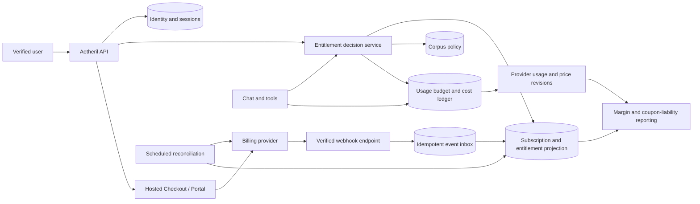

# Plan: subscription billing, coupons, and profitable access

Date: 2026-09-16  
Epic: `agent-forge-harness-yje`  
Status: proposed standalone initiative, revised after [plan review](../reports/additive-retrieval-and-billing-plan-review.md)

## Outcome

Aetheril moves from invite-only pilot access to verified accounts with a
server-enforced subscription entitlement. Users can purchase a plan or redeem a
unique 100% promotion for one or two months. Existing accounts and data migrate
without changing ownership. Access, discounts, AI usage, corpus rights, and
product roles remain separate concepts.

The initiative also establishes a hard financial control loop:

1. price every provider/model/tool revision;
2. reserve cost before an operation;
3. reconcile provider-reported actual usage;
4. measure contribution margin by paid and sponsored cohort;
5. shed optional expensive features before core account/data access; and
6. block sales or features if the approved margin or cash-exposure boundary is
   breached.

This is intentionally a separate epic from the GM Workbench. The Workbench may
consume billing entitlements later, but billing has its own legal, security,
financial, migration, and operational acceptance gates.

## Critical launch boundary: payment is not a content license

The current repository documents the PDF book corpus as closed-pilot content and
treats the invite list as part of that boundary (decision `x5bz.5` and the
standing rule in `docs/invite-copy.md`: an SRD-only serving mode comes before any
wider audience). Replacing an invite with a credit card does not establish the
right to expose that corpus to the public.

The corpus is larger than the older docs say: 12 PDF books plus 849 chunks
scraped from `dnd5e.wikidot.com` (`book_slug=wikidot-5e`).
`docs/licensing-wikidot-corpus.md` scopes the wikidot content to the closed
tier, but also suggests it as a public-tier candidate. That suggestion should
not be relied on: 422 of the 849 chunks overlap book text, the site hosts full
entries from non-SRD books, and Wikidot's terms make contributors responsible
for what they post, so the site's CC BY-SA 3.0 footer cannot be assumed to
license publisher-owned text. `yje.1.1` must classify wikidot explicitly, with
counsel input.

Two other paths can leak excluded content to subscribers: web fallback
(`xiu`), which could fetch a mirror of text the local corpus deliberately
excludes, and model-only answers. `yje.1.1` covers both.

The paid public product must default to:

- SRD 5.1 and/or SRD 5.2 content used under the applicable CC BY 4.0 terms;
- required attribution and license links;
- original Aetheril content; and
- content uploaded or authored by the user under the product terms.

Any broader book corpus remains a distinct `corpus_entitlement` that is disabled
for public subscribers until rights are documented and approved. `yje.1.1` is a
public-paid-launch blocker. Enforcement is new work (`yje.4.6`): no SRD text is
ingested yet, the only retrieval filter is `book_slug` (used only by Spell
mode), and the `license` column is populated only for wikidot chunks.

This plan identifies an engineering and go-live control, not legal advice.
Counsel should review the actual corpus, product behavior, attribution, branding,
exports, and customer terms.

## Current state

### Identity and access

- Accounts are created only by atomically redeeming `auth.invites`.
- The invite fixes the account role (`player` or `dm`).
- Sessions are stateless signed cookies; the account is reread on every request,
  but individual sessions cannot be revoked.
- There is no email verification, password reset, account-preserving recovery,
  subscription, billing customer, or entitlement model.
- Signup is reached through `/#invite=<token>` and the UI has no open
  registration path.
- The invite CLI, invite copy, accepted ADR, schema, tests, and incident runbook
  all encode the pilot lifecycle.
- Signup already reveals whether an account exists: a taken email returns 409,
  and used, expired, and revoked invites return distinct messages.
- Logout only clears the browser cookie; revoking a session means rotating the
  global secret. Cookies last 14 days.
- Existing accounts' email addresses were never verified.
- The UI has no client-side router, so email-verification links and Checkout
  return URLs need a router or the existing root-path fragment pattern.
- Public ingress is locked: `scripts/deploy.sh` never requests it and
  `tests/test_deploy_contract.py` enforces that (the pilot licensing lock).

### Cost controls

- Chat is limited to 20 requests per user per hour and 500 persisted user turns
  per UTC day across the pilot.
- The hourly limit is held in memory on each Cloud Run instance, so with two
  instances a user can get up to 40 per hour, and it resets when an instance
  restarts.
- The 500-turn daily cap is shared by every user (`calls_today()` counts all
  users' turns), so a few heavy users can close chat for everyone. It is skipped
  entirely when the message store failed at startup.
- Those controls count calls, not actual provider cost. One counted turn can
  include an embedding, up to three generation attempts, and extra suggestion
  and structuring calls in Spell mode.
- Production records no token usage: the graph passes no `AttemptObserver`, so
  every attempt is discarded. The model picker labels responses but does not
  change the model called.
- The model-routing plan introduces provider/model usage and price revisions but
  is not yet a subscription ledger.
- GCP has a documented roughly $9.40/month pilot database cost and a $10 kill
  switch that detaches billing from the whole project, halting every billable
  resource. OpenAI/provider spend is outside that GCP cap. Neither pilot control
  can survive a paid launch (`yje.5.2`, `yje.6.6`).
- There is no per-customer monthly COGS reservation, sponsored-account exposure,
  coupon liability, revenue reconciliation, or contribution-margin dashboard.

## Separation of concerns

The implementation must not collapse these independent dimensions:

| Dimension | Examples | Authority |
|---|---|---|
| Identity | unverified, verified, suspended, deleted | Aetheril auth store |
| Product role | player, DM, operator | Aetheril authorization |
| Billing state | active, promotional, grace, delinquent, canceled | Local projection of verified provider events |
| Feature entitlement | chat, campaigns, web fallback, media generation | Product/price feature mapping plus local policy |
| Corpus entitlement | SRD, user content, licensed private corpus | Aetheril licensing policy |
| Usage budget | remaining monthly variable-cost allowance | Aetheril cost ledger |
| Promotion | one-month gift, two-month gift, marketing campaign | Provider coupon/promotion plus Aetheril audit |

A coupon is not a login credential, a role grant, a corpus license, or a usage
limit. It changes invoice amount. Access follows only after verified identity and
the server-owned entitlement decision.

## Recommended provider boundary

The working recommendation is Stripe because hosted Checkout and Customer
Portal reduce PCI scope, Billing models subscriptions, Coupons/Promotion Codes
support percentage discounts with durations and redemption limits, and
Entitlements can emit feature changes. `yje.1.4` remains an explicit ADR so this
recommendation is reviewed rather than smuggled into implementation.

The ADR must also cost a merchant-of-record option. Stripe Managed Payments
keeps the Checkout and Billing stack but makes Stripe the seller, calculating,
collecting, filing, and remitting sales tax, VAT, and GST, for 3.5% on top of
standard processing. Paddle charges 5% plus $0.50. A merchant of record removes
most of the tax-registration workload that this plan otherwise hands to an
accountant; confirm promotion-code, trial, and Customer Portal support first.

Use these responsibilities:

### Stripe owns

- customer and payment-method vaulting;
- products, prices, invoices, discounts, taxes configured there, refunds, and
  disputes;
- Checkout and Customer Portal UI;
- coupon/promotion redemption and monetary calculations; and
- signed event delivery.

### Aetheril owns

- user identity and user-to-customer mapping;
- the locally persisted subscription/entitlement projection;
- authorization on every protected request;
- corpus rights and product roles;
- actual AI/tool/storage usage and COGS budgets;
- webhook inbox/idempotency/reconciliation;
- operator promotion issuance policy and audit; and
- readable access, export, and retention after entitlement ends.

The browser never supplies a trusted customer id, price id, role, discount,
subscription status, or entitlement.

## Target architecture



## Subscription and access lifecycle

The final transition table belongs to `yje.1.3`. The baseline policy is:

| State | Paid generation | User data | Recovery |
|---|---|---|---|
| Email unverified | No | Minimal account record | Verify/resend |
| Checkout incomplete | No | Existing data if migrated | Resume checkout |
| Active paid | Yes within plan budget | Full | Portal |
| Active promotion | Yes within sponsored budget | Full | Purchase or portal |
| Past due / grace | Limited according to explicit grace policy | Read/export/delete retained | Update payment method |
| Unpaid / expired | No paid generation | Read/export/delete retained | Subscribe/reactivate |
| Canceled at period end | Yes until entitlement end | Full, then retained read/export/delete | Reactivate before/after end |
| Suspended for abuse | No | According to terms and appeal policy | Operator review |
| Deleted | No | Erased according to retention/legal holds | None |

Loss of payment must not silently delete campaigns, documents, or chat history.
Nor should a payment-provider outage automatically grant new access. The ADR
must choose a bounded stale-entitlement grace period for already-active users and
fail closed for new grants.

## Coupon system

### Provider objects

For promotions that continue as paid subscriptions, use approved 100%-off
coupon templates with `duration=repeating` and `duration_in_months` equal to 1
or 2. Create a unique customer-facing promotion code per recipient with:

- a customer restriction or verified-email/account binding;
- `max_redemptions=1`;
- a short expiry through the promotion code's `expires_at` (`redeem_by` is the
  coupon-level limit, and a code cannot outlive it);
- the exact eligible product (`applies_to` on the coupon);
- an unguessable code;
- internal campaign/sponsor metadata in Aetheril; and
- an Aetheril usage budget even when the invoice is $0.

Stripe allows up to 20 discounts on one subscription, so Aetheril enforces no
stacking itself. API version `2025-09-30.clover` changed promotion codes to
reference coupons through `promotion[coupon]`; the ADR pins the API version.

Do not implement monetary discount math in Aetheril. Store provider ids and a
read-only local projection, then let the billing provider calculate invoices.

### Two explicit promotion modes

The UI and operator workflow must distinguish these modes:

1. **Sponsored access, no automatic charge.** No payment method is required;
   access ends after one or two months unless the user actively purchases a
   plan. This is the safest default for personal gifts and testers. Do not build
   it on a 100%-off coupon: when the discount ends, Stripe issues a normal
   invoice and a card-less subscription goes `past_due` into the account-wide
   dunning flow. Use a local time-boxed entitlement grant, or a trial created
   with `payment_method_collection=if_required` and
   `trial_settings.end_behavior.missing_payment_method=cancel`.
2. **Promotional subscription, automatic charge after the discount.** A payment
   method is collected and the user is shown the exact first charge date and
   amount before confirmation. Renewal reminders and easy cancellation are
   required.

A single ambiguous “free for two months” flow is not acceptable. It creates
support risk and potential auto-renewal compliance problems.

### Abuse and cash exposure

- Verify email before redemption.
- Bind a personal code to one customer/account.
- Prevent discount stacking and multiple sponsored accounts.
- Keep paid and sponsored usage ceilings explicit.
- Make revocation stop future entitlement without rewriting historical invoices.
- Track issued, redeemed, active, expired, converted, and revoked promotions.
- Set a monthly issuance budget from maximum variable-cost liability, not from
  forgone sticker-price revenue alone.

## Unit-economics model

### Variables

All monetary values are USD and exclude pass-through sales tax from revenue.

```text
P  = monthly sticker price
d  = applied discount fraction for the invoice
R  = P * (1 - d)                         # collected subscription revenue
rp = payment percentage fee
fb = fixed payment fee when R > 0
rb = recurring Billing percentage fee
rt = optional tax-product percentage fee
V  = variable COGS: models + tools + storage + bandwidth + variable support
F  = fixed monthly operating cost

provider_fees = R * (rp + rb + rt) + (fb if R > 0 else 0)
contribution_dollars = R - provider_fees - V
contribution_margin = contribution_dollars / R
break_even_paid_users = ceil((F + sponsored_monthly_COGS) /
                             contribution_dollars)
coupon_max_liability = redemptions * free_months * sponsored_COGS_cap
```

Do not count collected sales tax as revenue. Refunds, disputes, payment fees that
are not returned, and chargeback fees are negative contribution in the period
where they become known.

### Current external fee assumptions

The conservative US card scenario uses current public list pricing:

- Stripe Payments: 2.9% + $0.30 for a successful domestic card transaction;
- Stripe Billing pay-as-you-go: 0.7% of Billing volume; and
- optional Stripe Tax no-code calculation: 0.5% where applicable.

This gives `4.1% + $0.30` before AI/tool/storage COGS. Actual merchant country,
payment method, international cards, currency conversion, tax integration,
refunds, disputes, and negotiated rates can differ. The price revision in the
economics model must match the real account fee schedule before launch.

Three sensitivity cases at $15 with $3 variable COGS still clear the 70%
target:

| Fee scenario | Fees | Contribution | Margin |
|---|---:|---:|---:|
| International card with currency conversion (6.6% + $0.30) | $1.29 | $10.71 | 71.4% |
| Stripe Managed Payments, merchant of record (2.9% + 3.5% + 0.7% Billing + $0.30) | $1.37 | $10.64 | 70.9% |
| Paddle, merchant of record (5% + $0.50) | $1.25 | $10.75 | 71.7% |

### AI and web baseline

The existing model-routing plan uses a representative 6,000 input and 600 output
tokens per answer. At current `gpt-4o-mini` list prices, that is approximately:

```text
6,000 / 1,000,000 * $0.15 + 600 / 1,000,000 * $0.60
= $0.00126 per baseline generation
```

OpenAI web search currently adds a $0.01 tool-call fee plus search-content
tokens, which `gpt-4o-mini` pays as a fixed 8,000-input-token block (about
$0.0012). For planning, use **$0.015 per web-fallback turn** until measured usage
replaces it. One search per turn costs about $0.0125 including the baseline
answer, so the figure holds only if search is capped at one call per turn; two
searches cost about $0.024.

The baseline itself must come from real data before `yje.1.2` is approved:
actual pilot OpenAI usage or invoices divided by persisted turns, until
`yje.5.1` adds per-turn capture.

One reasonable target scenario is:

```text
300 chat turns / month
85% local or model-only at $0.00126
15% web fallback at $0.015
25% overhead for structuring, suggestions, retries, and usage variance
$0.25 storage/logging/bandwidth allocation

estimated variable COGS ≈ $1.50 / active user / month
```

The initial hard planning cap should be **$3.00 per paid or sponsored account per
month**, with a stress scenario at **$5.00**. This is not a permanent customer
quota and must be replaced by observed p50/p95 usage, model mix, future media
cost, and support data. It is a safe engineering boundary for launch planning.

### Price scenarios

This table includes the conservative `4.1% + $0.30` payment/Billing/Tax tooling
assumption:

| Monthly price | Variable COGS | Fees | Contribution | Contribution margin |
|---:|---:|---:|---:|---:|
| $10 | $1.50 | $0.71 | $7.79 | 77.9% |
| $10 | $3.00 | $0.71 | $6.29 | 62.9% |
| $10 | $5.00 | $0.71 | $4.29 | 42.9% |
| $12 | $1.50 | $0.79 | $9.71 | 80.9% |
| $12 | $3.00 | $0.79 | $8.21 | 68.4% |
| $12 | $5.00 | $0.79 | $6.21 | 51.7% |
| $15 | $1.50 | $0.92 | $12.59 | 83.9% |
| $15 | $3.00 | $0.92 | $11.09 | 73.9% |
| $15 | $5.00 | $0.92 | $9.09 | 60.6% |

### Launch hypothesis

Use **$15/month as the financial launch hypothesis**, not as a final product
decision. It is the only scenario above that exceeds 70% contribution margin at
the $3 hard COGS target ($12 reaches 68.4%) and still has room for the much
larger Workbench feature set. Validate willingness to pay before public launch.

Do not advertise “unlimited.” Expose a humane usage policy and reset date. The
server should enforce actual cost rather than a single raw turn count because a
local answer, web search, structured document, and future media generation have
very different costs.

At $15 and $3 variable COGS, contribution is about $11.09 per paid subscriber:

| Fixed monthly cost | Paid users to break even, before sponsored COGS |
|---:|---:|
| $100 | 10 |
| $250 | 23 |
| $500 | 46 |

If 25 users receive two sponsored months with a $3 hard monthly cost cap, maximum
cash COGS exposure is:

```text
25 * 2 * $3 = $150
```

That $150 is added to fixed costs in the break-even calculation for the affected
months. Forgone $750 sticker-price revenue is reported separately as marketing
discount value; it is not the same as cash COGS.

### Profitability rules

1. Target at least **70% contribution margin** under the approved target-cost
   scenario.
2. Block public launch if the stress scenario produces an unapproved loss or if
   p95 account COGS is not bounded.
3. Reserve before every metered operation and reconcile actual provider usage.
4. Apply optional-feature shedding in this order: automatic web search, premium
   model routing, extra structuring/suggestions, media generation. Core account
   and user-data access remains.
5. Maintain per-account, per-promotion-campaign, and global monthly exposure.
6. Price and provider fee changes require an effective-dated revision and a new
   scenario run before enablement.
7. Review weekly during canary and monthly after stability.
8. Track operator/support labor separately from infrastructure contribution
   margin so the business does not confuse gross contribution with net profit.
9. Replace the pilot guards rather than keeping them as defense in depth: the
   shared 500-turn daily cap becomes a much higher global spend breaker that
   alerts before it sheds, and per-user throttles move to a shared store
   (`yje.5.2`).

## Identity migration

Open registration is more than removing the `invite` field. `yje.1.5` first
decides whether to extend the in-house stack or adopt a managed identity
provider; either way the work includes:

- add email verification before AI access;
- add account-preserving password reset;
- add individually revocable sessions and logout-all;
- introduce non-enumerating auth responses (signup enumerates accounts today)
  and re-size the Argon2 and rate-limit controls, which were sized for a closed
  pilot on two instances;
- rate-limit verification/resend/reset/signup and add bot defenses;
- preserve existing user IDs, roles, conversations, and ownership;
- give every existing account an explicit migration state and communication;
- run billing entitlement in shadow mode before enforcement; and
- remove invite schema/code/UI/docs only after the rollback window.

Existing users may receive an operator grant, a unique promotion, a grandfathered
period, or a normal checkout request. That is a product decision recorded per
account; it must not be inferred from an old invite row.

## Webhooks and consistency

Access is not granted from a Checkout success redirect. The server:

1. verifies the raw webhook signature;
2. inserts the provider event ID and payload hash into an idempotent inbox;
3. applies a transactionally safe projection update;
4. records processing status and bounded failure reason;
5. invalidates the entitlement cache; and
6. acknowledges only according to the retry contract.

Duplicate and out-of-order delivery must converge. A scheduled reconciliation
reads customers/subscriptions/entitlements from the provider to repair missed or
poison events. Stripe recommends persisting entitlements internally for fast
resolution; Aetheril should treat that projection as authorization input while
retaining provider reconciliation as the billing truth check.

## Security and compliance gates

- Hosted Checkout/Portal keeps payment details out of Aetheril.
- Webhook signatures, replay prevention, event ordering, customer mapping,
  redirect allowlists, CSRF, session fixation, promotion enumeration, and admin
  authorization receive adversarial tests.
- Live and test products, prices, keys, webhooks, and data are isolated.
- Provider secrets live in Secret Manager with least privilege and rotation.
- Logs/metrics exclude payment details, promotion codes, full webhook payloads,
  email tokens, prompts, and source text.
- Published terms cover subscription renewal, cancellation, usage limits,
  refunds, sponsored periods, data retention, acceptable use, and AI behavior.
- Privacy documentation names payment, email, model, search, tracing, and hosting
  processors and their data flows.
- Tax registration/collection and revenue recognition are reviewed by an
  accountant; this plan does not infer obligations from provider tooling.
- Public paid launch remains blocked until the corpus/license matrix is approved.

## Delivery phases

### Phase 0 — Commercial gates and real usage data

Start `yje.5.1` immediately so production records real usage. Complete
`yje.1.1`, `yje.1.2`, `yje.1.5`, and the legal/accounting inputs to `yje.6.1`.
Choose what can be sold and what margin/cash exposure is acceptable before
building a flow that could charge customers.

### Phase 1 — Architecture and migration foundation

Complete `yje.1.3`, `yje.1.4`, the identity schema (`yje.2.1`), the billing
schema (`yje.3.7`), and product/catalog configuration, using the shared
migration runner from `1kg.1.5`. Introduce the webhook inbox and shadow
projections without enforcing a paywall.

### Phase 2 — Safe open accounts

Complete `yje.2.2`–`yje.2.4`: verification, recovery, revocable sessions, abuse
controls, and existing-account migration. This phase no longer waits for the
billing-provider ADR. Invites remain available as rollback until the paid
lifecycle is proven.

### Phase 3 — Billing and promotions

Complete `yje.3.1`–`yje.3.6`: Checkout, Portal, webhooks, reconciliation, and
unique one/two-month promotion flows in provider test mode.

### Phase 4 — Entitlements and unit economics

Complete `yje.4.1`–`yje.4.6` and `yje.5.2`–`yje.5.5`: enforce access and corpus
entitlements consistently, ingest the SRD, preserve user data, apply account
budgets, and prove margin/coupon exposure. Per-account budgets (`yje.5.2`) can
ship with a default budget before the entitlement service exists.

### Phase 5 — Public go-live, paid canary, and invite retirement

Complete `yje.6.1`–`yje.6.7`, including replacing the project-wide kill switch
(`yje.6.6`) and opening and hardening public ingress (`yje.6.7`). Run
owner/tester canaries, then enforce the paywall for the approved corpus. Retire
invites with `yje.2.5` only after migration and rollback gates pass.

## Bead map

| Bead | Priority | Work |
|---|---:|---|
| `yje` | P1 | Subscription billing, coupons, and profitable access epic |
| `yje.1` | P1 | Commercial/licensing/billing decisions |
| `yje.1.1` | P1 | Sellable corpus and content-entitlement decision (wikidot, web, model-only) |
| `yje.1.2` | P1 | Pricing, economics, and profit guardrails |
| `yje.1.3` | P1 | Account/role/subscription/coupon/access state machines |
| `yje.1.4` | P1 | Billing provider/source-of-truth ADR (incl. merchant of record) |
| `yje.1.5` | P1 | Identity implementation decision (in-house or managed provider) |
| `yje.2` | P1 | Production account lifecycle |
| `yje.2.1` | P1 | Ordered identity and session migrations |
| `yje.2.2` | P1 | Open signup, verification, and abuse controls |
| `yje.2.3` | P1 | Password recovery and revocable sessions |
| `yje.2.4` | P1 | Existing invite-user migration |
| `yje.2.5` | P2 | Invite retirement |
| `yje.3` | P1 | Checkout, portal, webhooks, and coupons |
| `yje.3.1` | P1 | Products/prices/features/promotions as code |
| `yje.3.2` | P1 | Hosted Checkout and Customer Portal |
| `yje.3.3` | P1 | Verified idempotent webhook inbox |
| `yje.3.4` | P1 | Customer/subscription/invoice/entitlement projection |
| `yje.3.5` | P1 | One/two-month grants: no-card local grant or trial; card promotions via codes |
| `yje.3.6` | P1 | Promotion-abuse controls |
| `yje.3.7` | P1 | Ordered billing, entitlement, and webhook migrations |
| `yje.4` | P1 | Paid and corpus entitlement enforcement |
| `yje.4.1` | P1 | Central entitlement decision service |
| `yje.4.2` | P1 | Subscription/delinquency/grace transitions |
| `yje.4.3` | P1 | Post-entitlement data access/retention |
| `yje.4.4` | P1 | Pricing/paywall/checkout/billing UI |
| `yje.4.5` | P1 | Cancellation/refund/dispute/dunning behavior |
| `yje.4.6` | P1 | SRD ingestion and corpus-entitlement enforcement |
| `yje.5` | P1 | Usage and profitability controls |
| `yje.5.1` | P1 | Provider/operation cost ledger and production usage capture |
| `yje.5.2` | P1 | Per-account COGS budgets replacing the shared pilot caps |
| `yje.5.3` | P1 | Web-fallback plan/budget integration |
| `yje.5.4` | P1 | Margin/break-even/coupon-liability dashboard |
| `yje.5.5` | P1 | Profit alerts, price gates, kill switches |
| `yje.6` | P1 | Compliance, tests, operations, rollout |
| `yje.6.1` | P1 | Licensing/tax/terms/privacy/refund/renewal review |
| `yje.6.2` | P1 | Billing and promotion security suite |
| `yje.6.3` | P1 | Subscription/coupon lifecycle E2E suite |
| `yje.6.4` | P1 | Migration/canary/communication/rollback |
| `yje.6.5` | P1 | Support and incident operations |
| `yje.6.6` | P1 | Replace the project-wide billing kill switch |
| `yje.6.7` | P1 | Open and harden public ingress |

## Coordination without scope collapse

- `agent-forge-harness-xiu`: additive retrieval owns search behavior; billing
  owns which plans may spend how much on it.
- `agent-forge-harness-b8o`: model routing supplies provider usage and price
  revision data; billing supplies account budgets and financial gates.
- `agent-forge-harness-1kg`: Workbench APIs consume entitlements but do not own
  billing state.
- `agent-forge-harness-1kg.1.5`: owns the ordered migration runner; `yje.2.1`
  and `yje.3.7` are blocked by it so no second mechanism appears.
- `agent-forge-harness-1kg.9.2`: Workbench cost accounting records into the
  `yje.5.1` ledger.
- `agent-forge-harness-iu6`: new auth/billing routers should follow the planned
  split of `service/app.py` into routers (not yet done) rather than making the
  monolith larger.

## Go-live definition

Public paid access is ready only when:

1. the sellable corpus and attribution are approved;
2. unit economics meet the approved target and stress limits using measured
   usage, not only the estimates above;
3. signup verification, recovery, and session revocation work;
4. provider events are verified, idempotent, reconcilable, and observable;
5. coupon duration, redemption, post-discount charges, and usage exposure are
   explicit;
6. one authorization service protects every paid/corpus surface;
7. unpaid users retain the approved read/export/delete path;
8. security, lifecycle E2E, tax/terms/privacy/refund, support, and rollback gates
   pass;
9. the operator can stop sales or expensive features without corrupting
   accounts, invoices, entitlements, or user data;
10. SRD content is ingested and corpus entitlements are enforced in every chat
    mode and in web fallback; and
11. no automated control can take the whole project offline, and public ingress
    is open with edge protections sized for anonymous traffic.

## Sources used for current external assumptions

- [Stripe pricing](https://stripe.com/pricing)
- [Stripe coupons and promotion codes](https://docs.stripe.com/billing/subscriptions/coupons)
- [Stripe Entitlements](https://docs.stripe.com/billing/entitlements)
- [OpenAI API pricing](https://developers.openai.com/api/docs/pricing)
- [GPT-4o mini pricing](https://developers.openai.com/api/docs/models/gpt-4o-mini)
- [D&D SRD licensing and versions](https://www.dndbeyond.com/srd)
- [Creative Commons Attribution 4.0 summary](https://creativecommons.org/licenses/by/4.0/)
- [Stripe free trials](https://docs.stripe.com/billing/subscriptions/trials/free-trials)
- [Stripe Managed Payments](https://stripe.com/managed-payments)
- [Paddle pricing](https://www.paddle.com/pricing)
- [Wikidot terms of service](http://www.wikidot.com/legal:terms-of-service)

All provider prices and legal/compliance assumptions must be revalidated against
the production account, merchant country, selected products, and professional
advice before launch.
