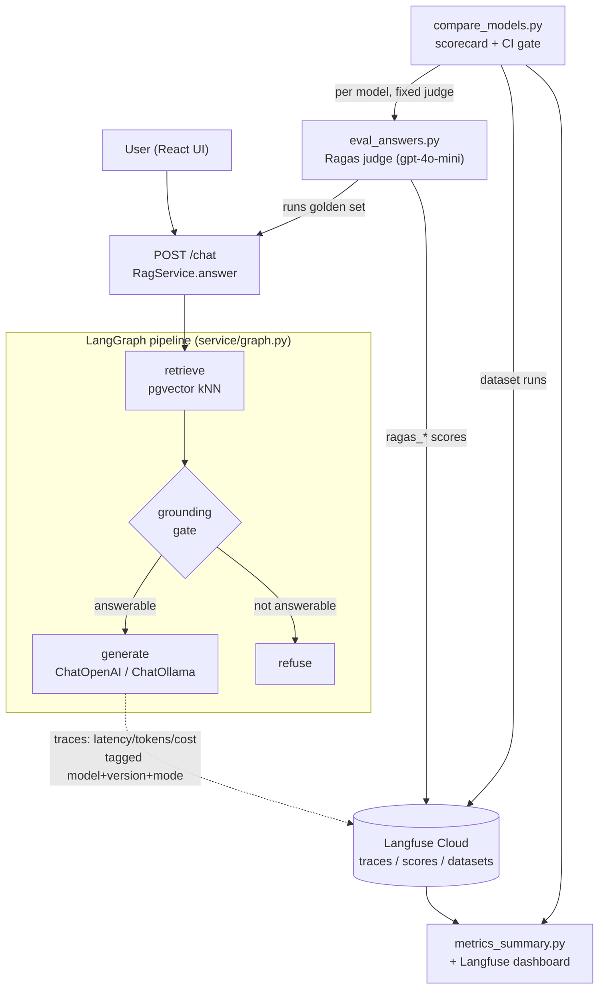
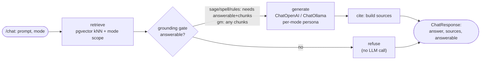
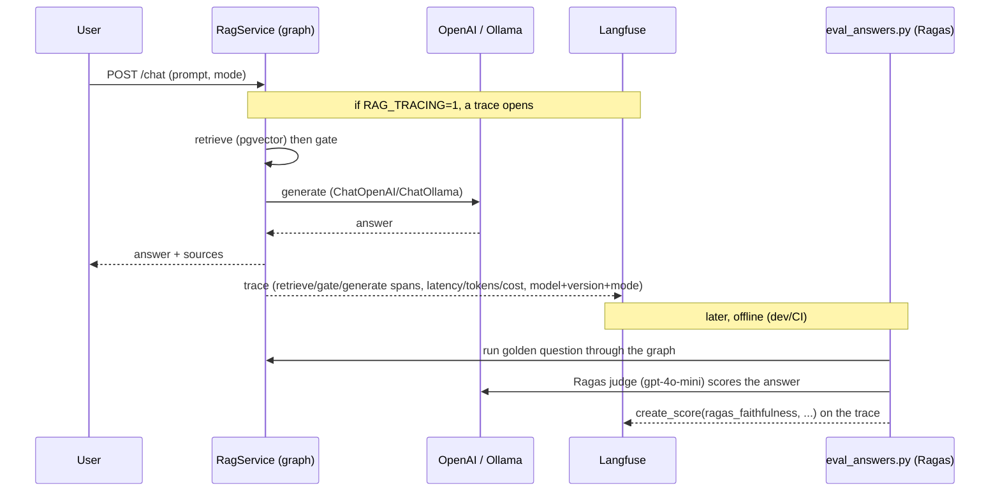
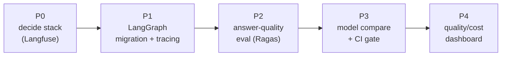
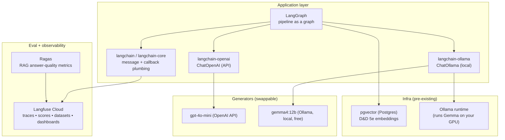
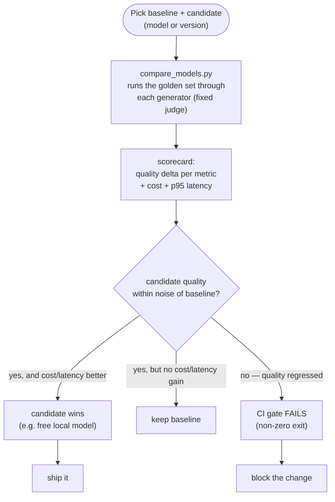

# rag-chat Observability & Agent-Eval — Master Overview

> **Epic:** `agent-forge-harness-ziw` — *Observability + agent-eval layer* (5/5 phases complete)
> **What this is:** the single doc that explains the whole initiative — the architecture we added, the
> products/technology used, why each decision was made, and how to run and read it. Companion deep-dives:
> [`phase0-langfuse-decision.md`](phase0-langfuse-decision.md) · [`eval-strategy.md`](eval-strategy.md) ·
> [`answer-eval.md`](answer-eval.md) · [`dashboard.md`](dashboard.md).

---

## 1. TL;DR

rag-chat is a D&D 5e Retrieval-Augmented-Generation (RAG) chat app. It worked, but it was a **black box**:
no way to see what a request did, no way to measure answer quality, and no way to answer *"is version/model
B better than A?"* This epic added a full **observability + evaluation layer** in five phases:

1. **Migrated** the answer pipeline from the raw OpenAI SDK to a **LangGraph** graph.
2. **Instrumented** it with **Langfuse** — every `/chat` emits a node-level trace (latency, tokens, cost),
   tagged by model/version/mode.
3. **Scored** answer quality with **Ragas** (an LLM-as-judge), attaching scores to the traces.
4. **Compared** models/versions with a **scorecard + CI regression gate**.
5. **Surfaced** quality + cost trends in a **dashboard** (Langfuse + a scriptable summary).

The result: a closed loop of **run → observe → measure → compare → decide**, so you can safely swap models
(e.g. `gpt-4o-mini` vs a free local `gemma4:12b`) and know whether quality held.

---

## 2. Architecture at a glance



**The runtime path** (solid, top) is unchanged in behavior — it's just modeled as a graph now. **The
observability/eval tooling** (bottom) is dev/CI-only and reads/scores what the graph produces.

### Before → after

| | Before | After |
|---|---|---|
| Orchestration | Imperative Python calling the raw OpenAI SDK, linear | A compiled **LangGraph** graph (`retrieve → gate → generate\|refuse`) |
| LLM call | `openai` SDK directly | `langchain-openai` **ChatOpenAI** (swappable for **ChatOllama**) |
| Observability | None (stray `print()`) | **Langfuse** node-level traces (latency/tokens/cost), off by default |
| Answer quality | Unmeasured | **Ragas** LLM-judge + deterministic graders, scored on traces |
| Model/version A/B | Not possible | **Scorecard + CI regression gate** (`compare_models.py`) |
| Trends visibility | None | **Langfuse dashboard** + scriptable `metrics_summary.py` |

---

## 3. The pipeline as a LangGraph graph

The heart of the migration (Phase 1). `RagService.answer()` validates the mode + guards empty prompts,
then delegates to a compiled graph. Behavior is **identical** to the old imperative flow — it's an
orchestration refactor, verified by holding the retrieval golden metrics + the full test suite green.



**Why LangGraph?** Modeling the pipeline as a graph gives **native node-level tracing** (each node is a
span) and opens the door to agentic patterns later — while the **injectable generator seam** (you pass in
the chat model) makes model-swapping and testing trivial. The nodes map 1:1 onto the pre-existing seams,
so the migration was low-risk.

---

## 4. How one request is traced and scored



Tracing is **env-gated (`RAG_TRACING`) and off by default**, so tests/CI and production stay untouched
unless you opt in — no cost, no key requirement, no behavior change.

---

## 5. The five phases



| Phase | Goal | Key artifacts | Notable decisions |
|---|---|---|---|
| **P0 — Stack decision** | Pick the observability/eval backend | `spikes/langgraph_langfuse_spike.py`, `phase0-langfuse-decision.md` | **Langfuse** over Phoenix (version/model tracking + dashboard); validated via a LangGraph spike |
| **P1 — Migration + tracing** | Model the pipeline as a graph; trace it | `service/graph.py`, `service/tracing.py`, `service/rag.py`, `service/generate.py` | LangGraph + `langchain-openai`; env-gated Langfuse `CallbackHandler`; tags `model`/`service_version`(git SHA)/`mode` |
| **P2 — Answer-quality eval** | Score generation quality | `ingestion/eval_answers.py` | Deterministic graders **first**, Ragas LLM-judge where needed; **fixed independent judge**; "Unknown" escape hatch |
| **P3 — Comparison + CI gate** | Answer "is B better than A?" | `ingestion/compare_models.py` | Same eval per generator (fixed judge); scorecard + **non-zero-exit CI gate**; any model via `name:tag`→Ollama else OpenAI |
| **P4 — Dashboard** | Make trends readable for A/B | `ingestion/metrics_summary.py`, `dashboard.md` | Langfuse dashboards (UI) + scriptable Metrics-API summary; documented A/B rubric |

---

## 6. Technology & products used



| Product / tech | What it is | Role here | Cost / license |
|---|---|---|---|
| **LangGraph** | Library to model an LLM pipeline as a stateful graph of nodes | The `retrieve→gate→generate` orchestration | OSS (MIT) |
| **LangChain / langchain-core** | LLM app framework; message + callback abstractions | `SystemMessage`/`HumanMessage`; the callback that Langfuse hooks | OSS (MIT) |
| **langchain-openai** | LangChain ↔ OpenAI adapter | `ChatOpenAI` generator (default `gpt-4o-mini`) | OSS |
| **langchain-ollama** | LangChain ↔ Ollama adapter | `ChatOllama` local generator | OSS |
| **Langfuse** | LLM observability + eval platform (traces, scores, datasets, dashboards) | The backbone — collects traces, holds scores, powers the dashboard | OSS core; **free Cloud Hobby tier** used here |
| **Ragas** | Purpose-built RAG evaluation metrics (faithfulness, answer correctness, …) | The LLM-as-judge that scores answers | OSS (Apache-2) |
| **Ollama** | Local model runtime | Serves `gemma4:12b` on the local GPU (an RTX 3080) | OSS |
| **Gemma 4 12B** | Google's open-weights model (Apache-2) | The free/local generator in the A/B | Free (Apache-2) |
| **gpt-4o-mini** | OpenAI's small model | Default generator **and** the fixed eval judge | API (fractions of a cent/call) |
| **pgvector** | Postgres vector-search extension | Retrieval (existing, unchanged) | OSS |

---

## 7. Key design decisions & direction changes

- **LangGraph became the foundation (not optional).** Originally observability was going to instrument the
  raw SDK, with LangGraph as an optional follow-up. Mid-epic the team committed to LangGraph, so the
  migration was re-sequenced to be **Phase 1** and tracing arrives *through* the graph's callbacks.
- **Langfuse Cloud (free tier), not self-host.** We trialled self-host (Docker: Postgres/ClickHouse/Redis/
  MinIO) then switched to the free **Cloud Hobby tier** to drop the infra + upkeep. Self-host stays the
  documented at-scale fallback. Code is identical (reads `LANGFUSE_*` from `.env`).
- **Consolidated on Langfuse + Ragas; dropped promptfoo.** Once Langfuse was wired, its native datasets +
  experiment comparison covered the version/model A/B, so a third tool (promptfoo) was redundant.
  (See [`eval-strategy.md`](eval-strategy.md).)
- **The judge is fixed and independent.** The eval judge is always `gpt-4o-mini`, kept **separate from and
  ≥ the generator** being tested. This avoids *self-enhancement bias* (a model scoring its own output too
  favorably) and keeps scores comparable across runs.
- **Deterministic graders first, LLM-judge only where needed.** Refusal / key-facts / citation checks are
  code (free, exact); Ragas is used only for the fuzzy dimensions (faithfulness, correctness).
- **The generator is an injectable seam.** `RagService(llm_client=<chat model>)` — swapping models is a
  one-line change and makes the whole thing testable with fakes (offline unit tests, no network).

---

## 8. The evaluation methodology (Anthropic's roadmap)

The eval design follows Anthropic's *Demystifying Evals for AI Agents*: start with **20–50 real cases**,
**unambiguous tasks with reference facts**, **balanced positive + negative** cases (answerable vs
must-refuse), **deterministic graders where possible + LLM-judge where necessary**, **grade the output not
the path**, give judges an **"Unknown"** escape hatch, and **read transcripts to calibrate**. This is why
the eval mixes code graders with Ragas and why the golden set includes negative (off-corpus) queries.

**Metrics captured per answer:**

| Grader | Type | Checks |
|---|---|---|
| refusal | code | off-corpus queries return the exact refusal string |
| key-facts | code | required facts present (case-insensitive) |
| citation | code | ≥1 `[n]` citation, all resolving to a returned source |
| faithfulness | Ragas | claims supported by retrieved context |
| answer_relevancy | Ragas | answer addresses the question |
| answer_correctness | Ragas | answer vs the key-facts reference |
| context_precision / recall | Ragas | retrieval quality vs reference |

---

## 9. What data is captured (and where)

- **Traces** (Langfuse) — one per `/chat`: child spans `retrieve` / `gate` / `generate`, each with latency;
  the LLM call carries **tokens + cost**; tagged `model`, `service_version` (git SHA), `mode`.
- **Scores** (Langfuse) — `ragas_faithfulness`, `ragas_answer_correctness`, … attached to the trace.
- **Dataset** (Langfuse) — `rag-chat-answers`, the golden cases; comparison runs are model-tagged.
- **Local JSON** — `eval_answers_results.json`, `compare_results.json`, `metrics_summary.json` (gitignored).

> **Known dashboard gotcha:** trace *metadata* (`model`, `service_version`) is **not** a queryable
> Langfuse dimension. Cost/latency group by model via the `observations` view + **`providedModelName`**;
> version-filtering needs the native trace `version` field (tracked follow-up `1c6`).

---

## 10. The A/B decision workflow



The **dashboard** shows the trend; the **CI gate** enforces it (`--gate-metric` + `--gate-threshold`). Same
data, two surfaces: humans read the dashboard, CI reads the exit code.

---

## 11. How to run everything

```bash
# --- prerequisites ---
docker compose up -d vector-db          # seeded pgvector (retrieval)
# .env holds OPENAI_API_KEY + LANGFUSE_PUBLIC_KEY/SECRET_KEY/BASE_URL

# --- live tracing (optional) ---
RAG_TRACING=1 <run the service or a /chat call>   # emits traces to Langfuse

# --- answer-quality eval (Phase 2) ---
uv run --with '.[eval]' python ingestion/eval_answers.py --limit 5

# --- model comparison + CI gate (Phase 3) ---
ollama pull gemma4:12b                  # local generator (~8GB; RTX 3080-friendly)
uv run --with '.[eval]' python ingestion/compare_models.py \
  --models gpt-4o-mini,gemma4:12b --limit 5 \
  --gate-metric answer_correctness --gate-threshold 0.05   # exit != 0 on regression

# --- dashboard summary (Phase 4) ---
python ingestion/metrics_summary.py --since 30d            # cost/latency by model
python ingestion/metrics_summary.py --from-results ingestion/compare_results.json  # offline quality
```

`ragas` + `langchain-ollama` live in the **`[eval]` optional extra** — the FastAPI service image never
pulls them. The offline unit tests use fakes and need none of it.

---

## 12. Cost model

- **Free:** Langfuse Cloud (Hobby tier, ~50k units/mo), all OSS libs, **local generation** on Ollama
  (Gemma runs on your GPU).
- **Spends tokens:** the LLM-judge (Ragas) and API generators (`gpt-4o-mini`) — **fractions of a cent** per
  call. Bounded by the golden subset size + `--limit`; run the full set on a nightly cadence.
- **The observed tradeoff (real numbers):** `gpt-4o-mini` ≈ $0.0011 / p95 ~2s vs `llama3.2` (local) free /
  p95 ~29s — the "fast-and-cheap API vs free-but-slow local" decision the dashboard makes visible.

---

## 13. Repository map (what this epic added)

| File | Phase | Purpose |
|---|---|---|
| `service/graph.py` | P1 | The LangGraph pipeline |
| `service/tracing.py` | P1 | Env-gated Langfuse trace config |
| `service/rag.py`, `service/generate.py` | P1 | Delegate to the graph; `ChatOpenAI` generate node |
| `ingestion/eval_answers.py` | P2 | Deterministic + Ragas answer-quality eval |
| `ingestion/compare_models.py` | P3 | Model comparison scorecard + CI gate |
| `ingestion/metrics_summary.py` | P4 | Langfuse Metrics-API cost/quality summary |
| `docs/observability/*.md` | all | Decision records + how-to (this doc + the four deep-dives) |
| `spikes/langgraph_langfuse_spike.py` | P0 | The integration spike |

---

## 14. Follow-ups (tracked in Beads)

| ID | What |
|---|---|
| `8nv` | Expand key-facts to ~20–30 reviewed cases (richer `answer_correctness`) |
| `zgm` | Feed full retrieved context (not snippets) to Ragas context metrics |
| `asq` | Langfuse dataset-run grouping (`item.run`) for the native side-by-side experiment UI |
| `1c6` | Set the native trace `version` field so version-filtering works in the dashboard |
| `3xs` | Migration hardening checklist (pin deps, PII retention, cloud-key hygiene) |

---

## 15. Glossary

- **RAG** — Retrieval-Augmented Generation: retrieve relevant text, then have an LLM answer *grounded* in it.
- **LangGraph** — models an LLM pipeline as a graph of nodes with shared state.
- **Trace / span** — a record of one request and its sub-steps (Langfuse); a span is one node/LLM call.
- **LLM-as-judge** — using an LLM to score another LLM's output against a rubric/reference (here: Ragas).
- **Faithfulness / groundedness** — are the answer's claims supported by the retrieved context?
- **Self-enhancement bias** — an LLM judge favoring its own outputs; avoided by a fixed, independent judge.
- **CI regression gate** — a check that fails the build if a metric drops past a threshold vs baseline.
- **`service_version`** — the git SHA of the running graph, tagged on every trace for version comparison.
- **Golden set** — the curated question set (positive + negative) the eval runs against.
